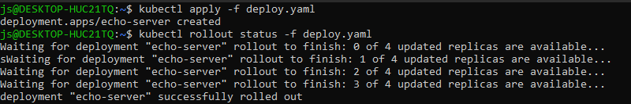
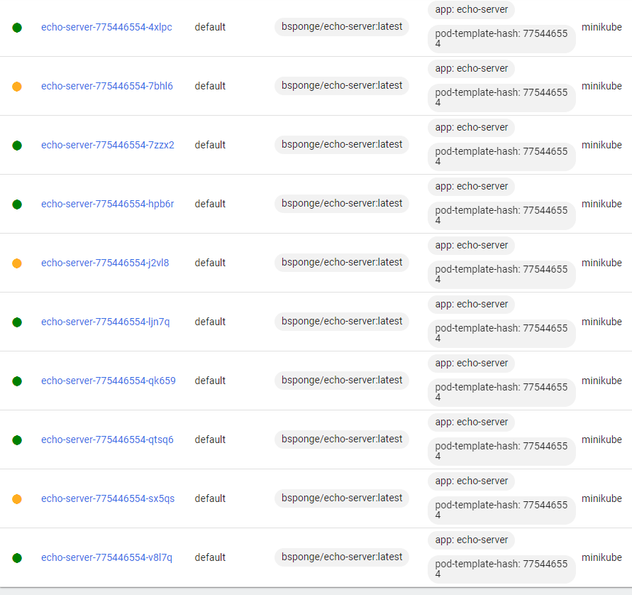
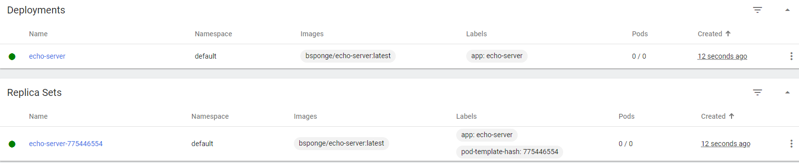
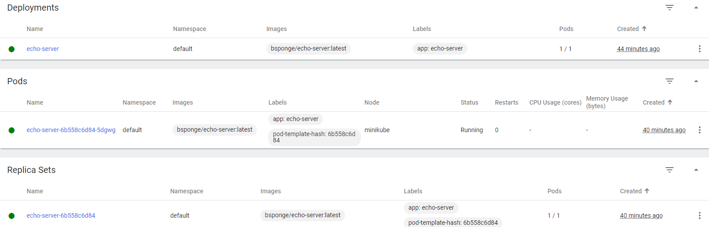

# Sprawozdanie Lab nr 12

## Konwersja wdrożenia ręcznego na wdrożenie deklaratywne YAML

Uruchomiono `minikube`


oraz zmieniono liczbę replik w deploymencie

```
apiVersion: apps/v1
kind: Deployment
metadata:
  name: echo-server
  labels:
    app: echo-server
spec:
  replicas: 4
  selector:
    matchLabels:
      app: echo-server
  template:
    metadata:
      labels:
        app: echo-server
    spec:
      containers:
      - name: echo-server
        image: bsponge/echo-server:latest
        ports:
        - containerPort: 8080
```

Zastosowano zaktualizowany deployment i obserwowano przez `kubectl rollout status`



## Przygotowanie nowego obrazu

Jako obraz failujący skorzystano z tego [projektu](https://github.com/pznamensky/docker-fail-image)

Zwiększenie replik do 10



Zmniejszenie do 0



Zwiększenie do 1



Zastosowanie nowej wersji obrazu


## Kontrola wdrożenia

Utworzono skrypt

```
#!/bin/bash

kubectl apply -f deploy.yaml
timeout 30 kubectl rollout status -f deploy.yaml
if [ $? -eq 0 ]
then
	    echo Success
    else
	        echo Fail
fi
```

## Strategie wdrożenia

W celu ustalenia strategi należało wypełnić dodatkowe pole w yamlu

### Recreate

```
  strategy: 
    type: Recreate
```

Ta strategia sprawia, że stare wersje są zamieniane przez nowsze

### Rolling update

```
strategy:
    type: RollingUpdate
```

W tym przypadku minimalizujemy downtime kosztem czasu aktualizowania. Strategi zakłada wyłączanie pojedynczo podów ze starymi wersjami i zastępowanie je nowymi. Dodatkowo można dodać modyfikacje

```
        maxSurge: 10%
        maxUnavailable: 10%
```

które mówią czy wymiana podów może zachodzić w ilości większej niż 1 w tym samym momencie.

### Canary Deployment workload

```
strategy:
    type: CanaryDeploymentWorkload 
```

W tej strategi deployment tworzy nowe pody z nową wersją podczas gdy większość podów jest na wersji starej (typo ratio 1:4). Większość klientów w takim przypadku używa starej wersji, a mała część używa wersji nowej. Pozwala to na testowanie nowej wersji bez ryzyka całkowitego totalnego braku dostarczania usługi.