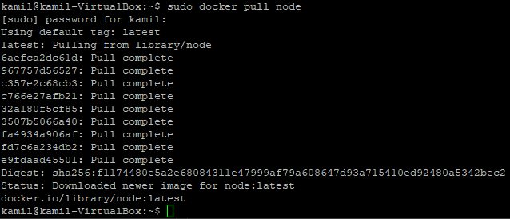
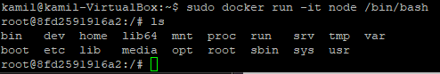
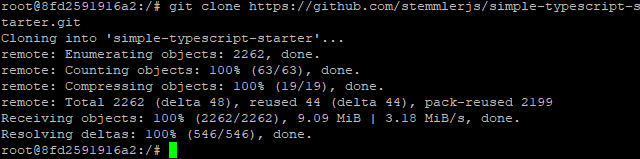
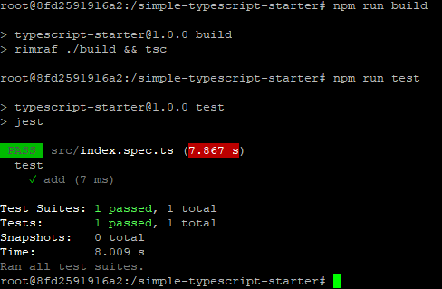
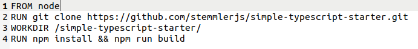
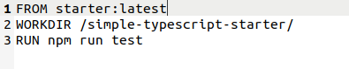
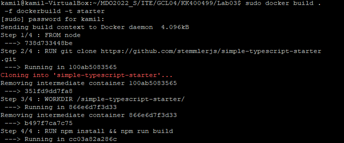
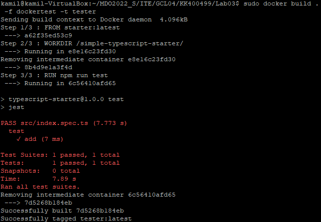

# Sprawozdanie
### Kamil Kruczek GL04
## Wykonanie ćwiczenia

1. Wykonanie polecenia ``` docker pull node ```



2. Uruchomienie kontenera 



3. Sklonowanie repozytorium



4. Build oraz testy projektu



5. Plik dockerbuild



Plik dockertest



6. Zbudowanie obrazów


