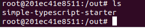

# Sprawozdanie
### Kamil Kruczek GL04

## Woluminy

1. Utworzenie woluminów wejściowych i wyjściowych 
``` sudo docker volume create input_vol ```   
``` sudo docker volume create output_vol ```


2. Uruchomienie kontenera w trybie interaktywnym
``` sudo docker run -it --name build --mount "source=input_vol,target=/in" --mount "source=output_vol,target=/out" starter /bin/bash ```


3. Sklonowanie repozytorium na wolumin wejściowy


4. Uruchomienie buildu w kontenerze


5. Skopiowanie plików do woluminu wyjściowego



## Porty

1. Uruchomienie serwera na nowym kontenerze ubuntu


2. Połączenie się za pomocą innego kontenera ubuntu


## Instalacja Jenkins

1. Wykonanie polecenia ``` sudo docker network create jenkins ```


2. Wykonanie polecenia ``` sudo docker run --name jenkins-docker --rm --detach \
  --privileged --network jenkins --network-alias docker \
  --env DOCKER_TLS_CERTDIR=/certs \
  --volume jenkins-docker-certs:/certs/client \
  --volume jenkins-data:/var/jenkins_home \
  --publish 2376:2376 \
  docker:dind --storage-driver overlay2 ```

  

  3. Zbudowanie obrazu z pliku dockerfile:

  

  4. Wykonanie polecenia ``` sudo docker run --name jenkins-blueocean --restart=on-failure --detach \
  --network jenkins --env DOCKER_HOST=tcp://docker:2376 \
  --env DOCKER_CERT_PATH=/certs/client --env DOCKER_TLS_VERIFY=1 \
  --publish 8080:8080 --publish 50000:50000 \
  --volume jenkins-data:/var/jenkins_home \
  --volume jenkins-docker-certs:/certs/client:ro \
  myjenkins-blueocean:2.332.3-1 ```

  

  5. Działający Jenkins

  

