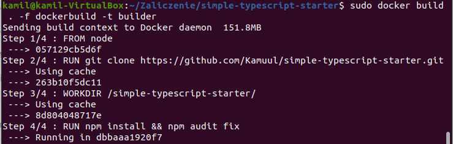

# Sprawozdanie
### Kamil Kruczek GL04
## Projekt zaliczeniowy

### Przygotowanie

1. Sklonowanie sforkowanego repozytorium


2. Zainstalowanie zależności i sprawdzenie działania aplikacji poza kontenerem

``` npm install ```


``` npm test ```


``` npm start ```


3. Przygotowanie plików dockerbuild i dockertest

``` dockerbuild ```


``` dockertest ```


4. Sprawdzenie działania kontenerów zbudowanych na podstawie powyższych plików

``` sudo docker build . -f dockerbuild -t builder ```



``` sudo docker build . -f dockertest -t tester ```


## Przygotowanie Pipeline'u

1. Utworzenie woluminów wejścia i wyjścia


2. Modyfikacja pliku dockerbuild

``` dockerbuild ```


3. Utworzenie pliku dockerdeploy

``` dockerdeploy ```


4. Utworzenie pliku Jenkinsfile

Kroki Prebuild oraz Build


Krok Test


Krok Deploy


Krok Publish


5. Uruchomienie Pipeline'u


## Diagramy


