<h1>Sprawozdanie z Lab11</h1>

<h3> Konrad Krzempek</h3>
grupa lab 4

Wykonanie ćwiczenia:

    Instalacja minikube:
   
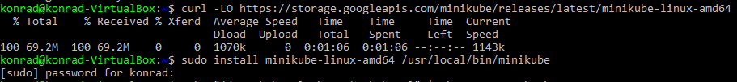

    Instalacja kubectl i sprawdzenie czy wszystko jest poprawnie:

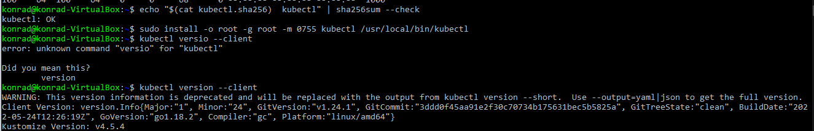

    Uruchomienie minikube:

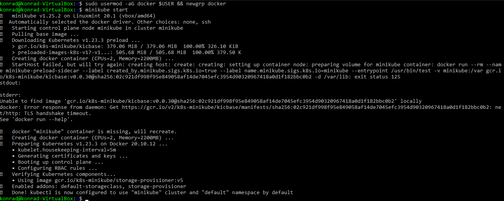

    Dashboard:

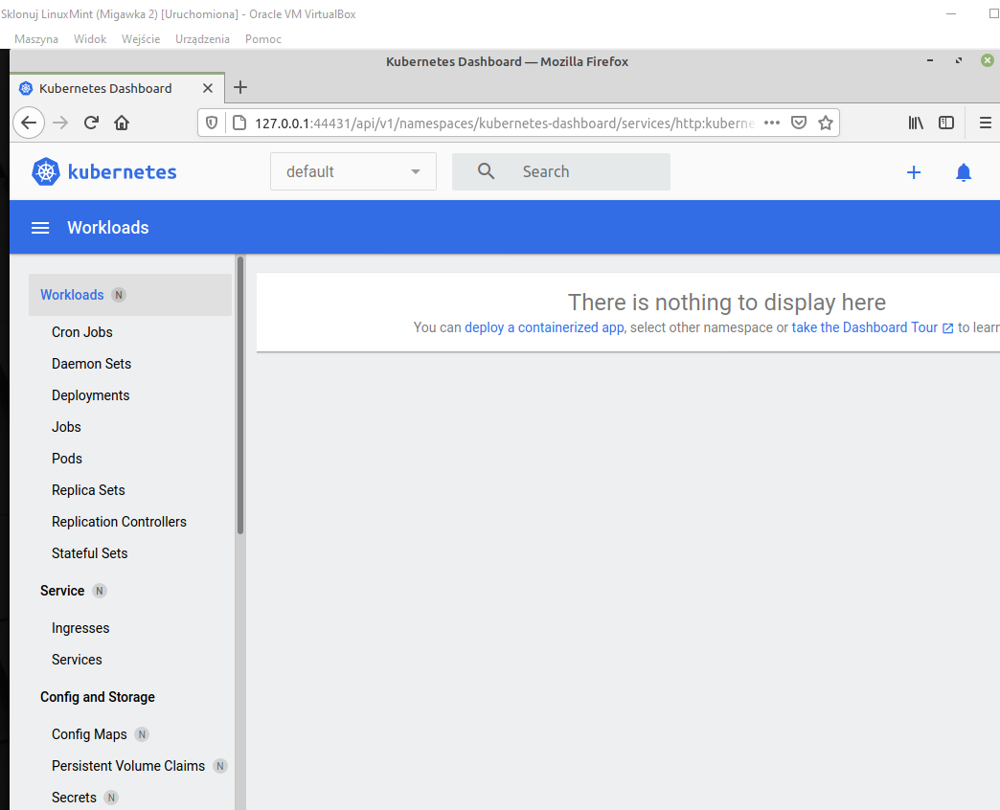

    Kontener minikube:

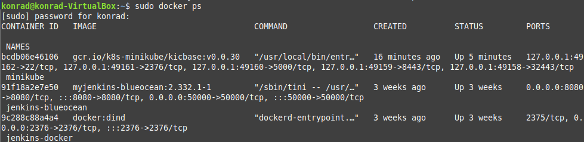

    Utworzenie node (nginx)

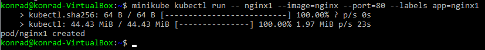

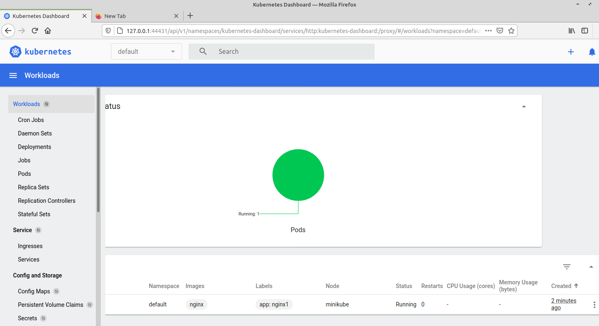

    Przekierowanie portów:

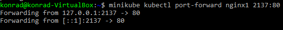

    Sprawdzenie czy aplikacja działa na ustawionym porcie:

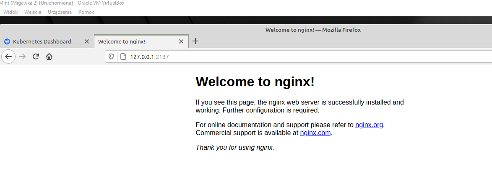

    Jak widać pokazała się informacja o nawiązaniu połączenia:

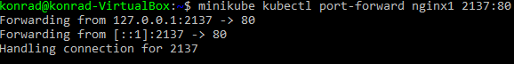

    Utorzenie pliku deploymentnginx.yaml i utworzenie na jego podstawie podów:

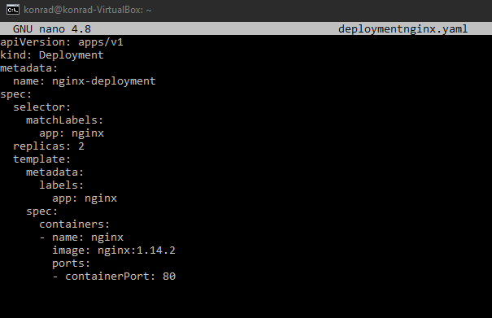

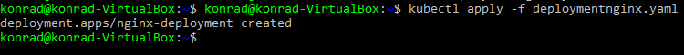

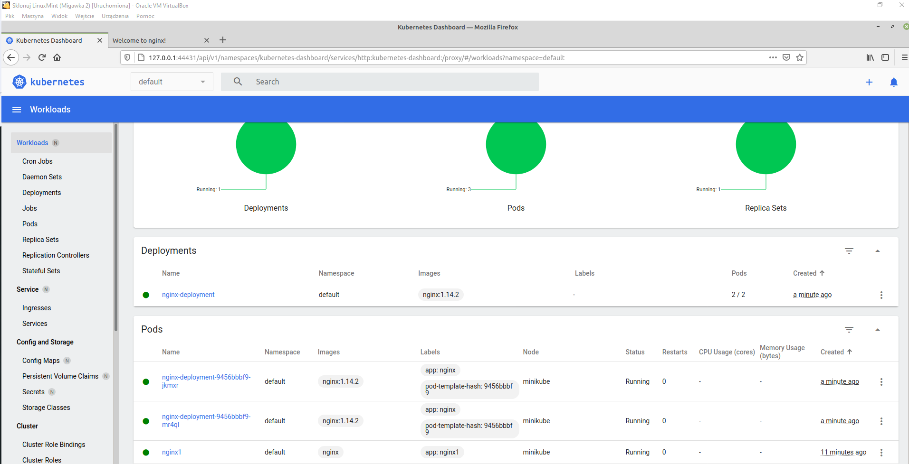

