<h1>Sprawozdanie z Lab12</h1>

<h3> Konrad Krzempek</h3>
grupa lab 4

Wykonanie ćwiczenia:

    Zmiana ilości podów na 4:
   
     W pliku z poprzednich zajęć zmieniona została liczba podów z 2 na 4
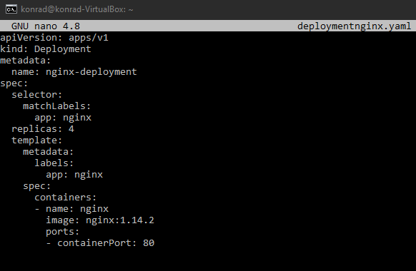

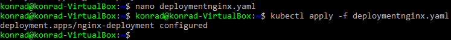

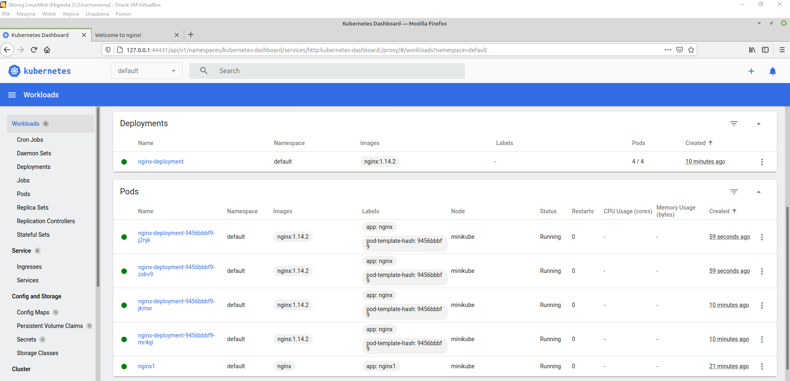

    Sprawdzenie stanu "Kubectl rollout status" 

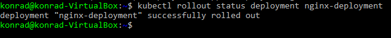

    Stworzenie obrazu nginx, który ma zwracać błąd

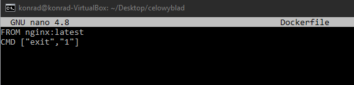

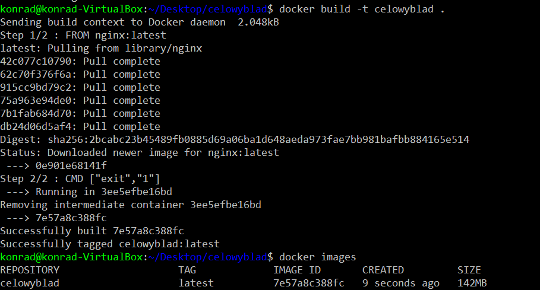

    Ustawienie ilości replik na 9

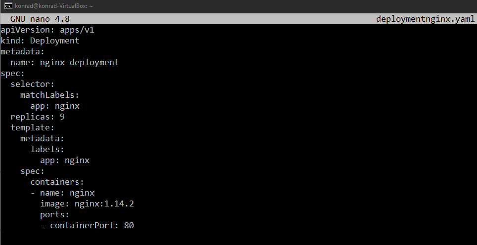

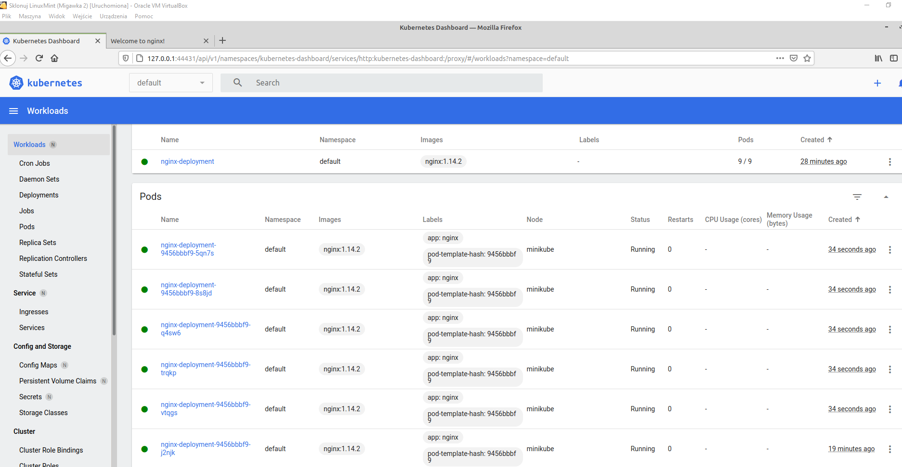

    Ustawienie ilości replik na 1

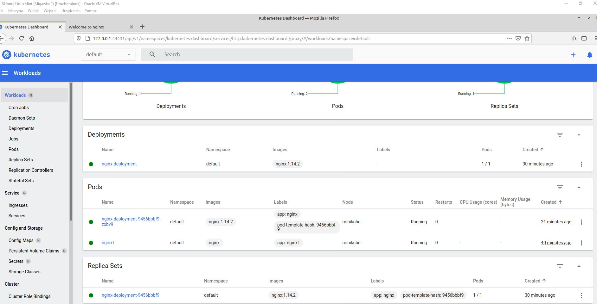

    Usunięcie wszystkich podów poprzez ustawienie ilości replik na 0

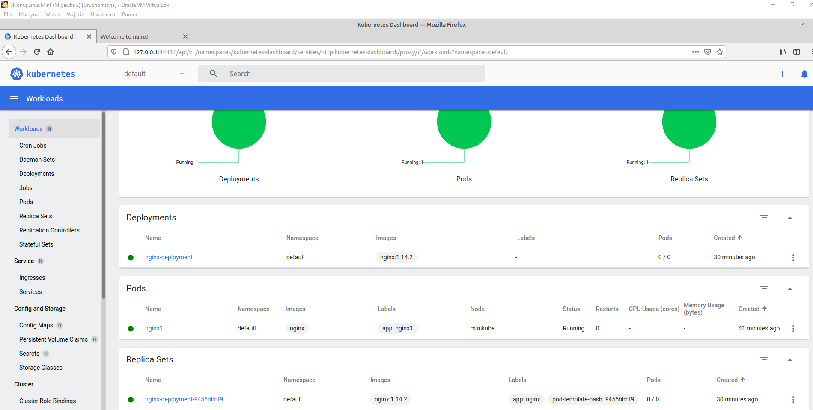

    Zmiana wersji obrazu na nowszą:

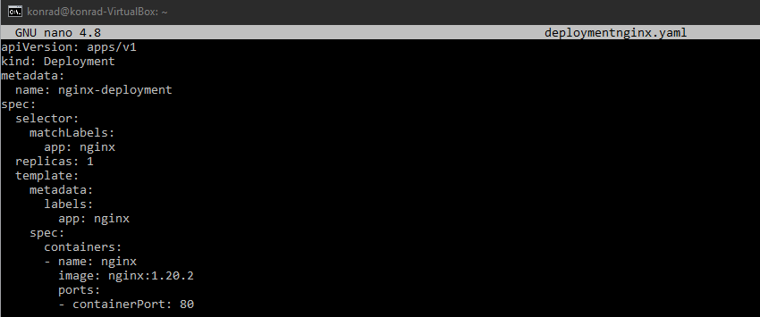

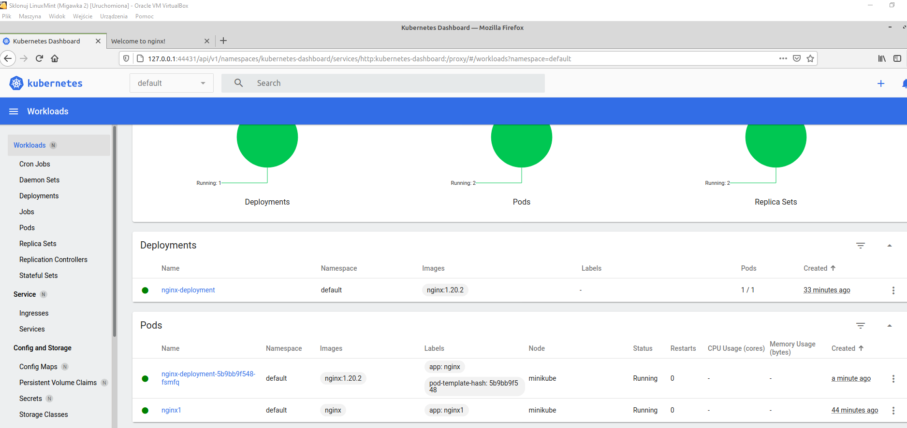

    Zmiana wersji obrazu na nie działającą:

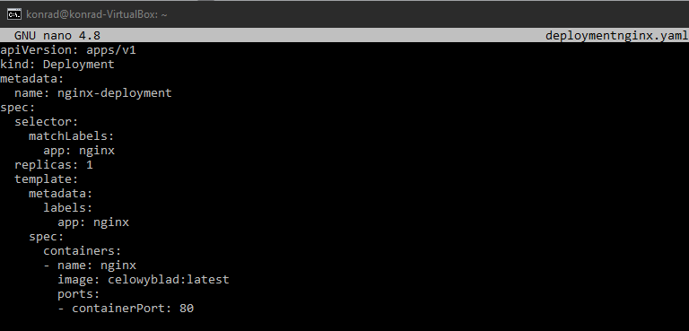

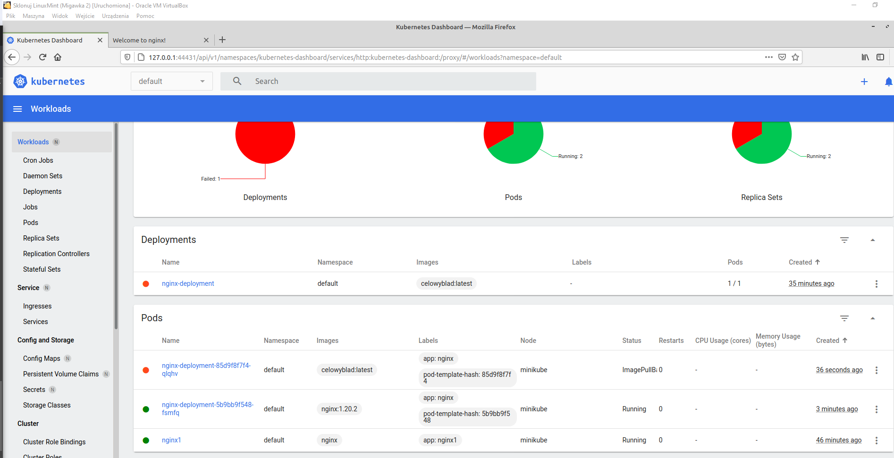

    Uzycie rollout history w celu pokazania histori zmian, a następnie wrócenie do działającej wersji z użyciem komendy rollout undo:

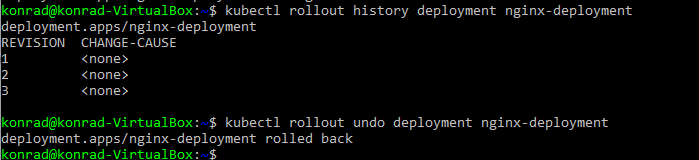

    Describe deployment:

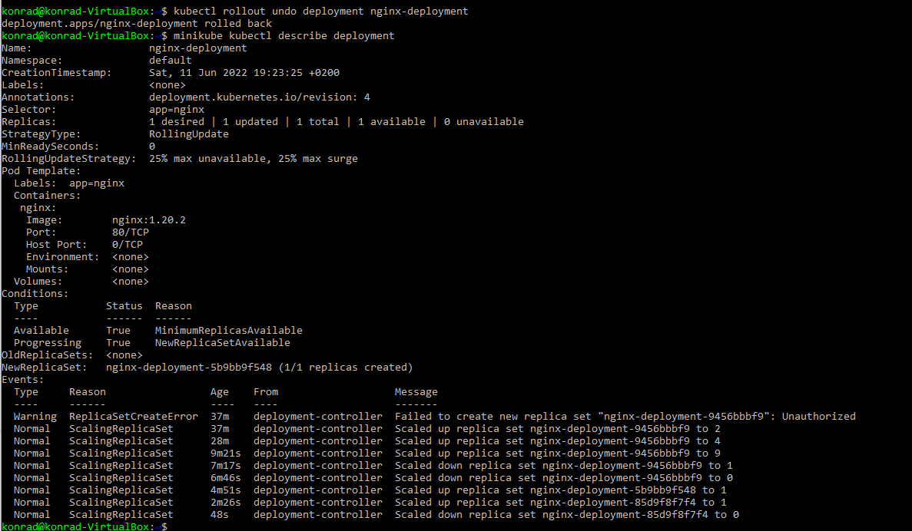

<h2>Różnice między Recreate, rolling update i canary deployment workload:</h2>

Recreate w odróżnieniu od pozostałych 2 strategii wdrożeń nie zapewnia ciągłości działania aplikacji, ponieważ zabija wszystkie pody przed powstaniem nowych. Canary Deployment workload pozwala na wdrażanie nowej wersji w taki sposób że działa ona równolegle ze starą wersją i stara wersja jest wygaszana dopiero w momencie gdy nowe wdrożenie będzie działać poprawnie.