# *Część 2*

## Konwersja wdrożenia ręcznego na wdrożenie deklaratywne YAML

- plik yml 4 repliki

  

  ```
  apiVersion: apps/v1
  kind: Deployment
    metadata:
      name: nginx-deployment
  spec:
    replicas: 4
    selector:
      matchLabels:
        app: nginx-deployment
    template:
        metadata:
          labels:
            app: nginx-deployment
        spec:
          containers:
          - name: nginx-dep
            image: nginx
            ports:
            - containerPort: 80 
  ```

- ```
  kubectl apply -f nginx-deployment.yml
  ```

  

  

- zbadanie stanu 

  ```
  kubectl rollout status -f nginx-deployment.yml
  ```

  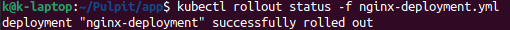


## Przygotowanie nowego obrazu

- wybrany został obraz [nginx](https://hub.docker.com/_/nginx?tab=description). ma on więcej niż 2 wersje. Dwie z nich to np. ```latest``` oraz ```1.20.2```. Pierwsza z ich jest tą bez określonego tagu.

  


## Zmiany w deploymencie

Aktualizowanie pliku YAML z wdrożeniem i przeprowadzanie ich ponownie po zastosowaniu następujących zmian:

- zwiększenie replik

  Zwiększono ```replicas``` z 4 na 5. Następnie użyto polecenia 

  ```
  kubectl apply -f nginx-deployment.yml
  ```

  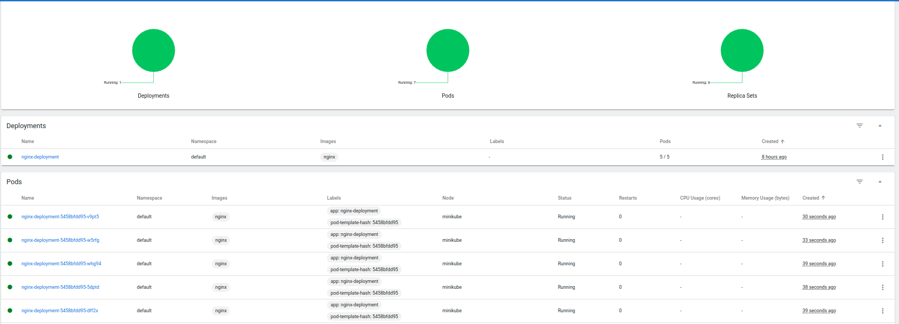

- zmniejszenie liczby replik do 1

  Liczba podsów wynosiła 5/1, a następnie 1/1

  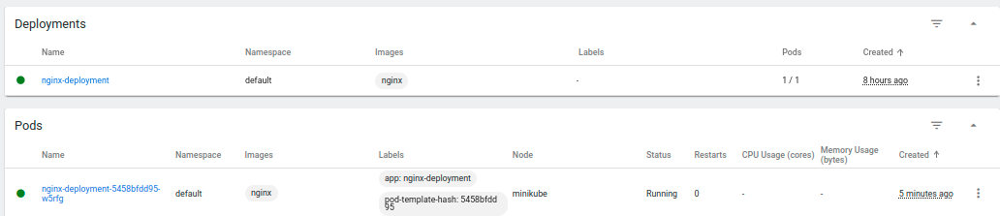

- zmniejszenie liczby replik do 0

  Liczba podsów wynosiła 1/0, a następnie 0/0

  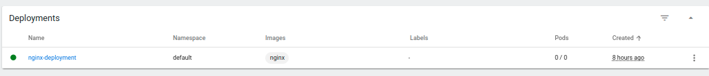

- Zastosowanie nowej wersji obrazu

  zastosowanie ```image: nginx:latest``` i zmiana ```replicas``` z 0 na 2

  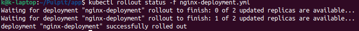  


- Zastosowanie starszej wersji obrazu

  zastosowanie ```image: nginx:1.20.2```

  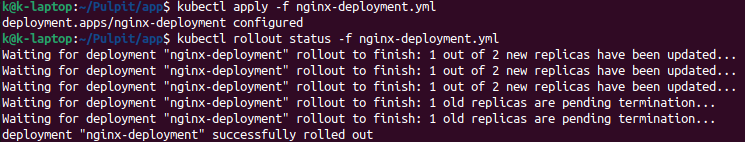 

- historia wdrożeń 

  ```
  kubectl rollout history deployment/nginx-deployment

  kubectl rollout undo deployment/nginx-deployment --to-revision 2
  ```

  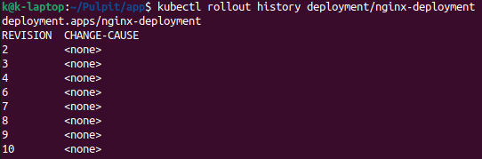 

  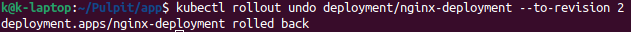 


## Kontrola wdrożenia

- skrypt weryfikujący, czy wdrożenie "zdążyło" się wdrożyć (60 sekund)

  ```
  #!/bin/bash
  kubectl apply -f nginx-deployment.yml
  sleep 60
  kubectl rollout status deployment/nginx-deployment
  if [ "$?" -ne 0 ]; then
    echo "Fail od deploy"
  else
    echo "Worked"
  fi
  ```
  
  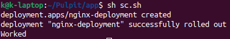 

## Strategie wdrożenia

Wersje wdrożeń stosujące następujące strategie wdrożeń + różnice:

- Recreate
  
  W sekcji ```spec``` dodano 

  ```
  strategy:
    type: Recreate
  ```

  W strategii tej najpierw usuwane są wszystkie pody, a następnie uruchamiane nowe.

  

- Rolling Update

    W sekcji ```spec``` dodano 

  ```
  strategy:
    type: RollingUpdate
    rollingUpdate:
      maxSurge: 1
      maxUnavailable: 1
  ```

  oraz zmieniono obraz na starszą wersję.

  Ustawiono:
  ```maxUnavailable``` na 1 co oznacza, że podczas wdrażania tylko 1 pod może być niedostępny.
  
  ```maxSurge``` również ustawiono na 1, co oznacza, że podczas wdrażania może zostać uruchomiony tylko jeden dodatkowy port (5/4).

  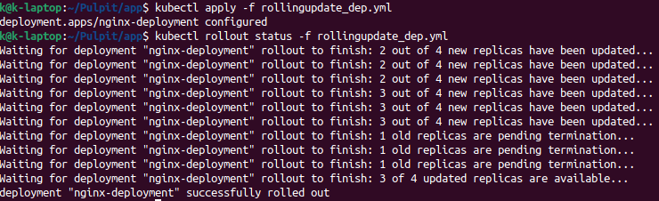

  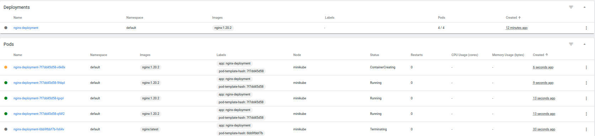

  W strategii tej pody nie są usuwane jednocześnie. Można zauważyć, że jeden pod ma status terminating, a reszta podów działa poprawnie na starym obrazie. Dwa pody były tworzone (na drugim zrzucie jest już tylko jeden - nie zdążyłam zrobić screena). Jednak oznacza to, że ```maxSurge``` nie było przekroczone.

- Canary Deployment workload

  Stworzono dwa deploymenty, które różnią się ```version``` - pierwszy "1.0" drugi "2.0".

  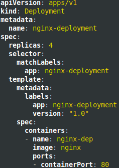

  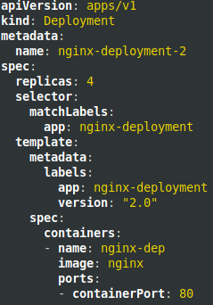

  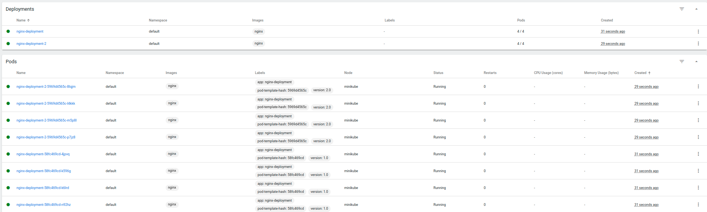

  W strategii tej obie wersje działają równolegle.
