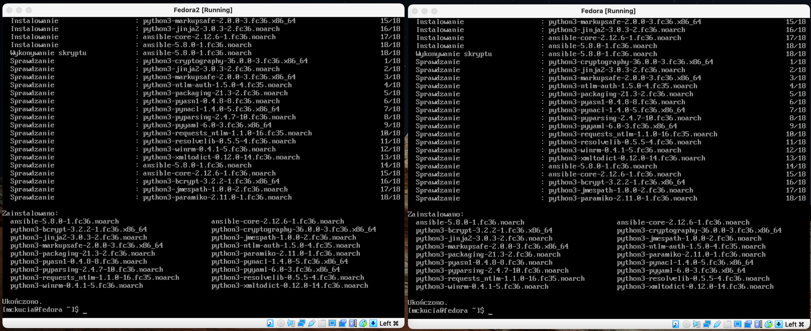
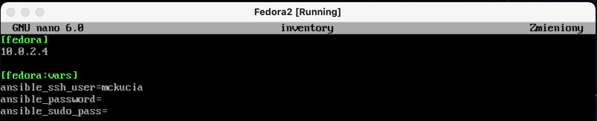

# Laboratorium nr. 10
##### 1. Uruchomienie dwóch maszyn z fedorą, zainstalowanie narzędzi ssh. Przetestowanie poleceniem `ping`.

##### 2. Stworzenie pliku `ansible.cfg`

##### 3. Stworzenie pliku `inventory`, który określa docelowy adres IP, użytkownika oraz hasło.

##### 4. Wykonanie ping do hosta za pomocą `ansible fedora -m ping`
