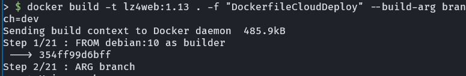
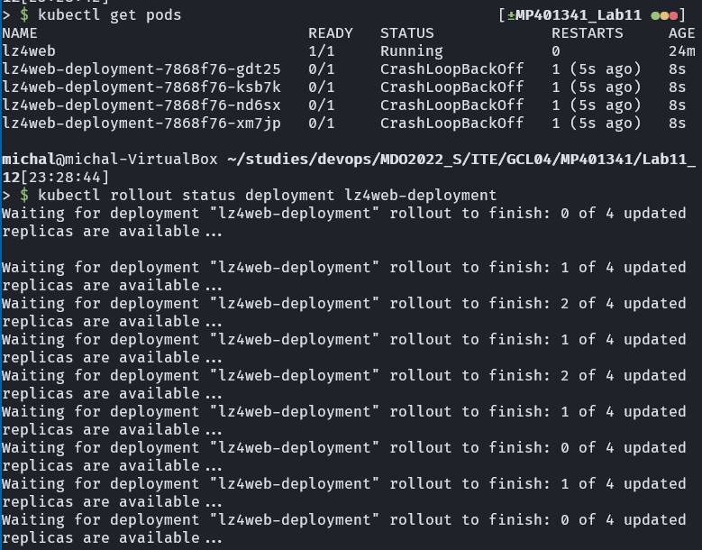
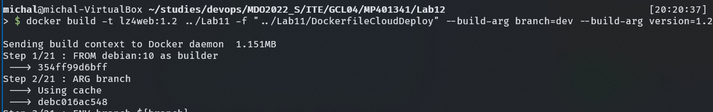
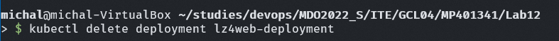
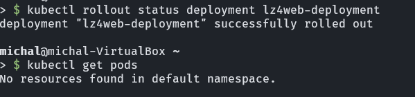
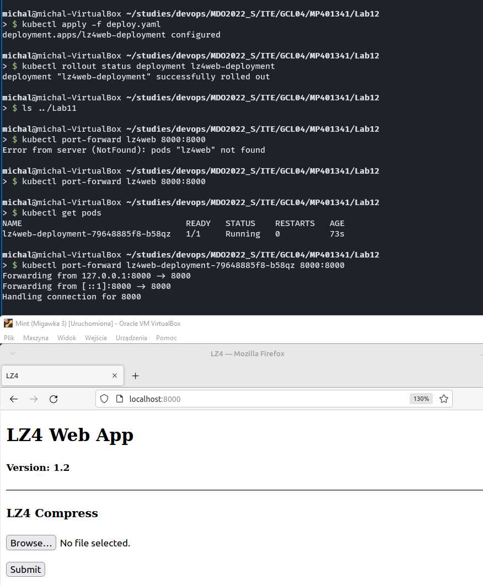
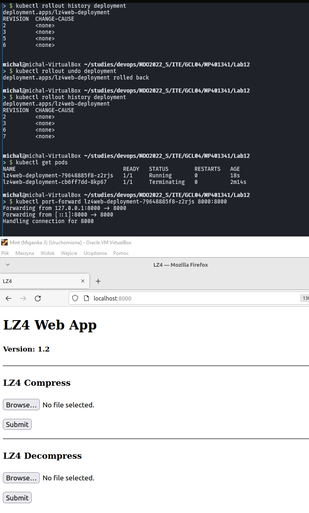
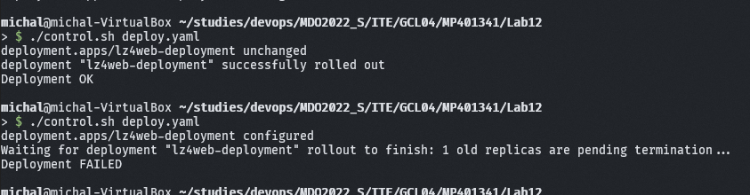
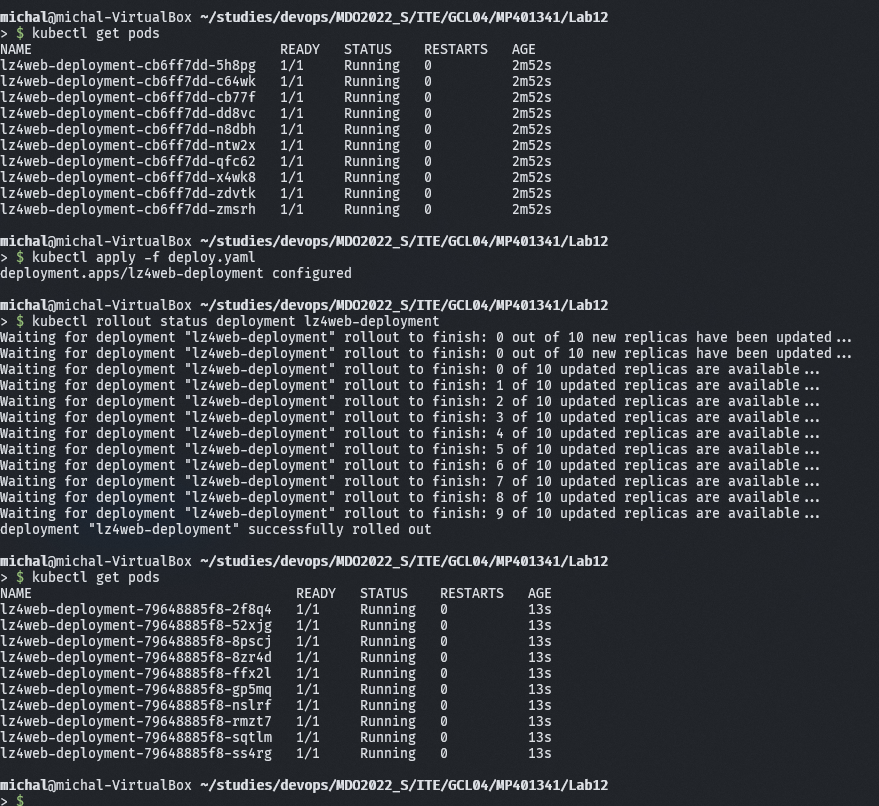
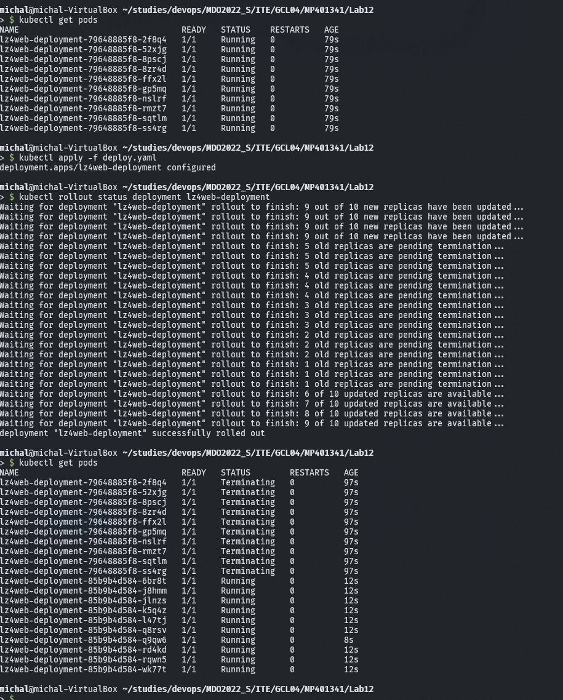

# Sprawozdanie Lab 12 - 09.06.2022

1.  Zmieniono liczbę replik na cztery i przeprowadzono deployment. Zadziałał poprawnie

    ```yaml
    replicas: 4
    ```

    

2.  Utworzono obraz 1.13, któremu nie przekazano numeru wersji. Aplikacja powinna wyrzucić błąd przy próbie uruchomienia. Zmieniono numer wersji w Deploymencie i przetestowano zmiany. Procedura deploymentu cały czas restartuje pody aż zaczną odpowiadać, get pods pokazuje jednak błąd CrashLoopBackOff.

    

    ```yaml
    template:
      metadata:
        labels:
          app: lz4web
      spec:
        containers:
          - name: lz4web
            image: lz4web:1.13
    ```

    

3.  Utworzono obraz 1.2 który uruchamiał się prawidłowo

    

4.  Usunięto poprzedni deployment, przywrócono wersję 1.0 i rozpoczęto testy z punktu "Zmiany w deploymencie"

    

5.  Zmieniono liczbę replik na zero. Status pokazał, że deployment powiódł się. Utworzone zostało zero podów

    ```yaml
    replicas: 0
    ```

    

6.  Zmieniono liczbę replik na jedną. Status pokazał, że deployment powiódł się. Utworzony został jeden pod

    ```yaml
    replicas: 1
    ```

    

7.  Zmieniono wersję obrazu na wersję 1.2

    ```yaml
    template:
      metadata:
        labels:
          app: lz4web
      spec:
        containers:
          - name: lz4web
            image: lz4web:1.2
    ```

    

8.  Zastosowano wersję 1.0

    ```yaml
    template:
      metadata:
        labels:
          app: lz4web
      spec:
        containers:
          - name: lz4web
            image: lz4web:1.0
    ```

    

9.  Przywrócono wersję 1.2 przy pomocy rollback. Najpierw wyświetlono historię wersji. Wykonanie rollback'a dodało kolejną wersję do historii

    

10. Utworzono skrypt do kontroli wdrożenia z wykorzystaniem komenty timeout, jej zadaniem jest zwrócenie błędu gdy wywołany nią proces nie zakończy się po określonej ilości czasu. Do skryptu dodano argument wpisywany z terminala co pozwala na używanie tego skryptu z różnymi plikami deploymentu.

```bash
      #!/bin/bash
      minikube kubectl apply -- -f $1
      timeout 30 minikube kubectl rollout status -- -f $1
      if [ $? -eq 0 ]
      then
        echo "Deployment OK"
      else
        echo "Deployment FAILED"
      fi
```

11. W celu przetestowania skryptu, uruchomiono deployment z wersją 1.0, po czym zmieniono na nie działającą wersję 1.13. Skrypt wyświetlił odpowiednie komuniakty

    

12. Strategie - Testy wykonane z ilością podów ustawioną na 10

    1. Recreate - na miejscu starej wersji tworzymy kontener z nową usuwając starą

    ```yaml
    strategy:
      type: Recreate
    ```

    

    2. Rolling Update - strategia znacznie częściej wykorzystywana. Jest też bardziej złożoną strategią, która definiuje zmienne maxSurge i maxUnavailable wyrażane procentowo. Rolling update polega na gradiacyjnym wprowadzaniu nowych podów. Zmienną maxSurge definiujemy jaki procent podów może być tworzony jednocześnie, a zmienną maxUnavailable definiujemy jaki procent może być na raz niedostępny. W zareprezontowanym przykładzie widać sporą różnicę w porównaniu z pierwszą strategią. Nie wszystkie repliki zostały zaaktualizowane jednocześnie i wyznaczone minimalne % niedostępności i jednoczesnego rolloutu zostały spełnione.

    ```yaml
    strategy:
    type: RollingUpdate
    rollingUpdate:
      maxSurge: 50%
      maxUnavailable: 40%
    ```

    

    3. Canary Deployment - nie jest to strategia dostępna przez atrybut strategy. Polega ona na załadowaniu dwóch kontenerów o różnych wersjach. Loadbalancer będzie przełączał się między nimi. Zależnie od odświeżenia strony możemy trafić na różną wersję aplikacji.

13. Podsumowanie

Prawdopodobnie najczęściej używaną taktyką jest rolling update, pozwala on największą niezawodność, oferując klientowi ciągły dostęp do aplikacji. Ciekawą taktyką jest Canary Deployment. Ten deployment jest powszechnie stosowany w celu betatestowania nowych funkcjonalności aplikacji, w wielu aplikacjach mobilnych i webowych można czasami zauważyć zmiany pojawiające się losowo, które dopiero z czasem stają się regularnym fragmentem aplikacji. Często stosowana jest także regionalizacja, wdrażając wersję beta zależną od lokalizacji użytkownika w ten sposób np. użytkownicy z jakiegoś kraju mogli być betatesterami danej funkcjonalności przed całym światem.
