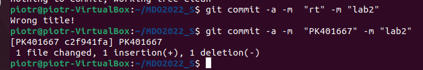
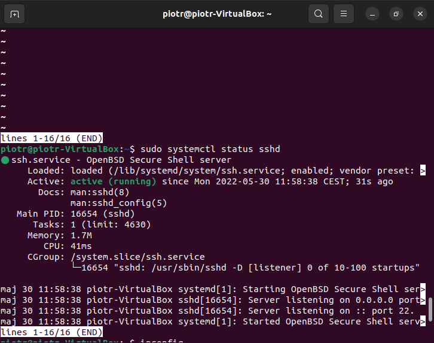
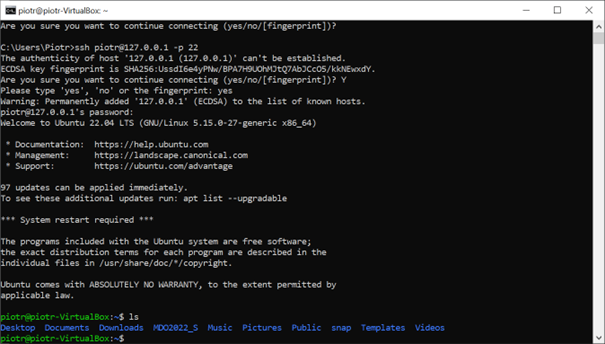
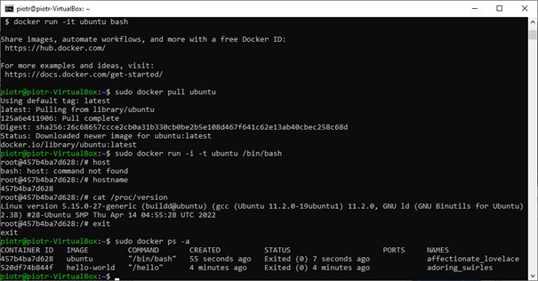

Sprawozdanie z laboratorium 2

Piotr Kulis GCL04

1. Git Hooks
	#!/bin/bash

	title=`head -n1 $1`
	if [ "$title" != "PK401667" ]; then
    		echo "Wrong title!"
    		exit 1
	fi

	while IFS= read -r line
	do
  		if [[ $line =~ $body_pattern ]]; then
    			exit 0
  		fi
	done < <(sed 1d $commit_file)

	echo "Invalid commit msg"
	exit 1
	
	W skrypcie został uwzględnione obie możliwość złego commita które zostały
	zawarte wpoleceniu a więc błędny tytuł i zawartość.
	
	
2. SSH
	Połączenie się przez cmd z Windowsa do Ubunutu na VM za pomocą SSH, w tym 
	celu została uruchomiona usługa ssh na Linuxie co prezentuje poniższy
	zrzut.
	
	
	Po uruchumienie udało się połączyć z poziomu CMD
	
	
	
3. Docekr
	Następnie został zainstalowany Docker.
	
	
	
	Następnie został stworzony obraz ubuntu.
	
	
	
	Obraz został pobrany popranie i uruchominy.
	
4. Docker Hub
	Na zakończenie założone zostało konto na serwisie Docker Hub
	
	![dockerHub] (Dockerhub.png "dockerHub")
	
