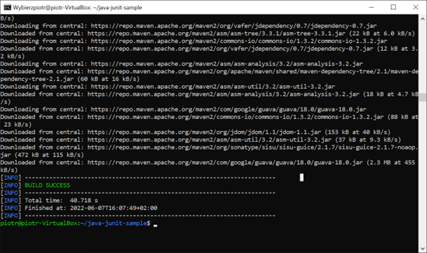
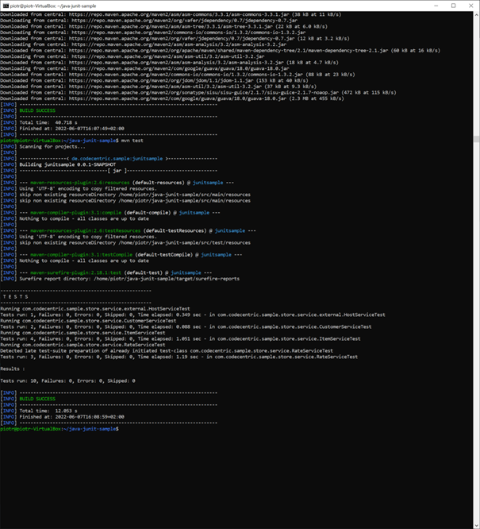
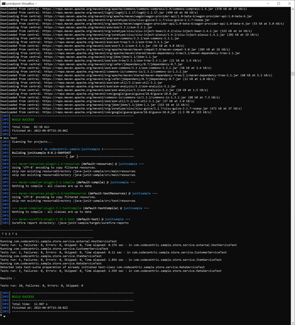
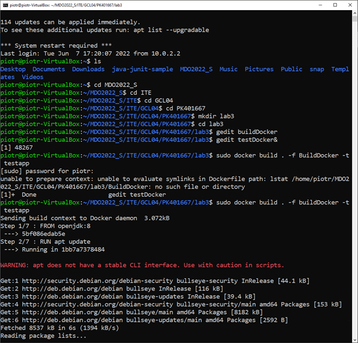

Sprawozdanie z laboratorium 3

Piotr Kulis GCL04

1. Bild localny
	Na początku zostało sklonowane repozytrium: 
		https://github.com/ThomasJaspers/java-junit-sample
	
	Po utworzeniu lokalnej kopi repozytorium, została podjęta próba
	uruchomienia go z wykorzystaniem maven-a. Konieczna była jego instalacja
	oraz zmiana wersji openjdk z 11 na 8.
	
	Zrzut przedstawia zakończenie budowania lokalnego.
	
	
	
	Zbudowano poleceniem mvn clean package -DSkipTests.
	Następnie zostały uruchomione testy poleceniem mvn.
	
	
	
2. Uruchomienie na kontenerze
	Następnie został utworzony obraz:
		sudo docker pull openjdk:8
	oraz uruchomiony poleceniem: 
		sudo docker run -it --name buildContainer openjdk:8 sh
	
	Po uruchomienu kontenera zostało sklonowane to samo repozytorium,
	początkowo nie udało się skopiować całego repo więc kontener został
	uruchomiony ponownie.
	
	Następnie została dokona ta sam operacja zmiany openjdk, co również
	sprawiło problem ponieważ najpierw musiał zostać zaktualizowany atp.
	
	Po sklonmowaniu repoytorium i doinstalowaniu koniecznych rzeczy udało 
	się odpalić na kontenerze builda i testy.
	
	
	
	Po zakończeniu pracy kontenera zostały napisane dwa Dockerfile, aby
	wszsytkie te kroki wykonywane były automatycznie.
	DockerBuild:
	
		FROM openjdk:8

		RUN apt update
		RUN apt -y upgrade
		RUN apt -y install maven

		RUN git clone https://github.com/ThomasJaspers/java-junit-sample.git

		WORKDIR /java-junit-sample/

		RUN mvn clean package -DSkipTests
		
	DockerTest:
		FROM testapp:latest

		WORKDIR /java-junit-sample/

		RUN mvn test
		
	
	
	Następnie zostały sprawdzone jeszcze jakie są utworzone obrazy dockerowe
	oraz uruchomino odpowiednie obrazy odpowiadjące za builda i testy.
	
	
		
