# Sprawozdanie Lab 11

Sławomir Kotula

IT, DevOps, grupa lab 4

Data: 11.06.2022

# Instalacja minikube
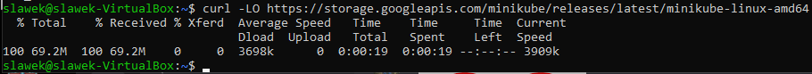
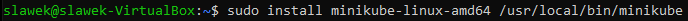
# Instalacja kubectl
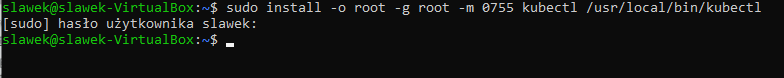
# Sprawdzenie poprawności instalacji
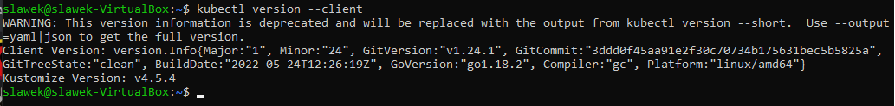
# Uruchomienie minukube
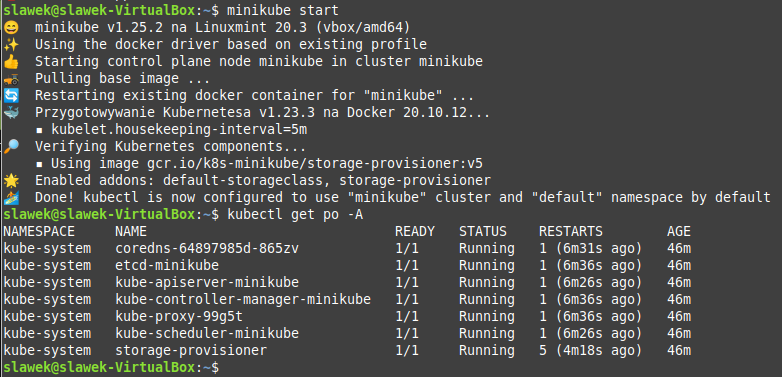
# Uruchomienie dashboard
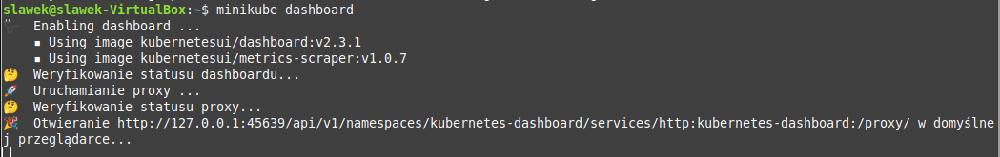
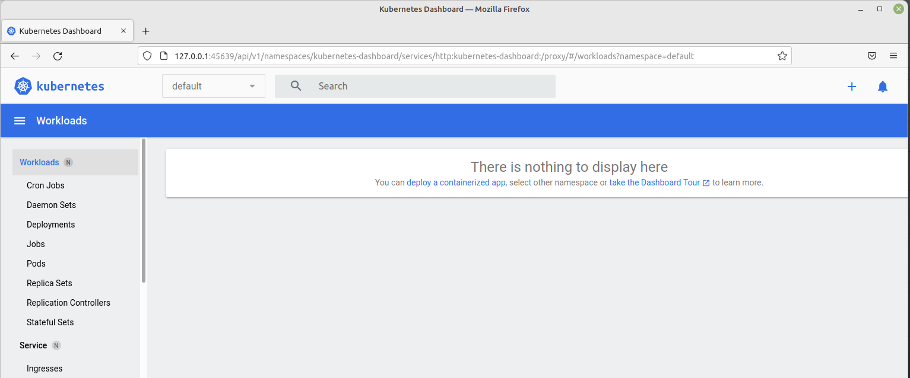
# Został stworzony kontener minikube
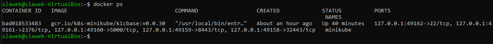
# Stworzenie node-a z nginx
```
minikube kubectl run -- wdrozenie-nginx --image=nginx --port=80 --labels app=wdrozenie-nginx
```
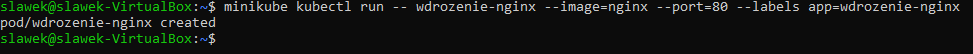
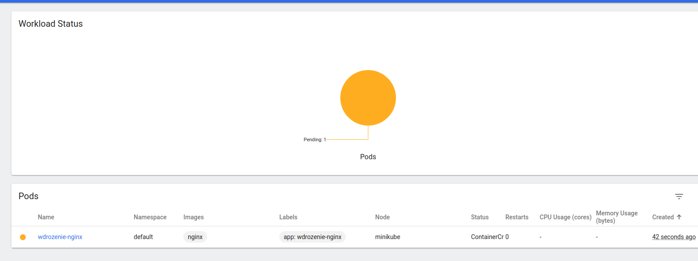
# Przekierowanie portów
```
minikube kubectl port-forward wdrozenie-nginx 1234:80
```
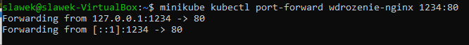
# Aplikacja działa na przekierowanym porcie
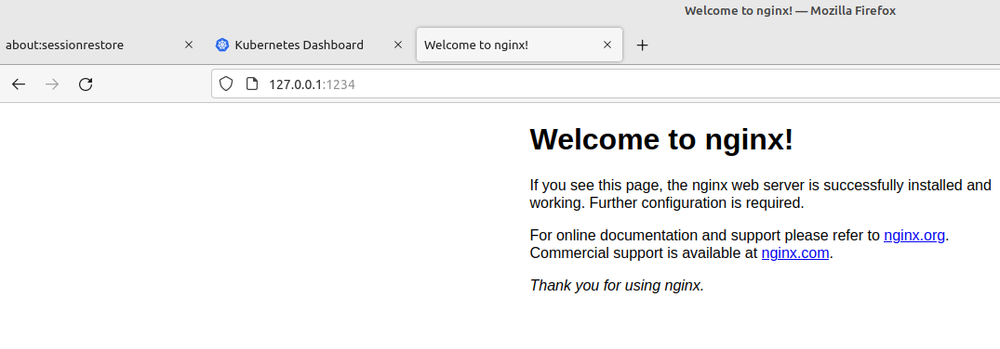
# Stworzono plik nginx-deploymnet.yaml
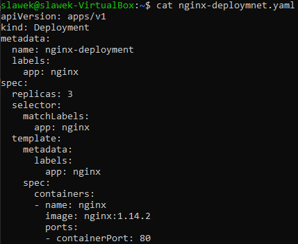
# Stworzono pody na podstawie pliku .yaml
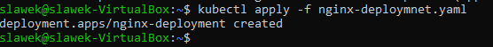
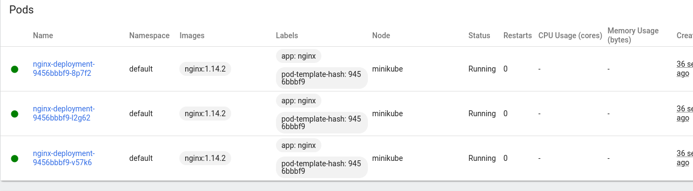