# Sprawozdanie Lab 12

Sławomir Kotula

IT, DevOps, grupa lab 4

Data: 11.06.2022
# Uruchomienie poda z czterema replikami
W plik <b><i>nginx-deploymnet.yaml</i></b> z poprzednich zajęć zwiększono ilość tworzonych replik do czterech przez zmianę kodu
```
spec:
  replicas: 3
```
na
```
spec:
  replicas: 4
```
Po wykonaniu polecenia ```kubectl apply -f nginx-deploymnet.yaml``` pody zostały stworzone:
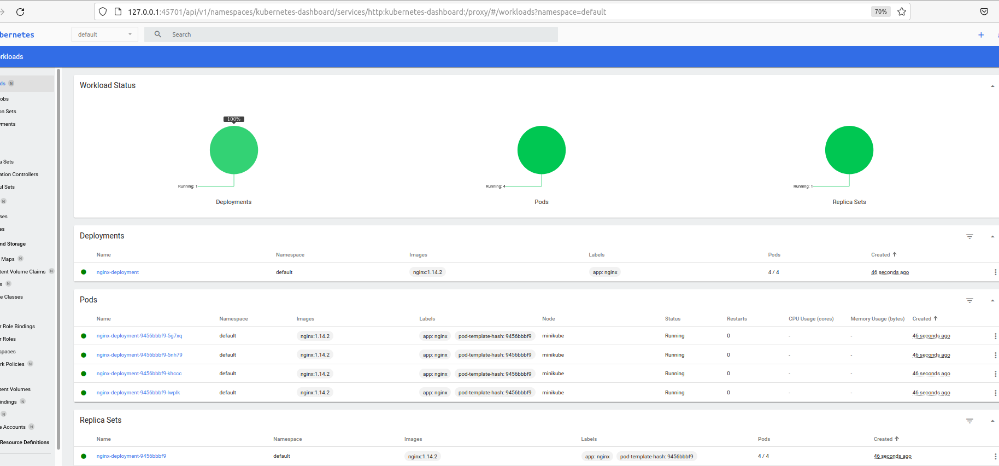
# Zbadaj stan za pomocą ```kubectl rollout status```
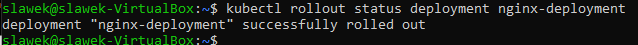
# Stworzono obraz nginx, który zwróci błąd przy uruchomieniu

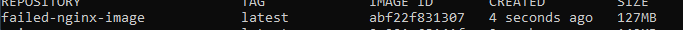
# Zmiany w deploymencie
## Zmiana ilości replik:
```
spec:
  replicas: 6
```
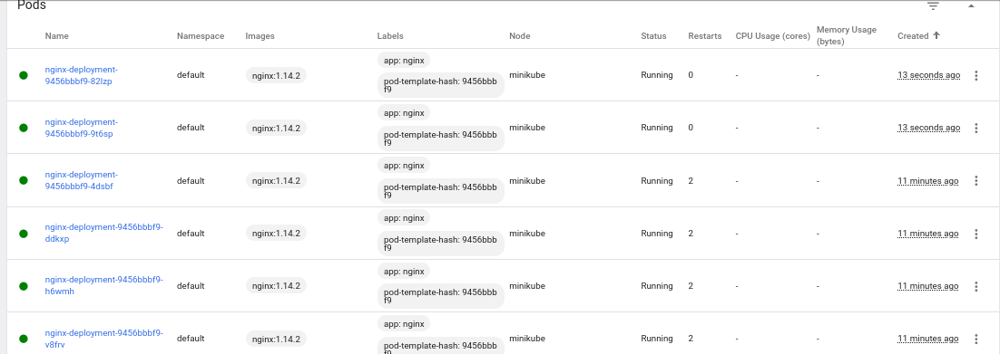
<br/><br/>

Zostawienie jednej
```
spec:
  replicas: 1
```
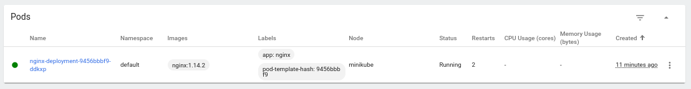
<br/><br/>

Usunięcie wszystkich podów
```
spec:
  replicas: 0
```
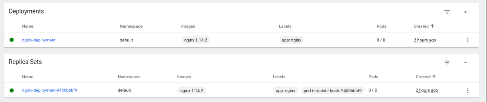
# Zastosowanie nowszej wersji obrazu
Po zaktualizowaniu wersji obrazu do nowszej stworzony został nowy, tymczasowy pod. Po chwili stare pody zostały zastąpione nowymi, podczas aktualizowania do nowej wersji aplikacja nigdy nie przestała działać.
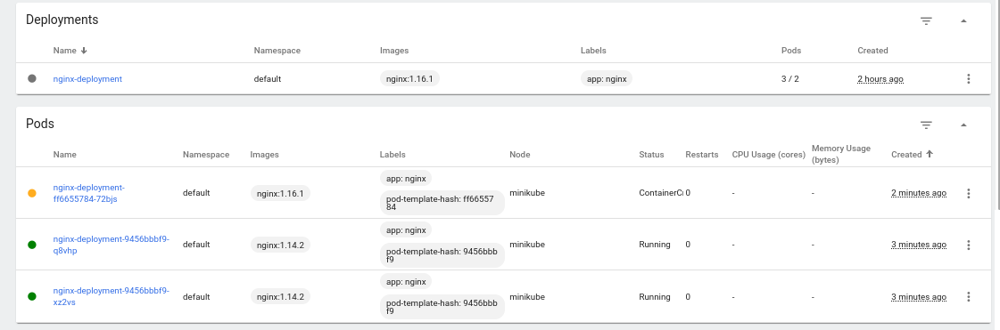
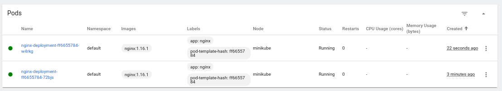

# Zastosowanie złej wersji obrazu
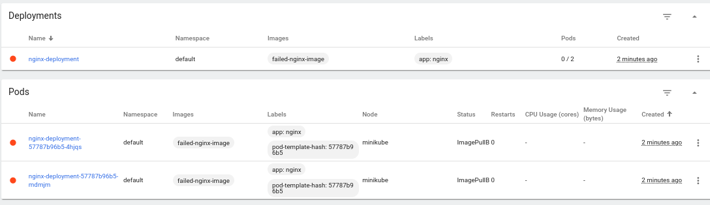
### ```kubectl rollout history deployment nginx-deployment```
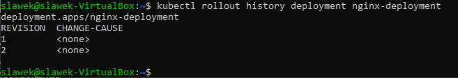
### ```kubectl rollout undo deployment nginx-deployment```
Wersja 

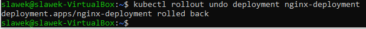
### ```minikube kubectl describe deployment```
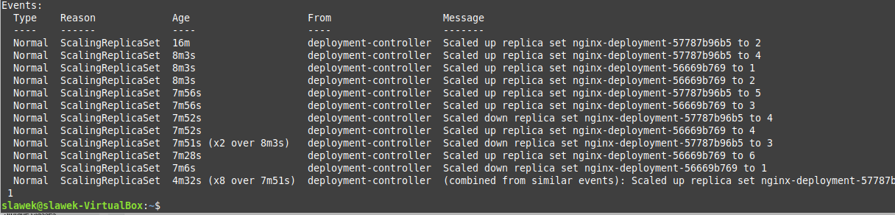