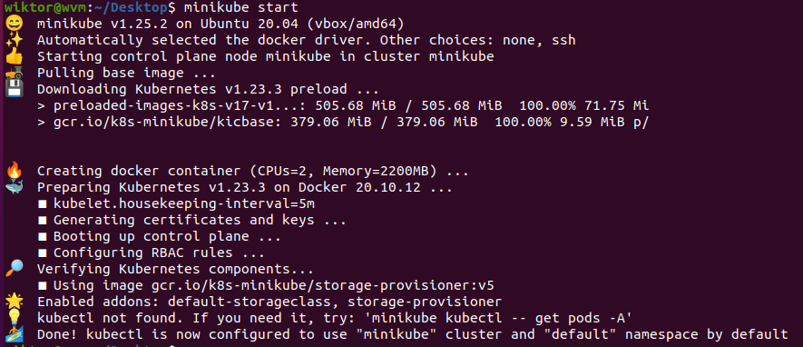
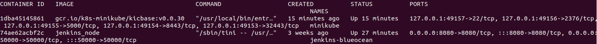
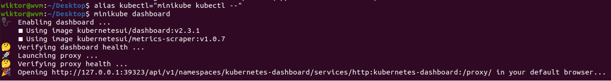
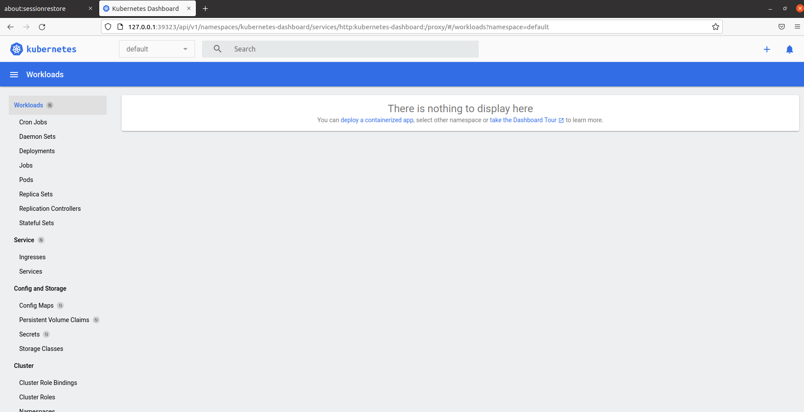
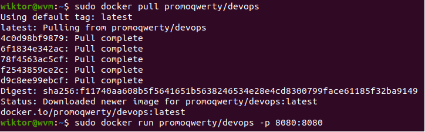
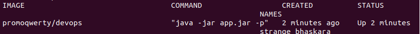
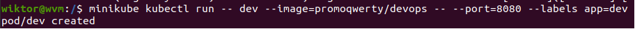
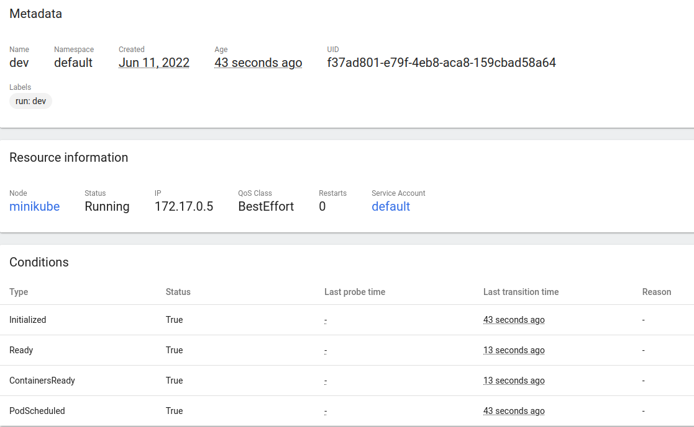
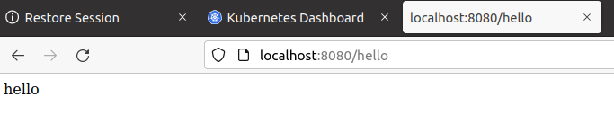
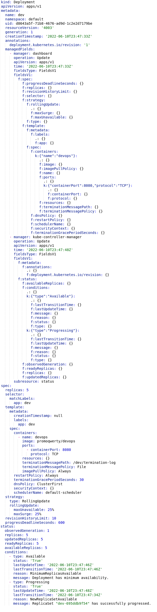

# 1. Instalacja

### Zgodnie z dokumentacją instaluję Kubernetesa wykorzystując instrukcję z dokumentacji.

### Uruchamiam dashboard i dodaję alias

# 2. Analiza 
### Korzystam z gotowego obrazu, zuplodowanego przeze mnie na dockerhuba.

### Kontener ten jak najbardziej działa

# 3. Uruchomienie oprogramowania na Kubernetesie
### Stawiam kontener na Kubernetesie za pomocą poniższego polecenia:

### Jak widać powyżej, został utworzony pod, który jest odpowiedzialny za aplikację. Widok w dashboardzie:

### Żeby potwierdzić poprawne działanie wchodzę także na port wyprowadzany przez aplikację

# 4. YAML
### Napisałem plik .yaml, niestety przez nieuwagę nie zrobiłem screena przed dokonaniem uploadu. Post factum Kubernetes dokonał modyfikacji pliku, przez co z pliku liczącego około 20 linii powstało prawie 150 linii

