# LAB 11 - Dominika Lazarowicz

### Minikube

Zadaniem Kubernetesa jest zarządzanie klastrem komputerów o wysokiej dostępności, działającego jako jedna całość. Poprzez swój system obiektów abstrakcyjnych, umożliwia uruchamianie aplikacji w kontenerach bez przypisywania ich do konkretnej maszyny.

Minikube to narzędzie, którego można użyć do uruchomienia Kubernetes (k8s) na komputerze lokalnym. Tworzy klaster z jednym węzłem w maszynie wirtualnej (VM). Umożliwia on demonstrację operacji Kubernetes bez konieczności czasochłonnej i zasobochłonnej instalacji pełnego K8s.

### Instalacja klastra

Dokonuje instalacji według oficjalnej strony producenta. Oprócz wykonania kroków z instrukcji należało doinstalować sterowniki. Pojawił się też problem z  KVM. Żeby go zdiagnozować i rozwiązać postępowałam zgodnie z tą podstroną:

https://minikube.sigs.k8s.io/docs/drivers/kvm2/

Po wykonaniu komendy `egrep -q 'vmx|svm' /proc/cpuinfo && echo yes || echo no` 

zwróciła odpowiedź "no" co oznaczało, że hipernadzorca nie zezwala na zagnieżdżoną wirtualizację.

Rozwiązaniem okazało się włączenie  Nested Virtualization z poziomu komputera poprzez komendę

`Set-VMProcessor -VMName <VMName> -ExposeVirtualizationExtensions $true`

Po wszystkich krokach udało się uruchomi minikube komendą`minikube start`

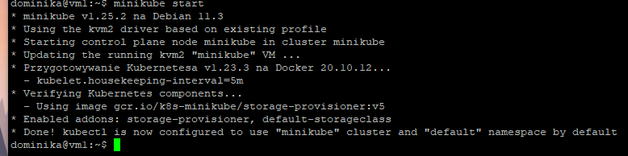

W tej wersji po wylistowaniu kontenerów dockerowych nie istniał na minikube. 

Dopiero usunięcie wystartowanego minikuba i ponowne uruchomienie z flaga --driver=docker pozwoliło uruchomić kontener dockera.

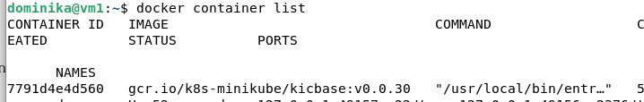

Zaopatruje się w polecenie *kubectl*

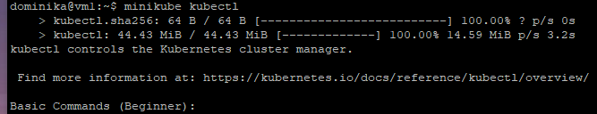

Komenda minikube dashboard uruchomiłam Dashboard w celu przedstawienia łączności:

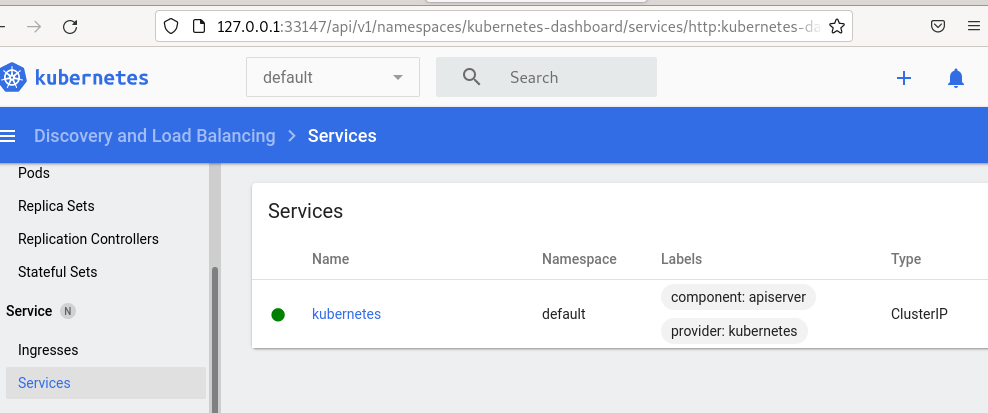

# Analiza posiadanego kontenera i uruchamianie oprogramowania

W tym puncie zajełam się wdrożeniem aplikacji

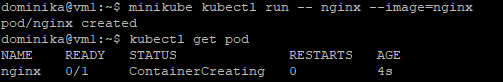

W sumie uruchomiłam 2 obrazy  : 

 - redis:alpine na porcie 6379

 - nginx na porcie 5000

W dalszej częsci będę pracować na obrazie nginx. 

W całym procesie opierałam się o oficjalną dokumentacje, gdzie właśnie ten obraz jest używany.

https://kubernetes.io/docs/concepts/workloads/pods/

Uruchomienie localhosta

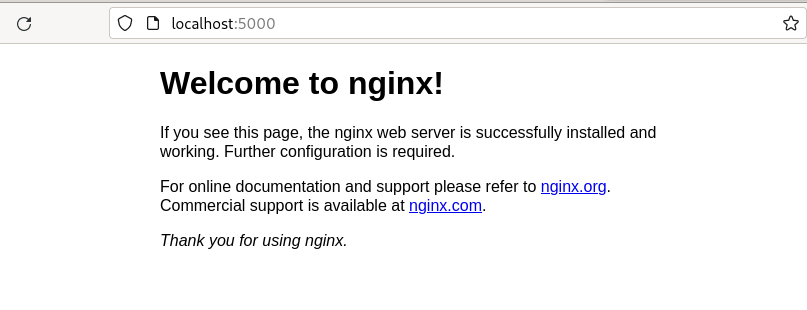

Widok dashbordu

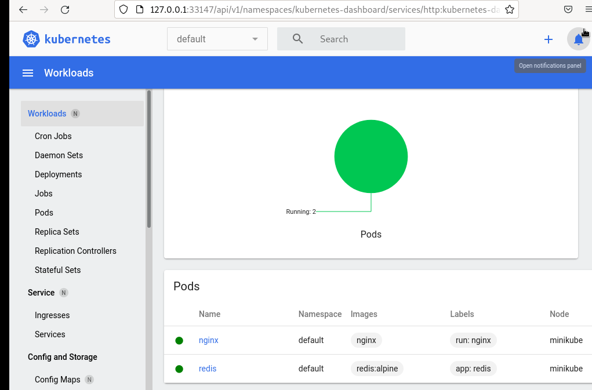

# Plik wdrożenia

Utworzyłam plik deploy.YAML dla wdrożenia 3 podów nginxa:

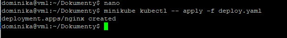

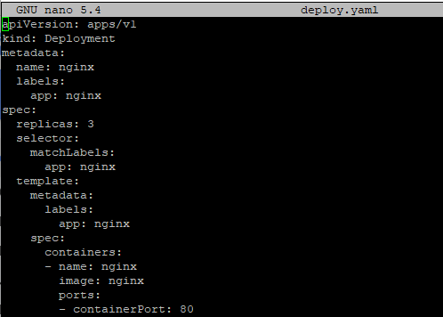

Po uruchomieniu  widzimy łącznie 5 pod'ów (2 stworzone wcześniej + 3 z plikku YAML)

Widok z dashboard'u

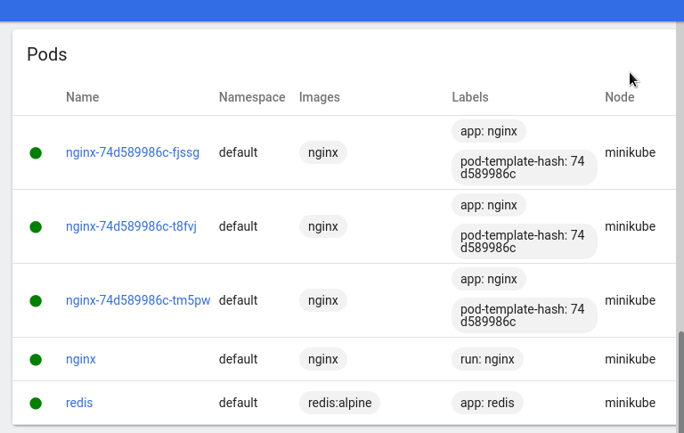

Widok z konsoli

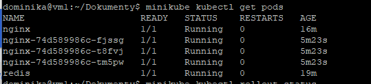

