# LAB 12 - Dominika Lazarowicz
Ćwiczenie będę kontynuować z użyciem dokumentacji https://kubernetes.io/docs/concepts/workloads/controllers/deployment/

Jako, iż chciałam zacząć "na czystko" usunęłam poprzedni klaster poleceniem `minikube delete`.

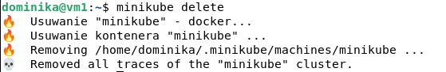

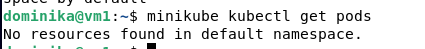


Zmodyfikowałam  plik deploy.yaml by stworzyc 4 pod'y 

(do pola `replicas` w sekcji`spec` wprowadzam  liczbę `4`). Flaga -f oznacza tu filename.

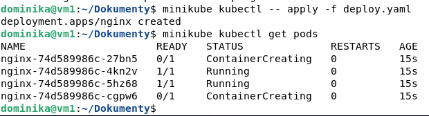

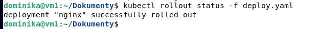


Sprawdzam wdrożenie na dashboardzie:

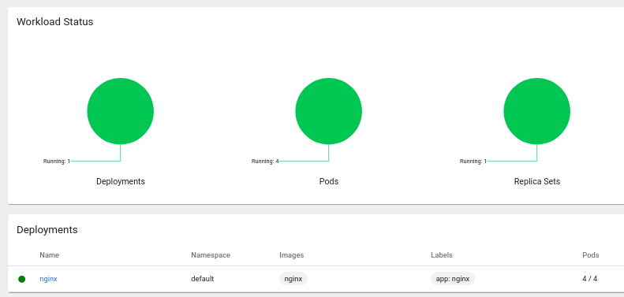

### Zmiany w deploymencie

Dokonuję ponownych wdrożeń z kolejną modyfikacją następujących zmian:

- zwiększam liczbę replik do 6

  - Widok podczas wgrywania

  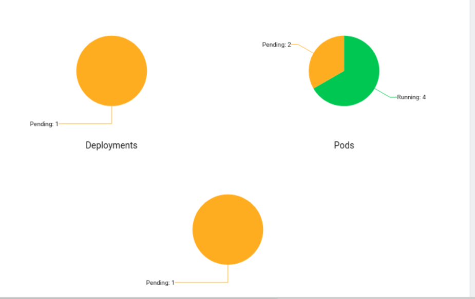

  - Widok po wgraniu

    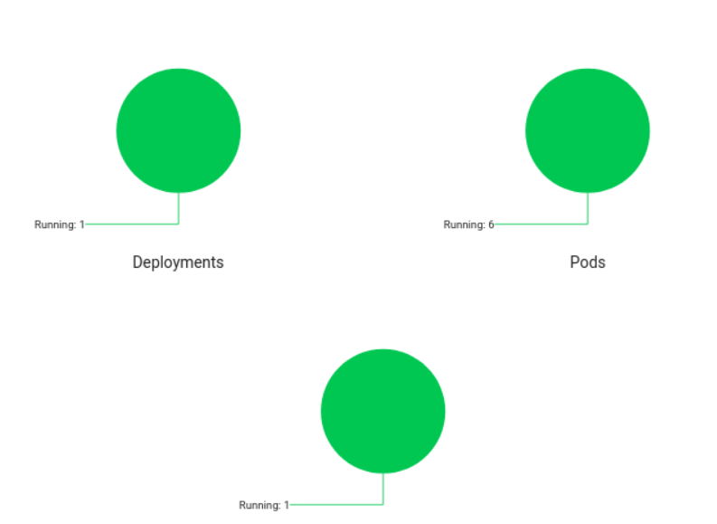

- Zmieniam liczbę replik na 0

  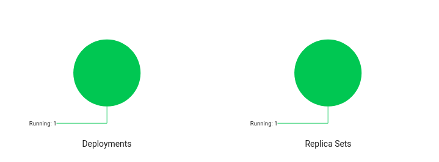

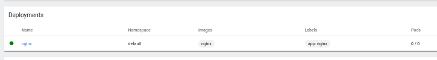

W trakcie wprowadzania tych zmian można było zauważyć, że w trakcie zmniejszania liczby podów działają one przez chwilę zanim zostaną usunięte. 

Przy liczbie podów równej zero można zauważyć w dashboardzie, że graficzne przedstawienie podów zniknęło, jednkaże deployment i replica sety nadal są aktywne.

# Przygotowanie nowego obrazu

W celu przygotowania niedziałającego obrazu tworzę prosty plik Dockerfile.

Zwraca on wartość 1 jako kod błędu.

```
FROM nginx:1.22.0
CMD [ "exit", "1"]
```

### 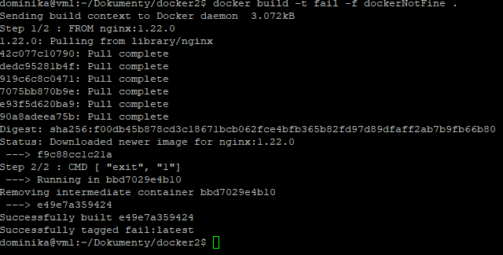

Obraz został zbudowany prawidłowo

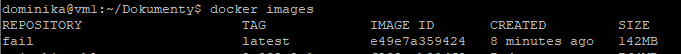


Próba deploy'u z nieprawidłowym obrazem

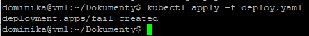


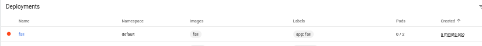


## Kontrola wdrożenia

1. Przygotowano skrypt bashowy, który przyjmuje dwa argumenty: nazwę pliku wdrożenia yaml i nazwę deploymentu do sprawdzenia. Następnie wykonano testy dla wdrożenia obrazu z tagiem latest.

- Rozpoczynam od wrzucenia do skryptu wszystkich poleceń, które wykonywałam do tej pory związanych ze wdrożeniem: delete, apply, rollout.
- Komendą `timeout 60` na rolloucie kontroluję to czy wdrożenie wykonało się poprawnie. Jeśli w ciągu 60s wykona się poprawnie zostaje wyświetlony odpowiedni komunikat, jeśli nie to użytkownik również jest o tym poinformowany.

```
#!/bin/bash

minikube kubectl apply -- -f deploy.yaml
timeout 60 
minikube kubectl rollout status -- -f deploy.yaml
if [ $? -eq 0 ]
then
    echo "Success"
else
    echo  "Failed"
fi
```

Deploy successed:

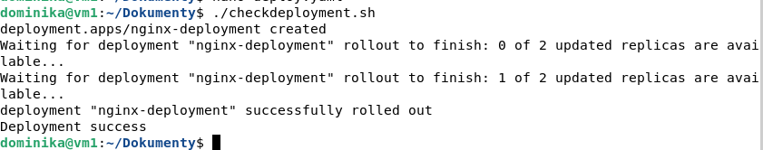

Deploy failed:

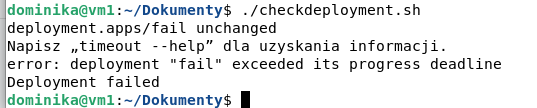

# Strategie wdrożenia

## Recreate

Strategia typu Recreate spowoduje zakończenie wszystkich uruchomionych wystąpień, a następnie ponowne ich utworzenie w nowszej wersji. Była używana w wcześniejszych wdrożeniach

```
...
  strategy:
    type: Recreate
 ...
```

## Rolling update

Pozwala prowadzić aktualizację w ramach Deploymentu bez przerw w jego działaniu dzięki krokowemu aktualizowaniu kolejnych Podów. 
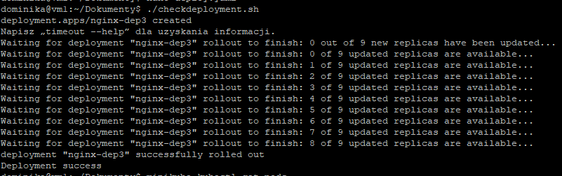

## Canary

Wdrożenia Canary to wzorzec wdrażania wydań dla podzbioru użytkowników lub serwerów. Pomysł polega na tym, aby najpierw wdrożyć zmianę na małym podzbiorze serwerów, przetestować ją, a następnie wdrożyć na pozostałych serwerach.

Przykład: na początku deploy idzie na 1 pod'a, dopiero później na pozostałe.

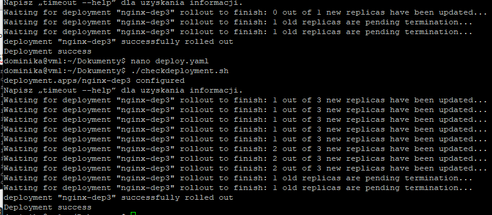
