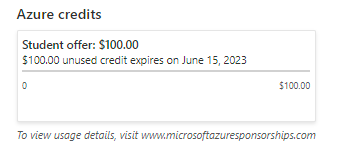
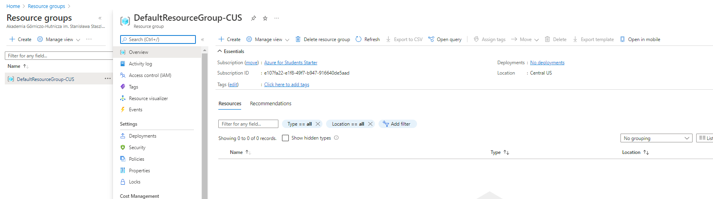
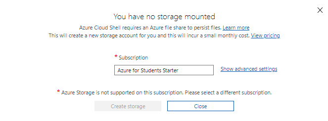
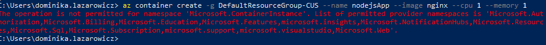
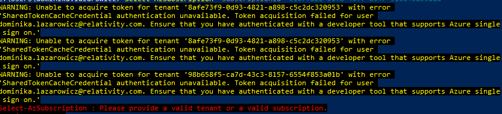
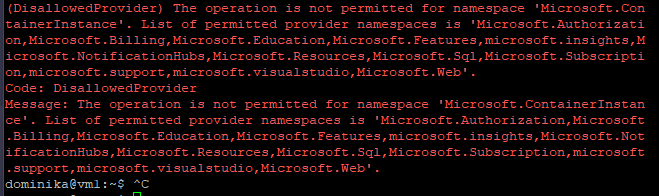

# LAB 13 - Dominika Lazarowicz

### Przygotowanie kontenera

Do zadania miałam w planach użyć gotowego obrazu nginx 

```
docker create --name nginx_base -p 80:80 nginx:alpine
```

lub własnego zamieszczonego na dockerhub'ie

https://hub.docker.com/r/dl299976/ldidil-node.js.org

### Zapoznanie z platformą

Udało się zalogować na portal azure i uruchomić uczelnianą subskrybcję, która daje 100$.



W pierwszej wersji chciałam wykonać ćwiczenie na stronie.

Do mojego konta była stworzona domyślna grupa.




Podczas próby tworzenia kontenera niestety wyświetlił się problem dotyczący subskrybcji


W drugim podejściu chciałam użyć konsoli która znajduje się na stronie. 



### Zapoznanie z platformą

Po zalogowaniu w powershell'u  `az login` Próba stworzenia kontenera w powershellu (windows)



Próba podpięcia subskrybcji ręcznie

 


Podobnie na maszynie wirtualnej z linuxem





### Wykonanie hipotetyczne

W celu wykonania ćwiczenia korzystam z oficjalnej dokumentacji microsoft

https://docs.microsoft.com/en-us/azure/container-instances/container-instances-quickstart

Stworzenia resource grupy 

`az group create --name myResourceGroup --location eastus`

Stworzenia kontenera

`az container create --resource-group myResourceGroup --name mycontainer --image mcr.microsoft.com/azuredocs/aci-helloworld --dns-name-label aci-demo --ports 80`

Ukazanie działania kontenera i aplikacji

`az container show --resource-group myResourceGroup --name mycontainer --query "{FQDN:ipAddress.fqdn,ProvisioningState:provisioningState}" --out table`

Wyświetlenie grup

`az group list`

Usunięcie kontenera

`az container show --resource-group myResourceGroup --name mycontainer`

Usunięcie grupy badawczej

`az group create --name myResourceGroup`
