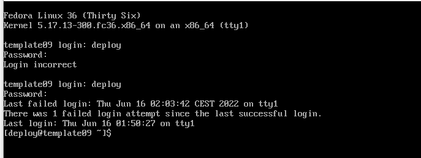
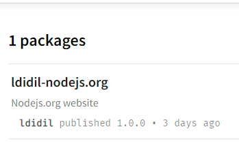
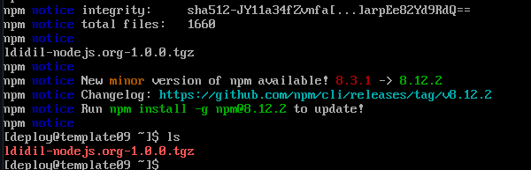
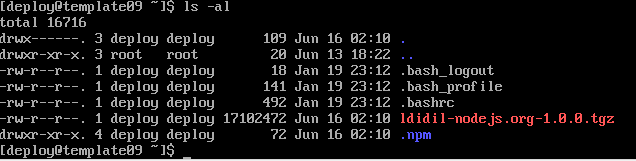
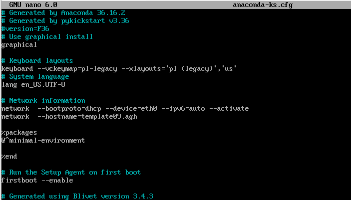
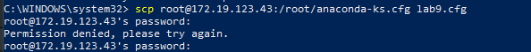
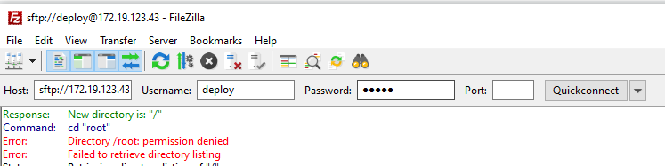
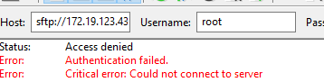

### Przygotowanie systemu pod uruchomienie

- **Przeprowadź instalację systemu Fedora w VM, skonfiguruj użytkowników (użyj haseł, które można bezkarnie umieścić na GitHubie!), sieć, wybierz podstawowy zbiór oprogramowania, optymalnie bez GUI**



Ze względu. że pakiet znajdującu się w npm regist przypomina działaniem serwer HTTP omijam ponowną instalacje Fedory. Proces umieszczania artefaktu na serwerze został spełniony w pipelinie z poprzedniego sprawozdania.



Na zainstalowanej maszynie instaluje npm (`yum install npm`)  w celu pobrania artefaktu.

Pobieram ją poleceniem `npm pack <nazwa>`




W moim projekcie publikuje artefakt w npm registry. Upload dokonuję przed `npm publish'.

Możliwe jest to przez wygenerowanie Token'u i dodanie go jako zmienna w jenkins.

Wycinek z kroku publish umożiwiający upload

```
...

withEnv(["TOKEN=${NPMJS_TOKEN}"]) {
    sh 'echo "//registry.npmjs.org/:_authToken=${TOKEN}" >> ~/.npmrc'
}
sh 'npm version ${VER}-build$BUILD_NUMBER'
sh 'npm publish'
...
```


Dzięki komendzie ls-al możemy zobaczyć plik tgz.



Należy pamiętać o rozpakowaniu pliku oraz nadania potrzebnych uprawnień.


### Instalacja nienadzorowana

**Zlokalizuj plik odpowiedzi z instalacji**

Kickstart jest odpowiedzialny za instalację całego systemu operacyjnego z określonej listy znanej jako plik Kickstart. 

Opcje instalacji są automatycznie zapisywane w pliku Kickstart o nazwie „ **anaconda-ks.cfg**”. Plik ten znajduje sie w katalogu root




Niestety nie udało mi się wyciągnąć pliku ani poleceniem scp ani przy użyciu filezilli.









Z racji tego wszystkie kroki opisze teorytycznie:

Do wyciągnietego pliku należy dodać procedure %packages która pobierze npm %post  która uruchomi skrypty poinstalacyjne
```
%packages

@^minimal-environment
npm*

%end
%post

npm i ldidil-nodejs.org
npm pack ldidil-nodejs.org

%end
```

Należy również zdefiniować repozytoria oraz ustawić typ instalacji na textowy.

```
# Use graphical install
text

# Repo
url --mirrorlist=http://mirrors.fedoraproject.org/mirrorlist?repo=fedora-$releasever&arch=x86_64 
repo --name=updates --mirrorlist=http://mirrors.fedoraproject.org/mirrorlist?repo=updates-released-f$releasever&arch=x86_64
```
