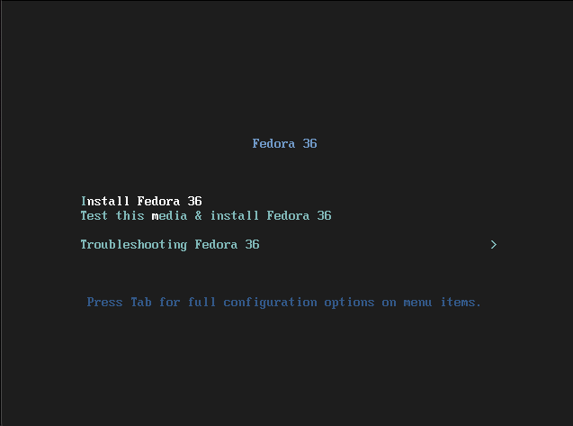
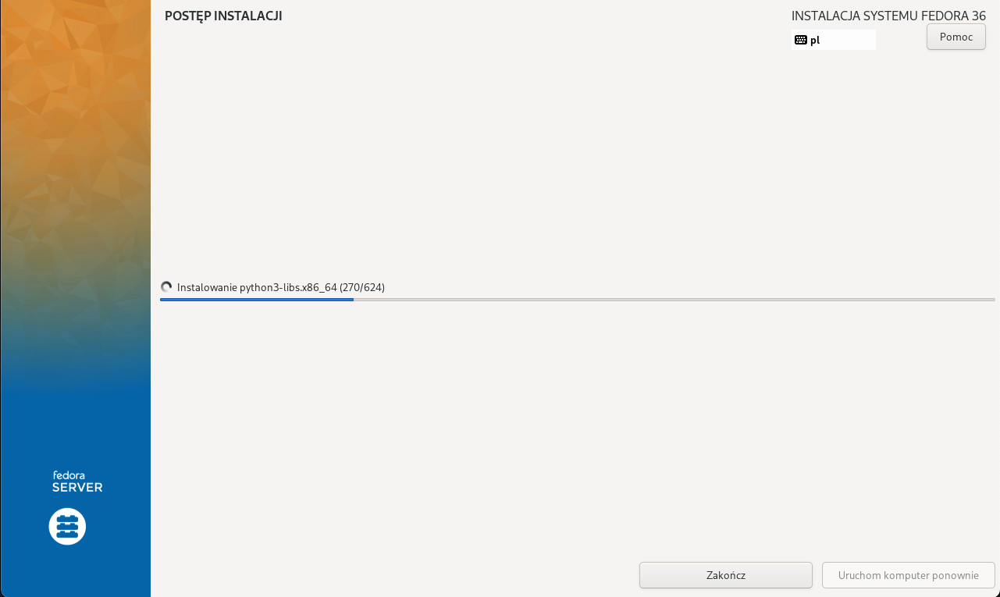
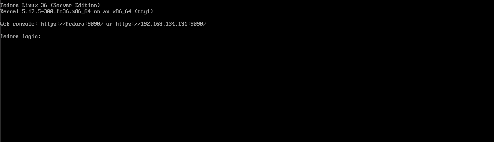
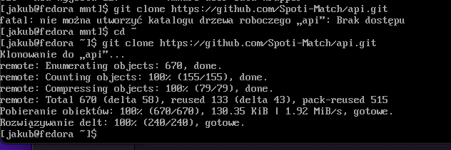
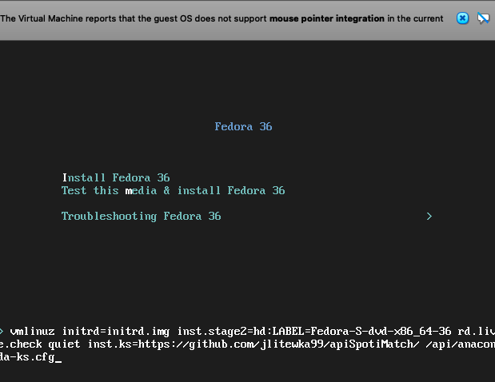
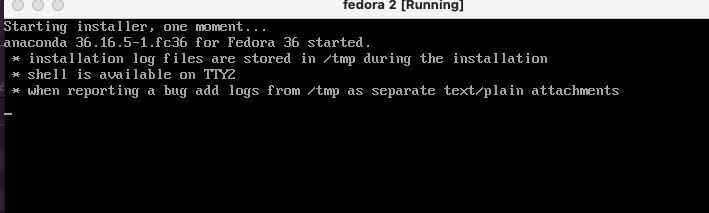

# Sprawozdanie - Lab 09

### Instalacja Fedory

Instalacja standardowa, przebiegała bez żadnych problemów.






Po instalacji i restarcie fedora wygląda tak:



### Instalacja dodatkowego oprogramowania oraz zclonowanie repozytorium

Wszystkie kroki przebiegały standardowo jedyną różnicą jaką udało mi się zaobserwować pomiędzy ubuntu a fedorą w wykonywanych operacjach był dnf zamiast apt-get.




### Plik anaconda

Plik znajdował się w folderze roota. Z racji na to, że schowek nie działał pomiędzy Fedora server oraz moim systemem przesłałem plik za pomocą rclone przez sftp na mój serwer VPS. 

Plik został dodany do repozytorium na githubie aby móc użyć go do instalacji.

### Instalacja przy użyciu pliku anaconda 

Podczas instalacji należało dodać url do repozytorium oraz path do pliku



Niestety instalacja zakończyła się niepowodzeniem, kolejne próby również zakończyły się fiaskiem.



Plik anaconda:

```
# Generated by Anaconda 36.16.5

# Generated by pykickstart v3.36

#version=F36

# Use graphical install

graphical

  

# Keyboard layouts

keyboard --vckeymap=pl --xlayouts='pl'

# System language

lang pl_PL.UTF-8

  

# Use CDROM installation media

cdrom

  

%packages

@^server-product-environment

  

%end

  

# Run the Setup Agent on first boot

firstboot --enable

  

# Generated using Blivet version 3.4.3

ignoredisk --only-use=sda

autopart

# Partition clearing information

clearpart --none --initlabel

  

# System timezone

timezone Europe/Warsaw --utc

  

# Root password

rootpw --iscrypted $y$j9T$ipUCFS7MIgxhFsA/PF5OgCe0$3FcaQgXirzSgfLJkRgN7qIYvwWjlJ5GshX7dhZn87C0
```