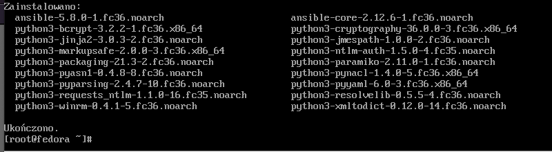
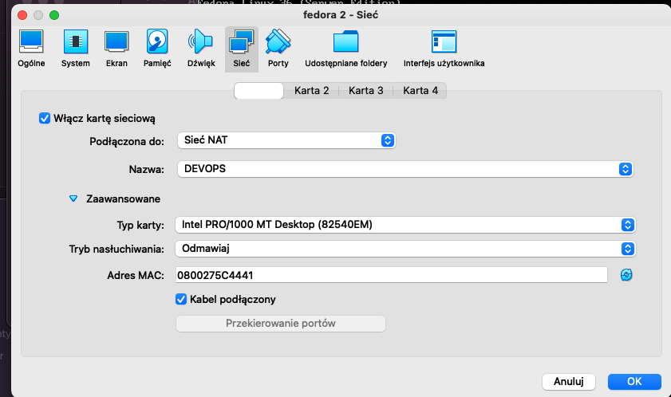
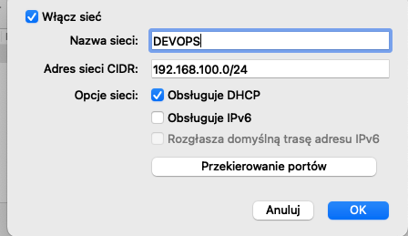
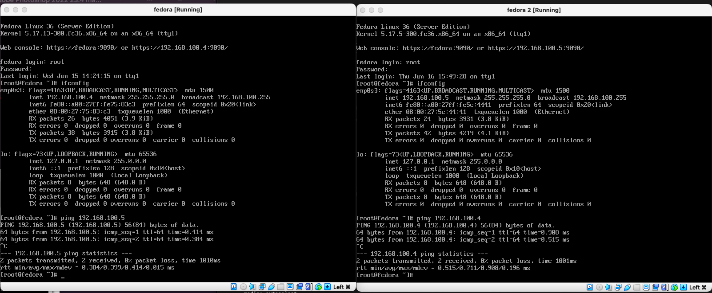

# Sprawozdanie - Lab 10

### Instalacja ansible

Instalacja standardowa, przebiegała bez żadnych problemów.

Aby móc pingować maszyny musiałem utworzyć nową sieć w VirtualBoxie
a następnie zmienić rodzaj karty sieciowej na NAT.

Jak widać pingowanie przebiegało bez problemu. Nad wynikami pingowania adresy ip maszyn.

