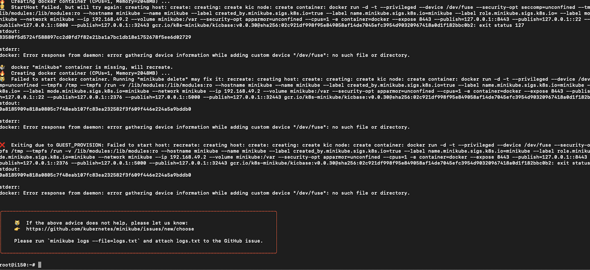
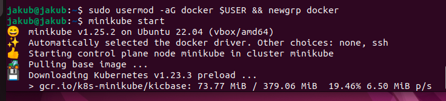
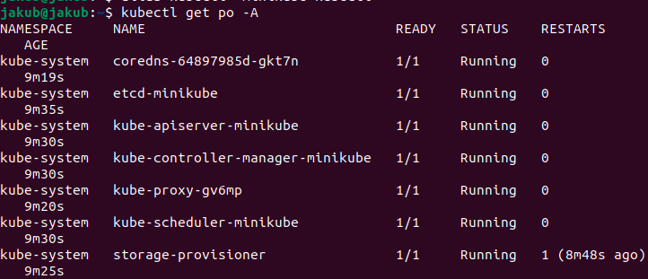
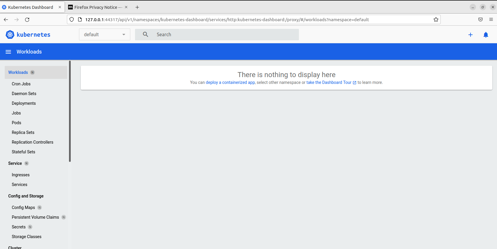
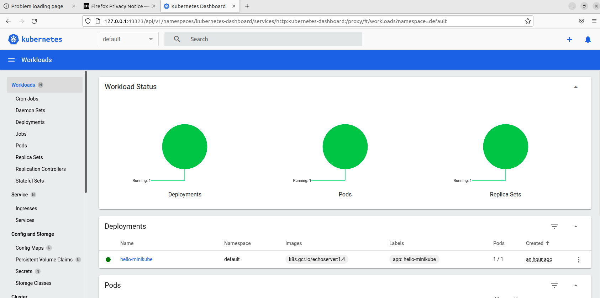
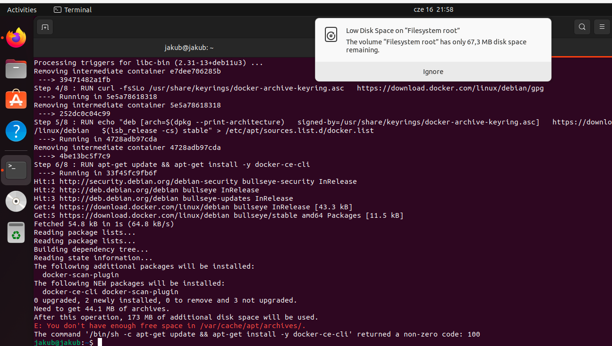

# Sprawozdanie - Lab 11

### Instalacja Kubernetes na VPS 

Jenkins zainstalowany jest na serwerze VPS jak się jednak okazało jego parametry są zbyt niskie na Kubernetes.

Pierwsza próba instalacji zakończyła się niepowodzeniem z powodu minimalnej wymaganej ilości CPU.

Druga próba z parametrem którego zadaniem jest pomijanie warunku minimalnej ilości CPU również zakończyła się niepowodzeniem. 



### Instalacja Kubernetes na Ubuntu

Do tej instalacji wykonałem czystą instalację Ubuntu, w VirtualBox ustawiłem ilość CPU na 2.









Kolejnym krokiem była próba odtworzenia środowiska z VPS jednak mój laptop ma ograniczoną pamięć (był to jeden z powodów dla których używałem VPS) i nie jestem w stanie tego odtworzyć.



Aby uruchomić aplikację użyłbym polecenia `minikube kubectl run -- SpotiMatch-1 --image=jlitewka99/SpotiMatch --port=8080 app=SpotiMatch-1`
Dzięki czemu pod adresem localhosta z portem 8080 powinna się ukazać aplikacja.


### Yaml
Plik yaml najprawdopodobniej wyglądałby tak:
```
apiVersion: apps/v1
kind: Deployment
metadata:
   name: SpotiMatch-1
   namespace: default
spec:
   selector:
      matchLabels:
         app: SpotiMatch-1
   replicas: 2
   template:
      metadata:
         labels:
            app: SpotiMatch-1
      spec:
         containers:
            - name: SpotiMatch
              image: jlitewka99/SpotiMatch
              ports:
                 - containerPort: 8080
```