# Sprawozdanie z laboratorium 11

1. Instalacja minikube
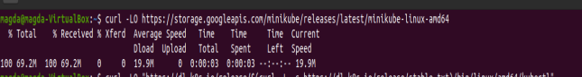
2. Uruchomienie minikube
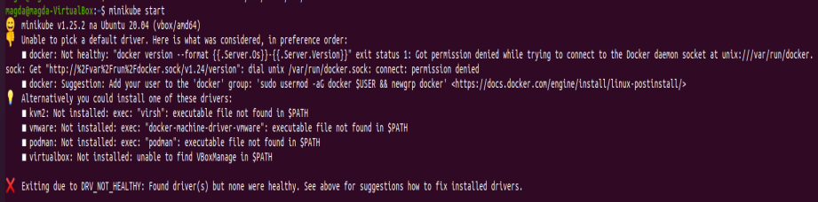
3. Pobranie pakietów kubectl oraz isntalacja kubectl (na ss umieszczona neistety tylko instalacja)
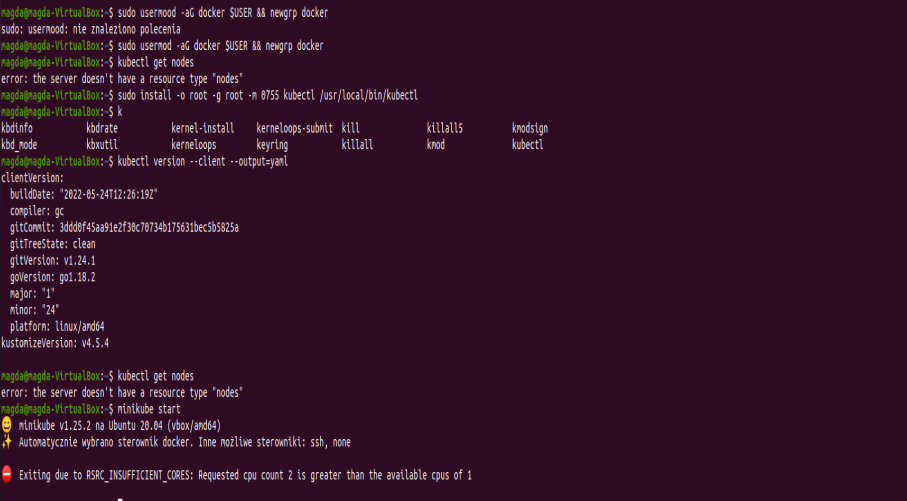
4. Przedstawienie działajacych podów oraz noda
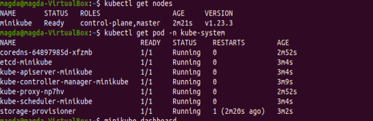
5. Działająćy dashboard
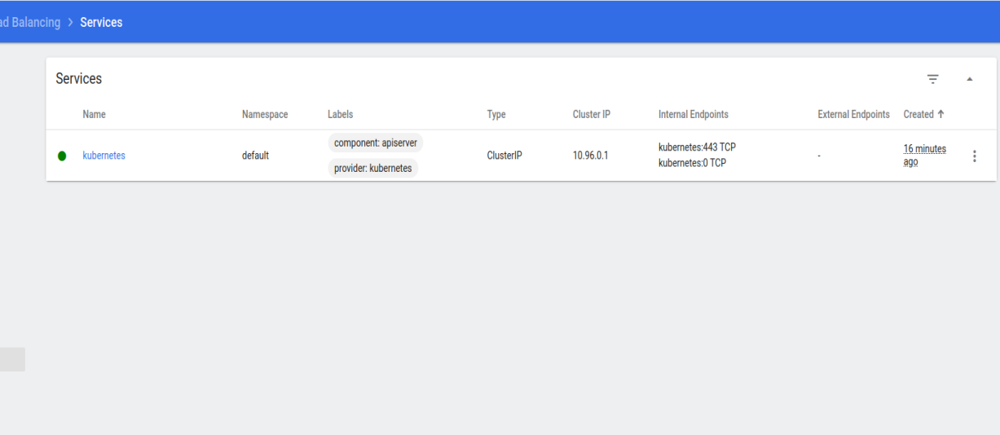
6. Analiza posiadanego kontenera
Utworzono nasßepujący dockerfile
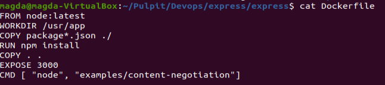
7. Przeprowadzono build obrazu
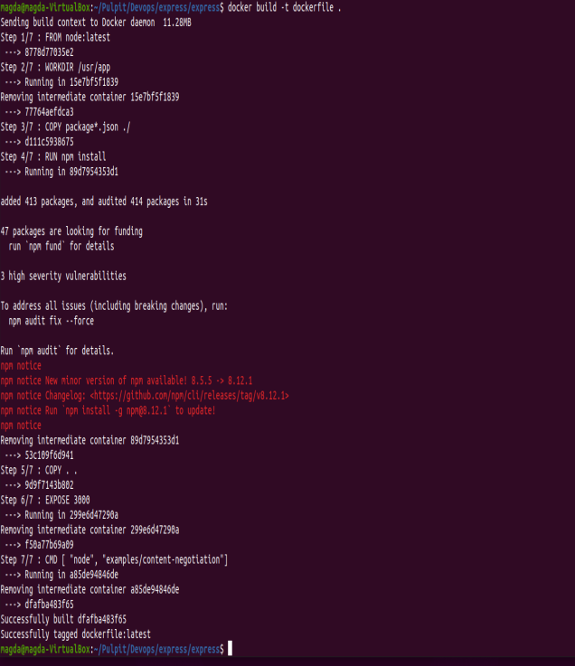
8. Po uruchomieniu konterenta przekierowany został na inny port w celu przedstawienia działania
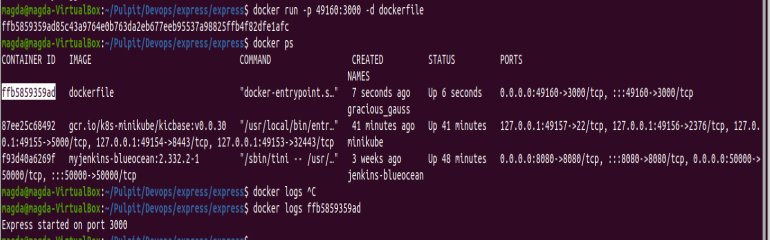
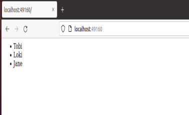
9. Utworzenie pliku pod.yaml
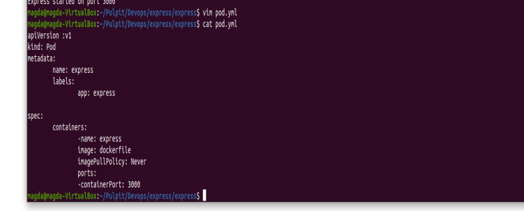
10. Utworzenie poda
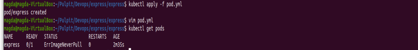
11. Poprawne działanie poda
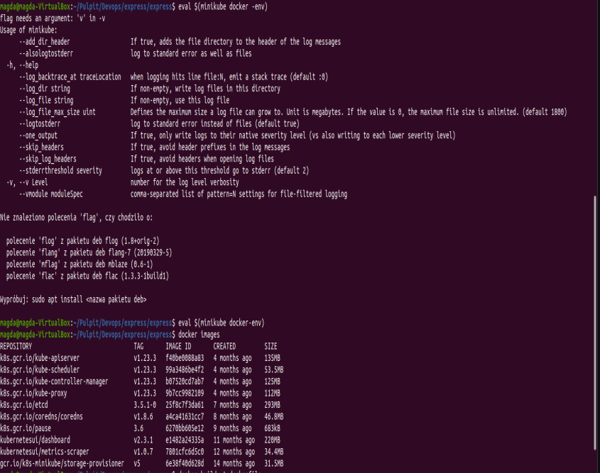
Na początku zaistaniał problem z uruchomieniem poda ponieważ nasz obraz nie jest w b8s tylko w lokalnym Dockerze. Rozwiązanie tego problemu byla komenda eval.
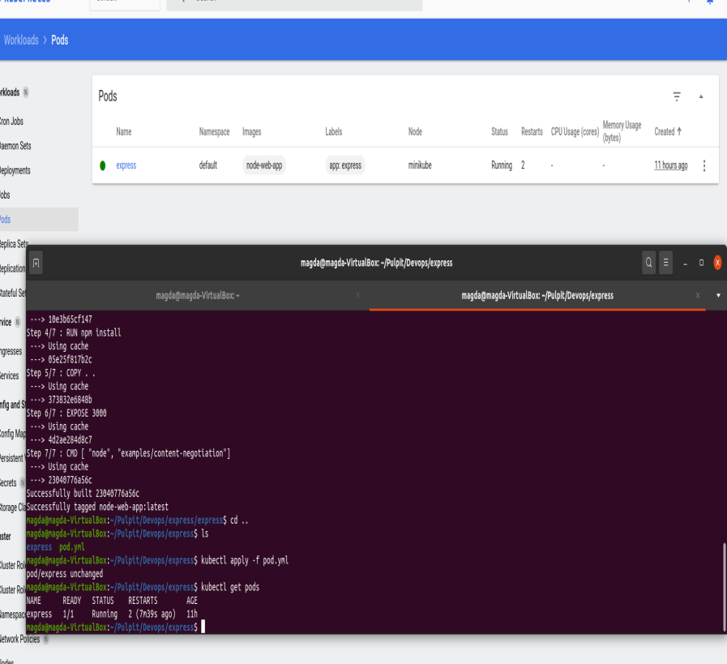
12. Przekucie wdrożenia manualnego w plik wdrożenia.
Kolejny plik yml
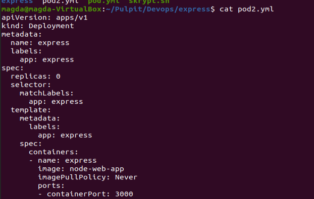
Działanie było widocznie na dashboard ale niesttety nie uchwyciłam tego na screenie.

#Sprawozdanie laboratorium 12
1. Zmiany w deployment
Plik .yml został zmodyfikowany, zmioniona została ilosć replik na 4. Możliwość dokonania zmiany daje komenda roollout
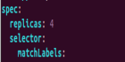
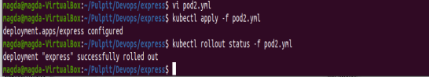
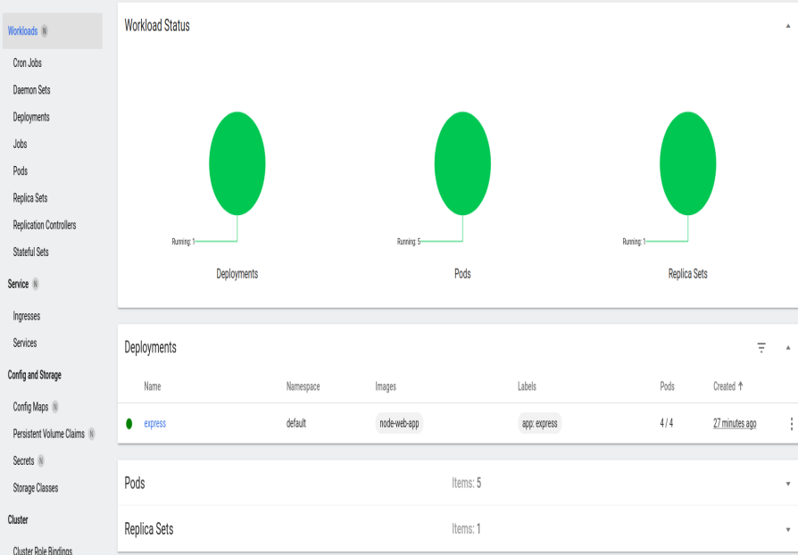
Zmiana ilosci replik na 9. Używamy ponownie komendy roolout, analogicznie jak przy zmianie na 4 repliki.

3. Zmiana ilosci replik na 1.
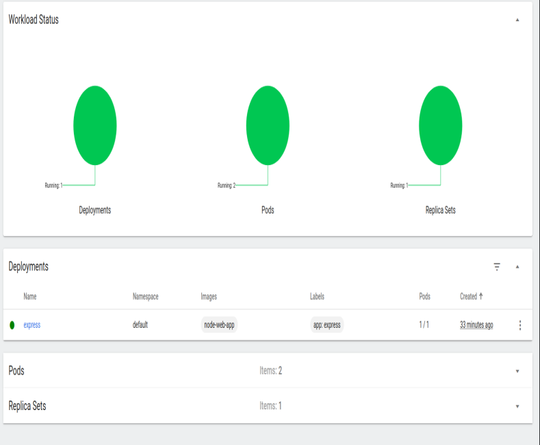
4. Zmiana ilosci replik na 0
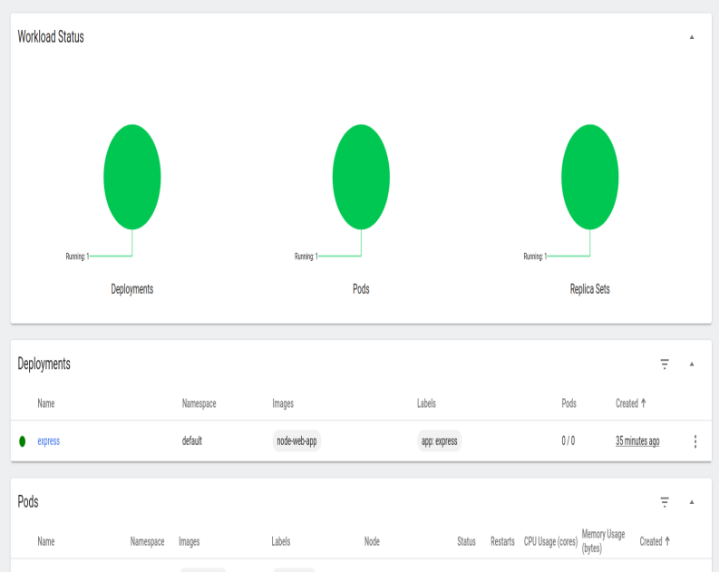
5. Kontrola wdrożenia. Został stworzony plik basha, który sprawdza czas wdrożenia. Jeśli ejst on większy niż 60 sekund skrytp zwraca nam informacje o błędzie.
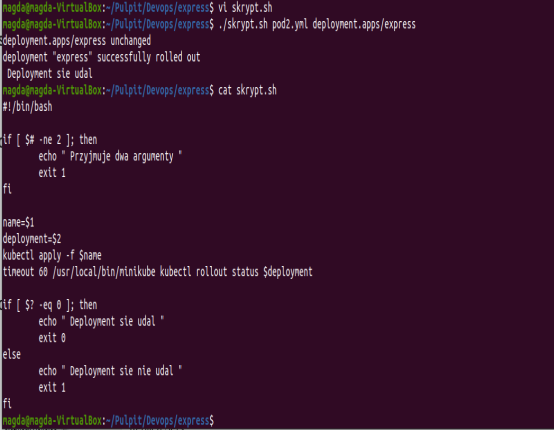

