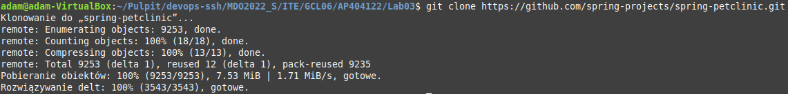
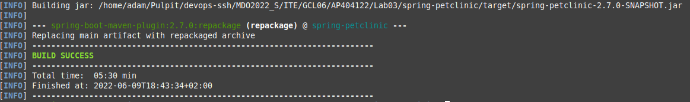
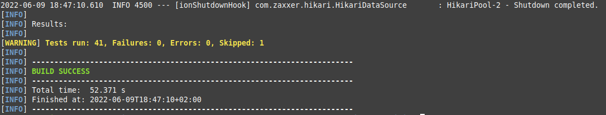
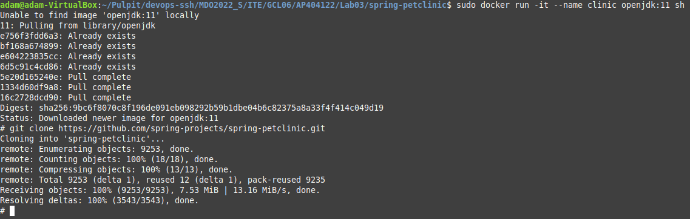
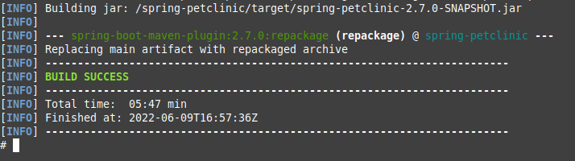
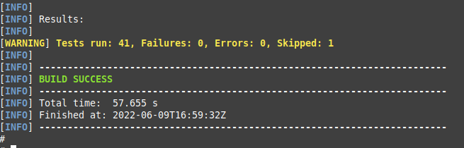
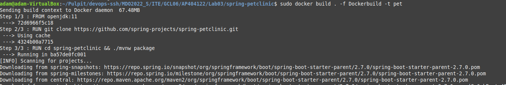
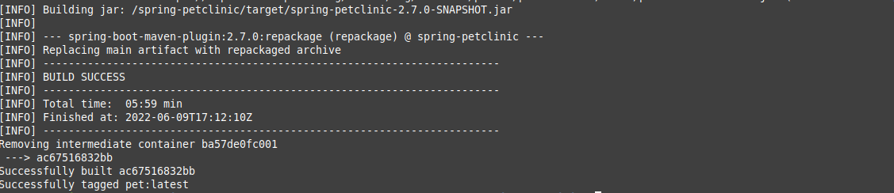
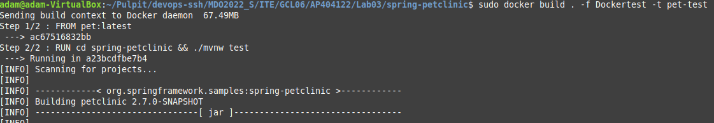
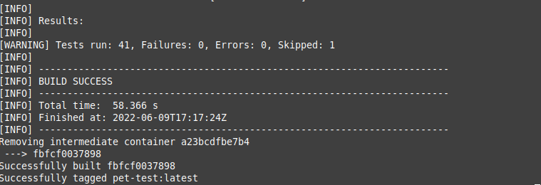

## Klonowanie repozytorium

## Przeprowadzenie build'u

## Przeprowadzenie testów

## Stworzenie konetenera i sklonowanie w nim repo

## Build wewnątrz kontenera

## Testy wewnątrze kontenera

## Stworzenie Dockerbuild
```docker
FROM openjdk:11
RUN git clone https://github.com/spring-projects/spring-petclinic.git
RUN cd spring-petclinic && ./mvnw package
```
## Odpalenie Dockerbuild


## Stworzenie Dockertest
```docker
FROM pet:latest
RUN cd spring-petclinic && ./mvnw test
```

