# Zachowwywanie stanu
## Przygotowanie woluminu wejściowego i wyjściowego
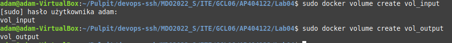
## Uruchomomienie konetenera
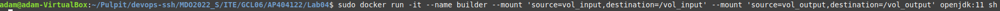
## Sklonowanie i zbudowanie repozytorium
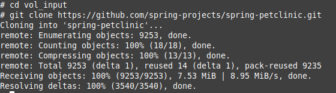
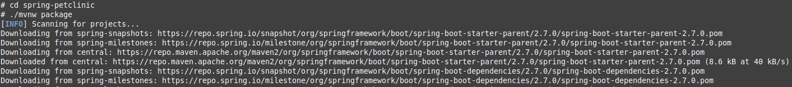
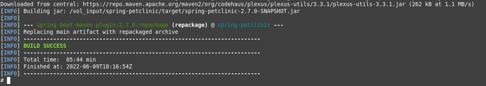
## Zapisanie powstałych plików w woluminie wyjściowym
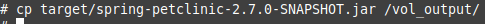
# Eksponowanie portu
## Uruchomienie kontenera i serwera iperf wewnątrze niego na porcie 8000
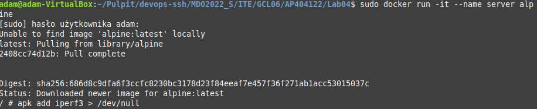
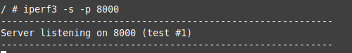
## Podłączenie się za pomocą drugiego konetenera
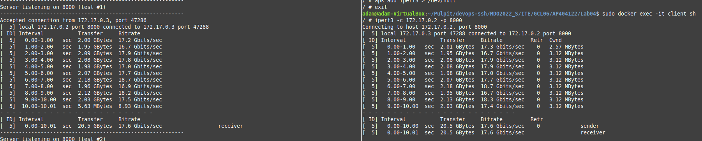
## Podłączenie się z spoza kontenera
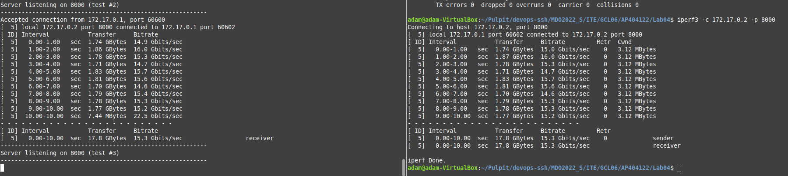
* Przepustowość kontener - kontener: 2.05 GB/s
* Przepustowość kontener - host: 1.78 GB/s
# Instancja Jenkins
## Tworzenie sieci Jenkins
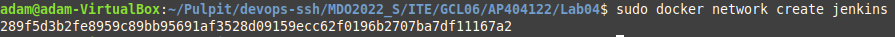
## Stworzenie docker:dind według instrukcji
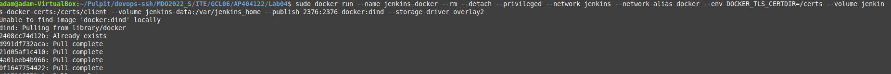
## Stworzenie Dockerfile i zbudowanie obrazu z jego pomocą
```docker
FROM jenkins/jenkins:2.332.1-jdk11
USER root
RUN apt-get update && apt-get install -y lsb-release
RUN curl -fsSLo /usr/share/keyrings/docker-archive-keyrings.asc https://download.docker.com/linux/debian/gpg
RUN echo "deb [arch=$(dpkg --print-architecture) signed-by=/usr/share/keyrings/docker-archive-keyrings.asc] https://download.docker.com/linux/debian $(lsb_release -cs) stable" > /etc/apt/sources.list.d/docker.list
RUN apt-get update && apt-get install -y docker-ce-cli
USER jenkins
RUN jenkins-plugin-cli --plugins "blueocean:1.25.3 docker-workflow:1.28"
```
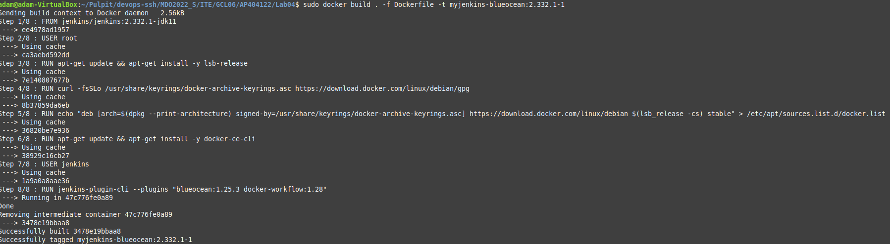
## Uruchomienie Jenkinsa
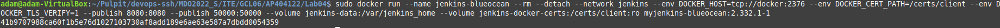
## Instalacja dodatków oraz tworzenie admina
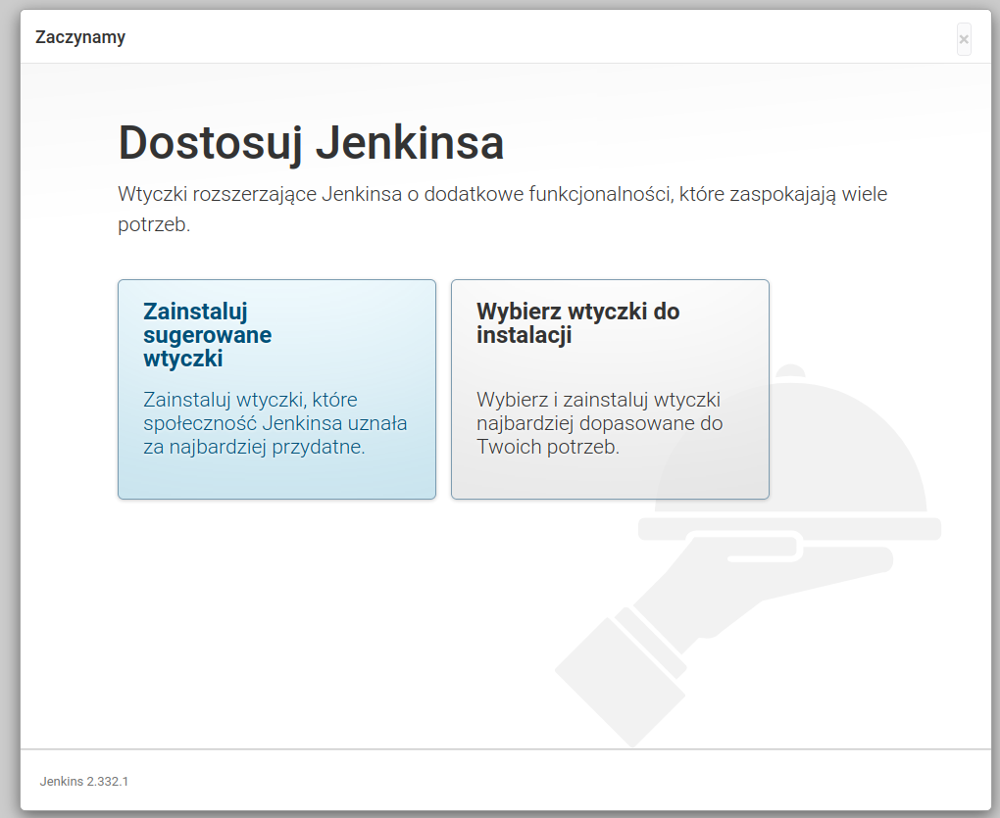
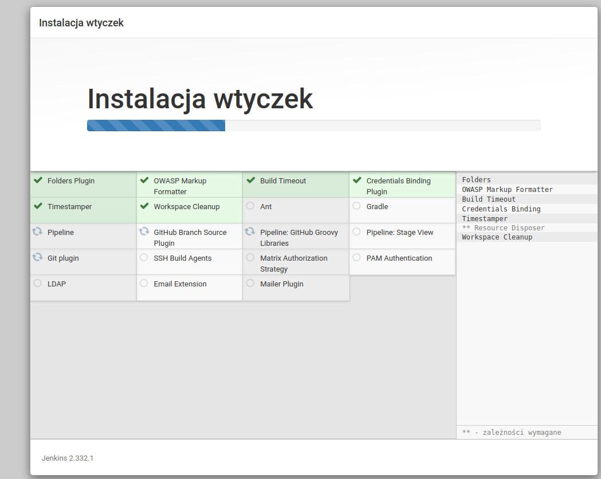
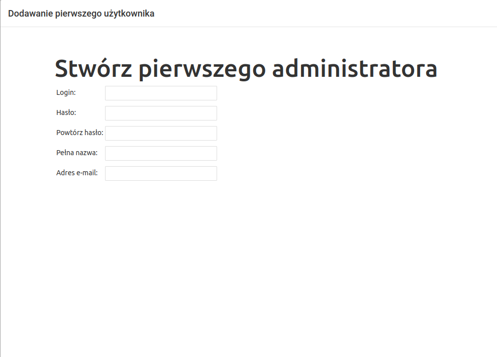
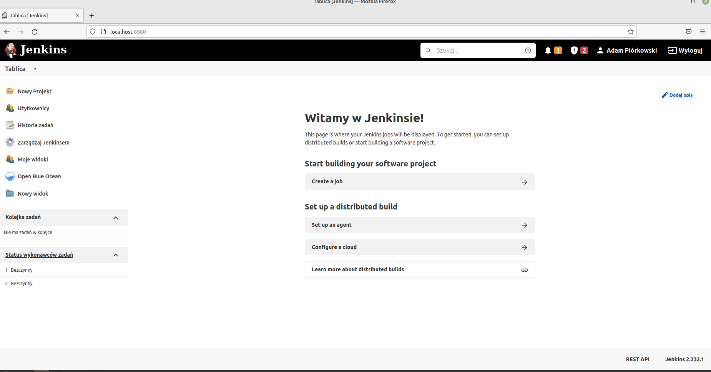