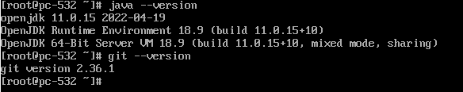
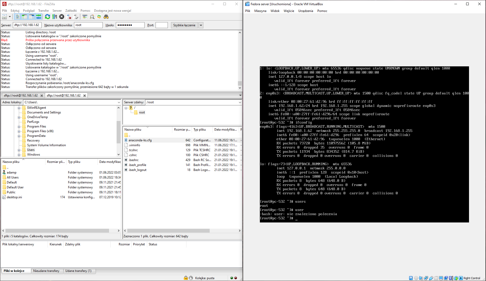
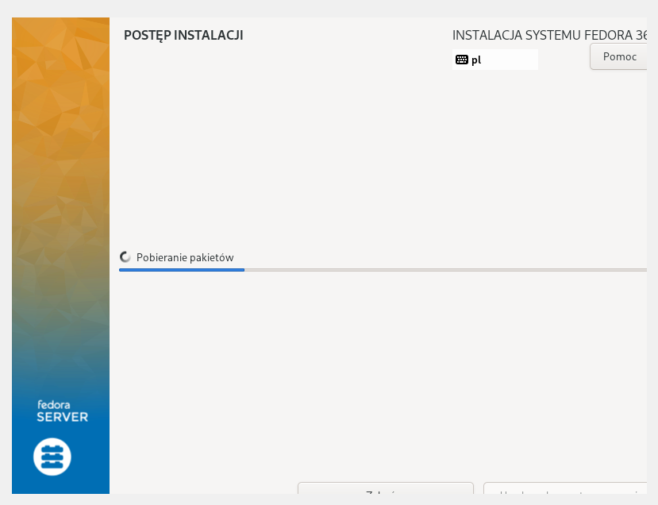
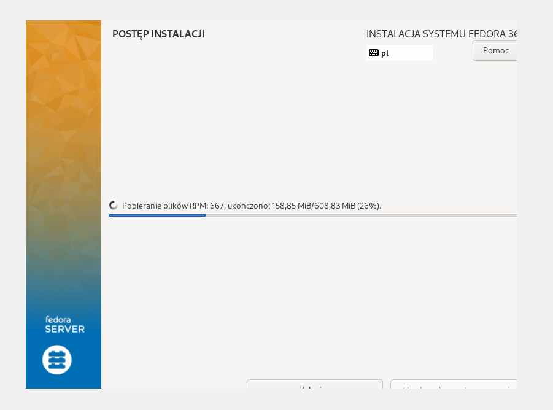
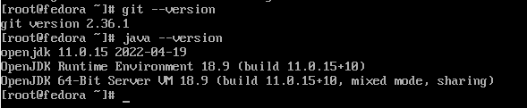

## Zainstalowanie Fedory

## Zainstalowanie paczek (git/java) 

## Skopiowanie artefaktu

```
# Generated by Anaconda 36.16.5
# Generated by pykickstart v3.36
#version=F36
# Use graphical install
graphical

# Keyboard layouts
keyboard --vckeymap=pl --xlayouts='pl'
# System language
lang pl_PL.UTF-8

# Use CDROM installation media
cdrom

%packages
@^server-product-environment

%end

# Run the Setup Agent on first boot
firstboot --enable

# Generated using Blivet version 3.4.3
ignoredisk --only-use=sda
autopart
# Partition clearing information
clearpart --none --initlabel

# System timezone
timezone Europe/Warsaw --utc

# Root password
rootpw --iscrypted $y$j9T$OKWNPljgwAvexnWhzzw3iSD5$loTZJU0YPzW6lMp41C2T3ngY63Ns6Tg1/3dXWd9ScMB
    %post
        exec < /dev/tty3 > /dev/tty3
        sudo dnf -y update
        sudo dnf -y install git
        sudo dnf -y install java-11-openjdk.x86_64
    %end
```
## Zainstalowanie kolejnej Fedory poprzez zaciągnięcie ustawień


## Wszystko działa poprawnie
