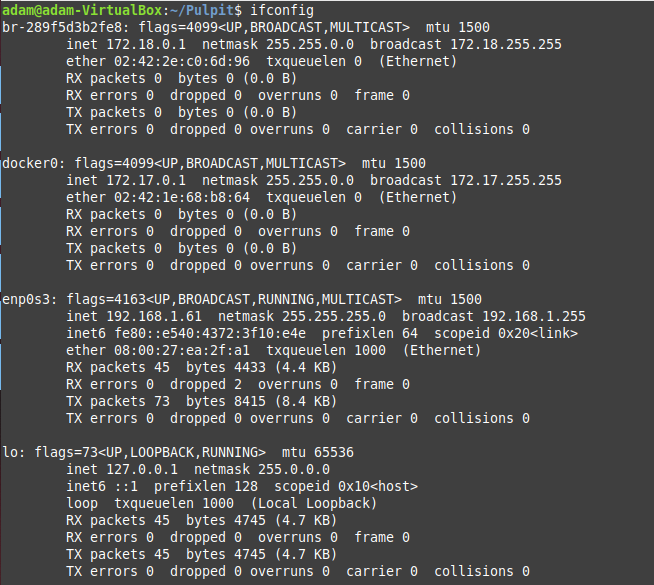
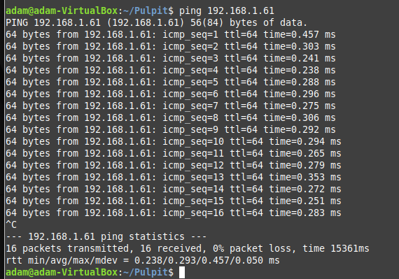

## Instalacja
Zainstalowano dwie maszyny wirtualne w tej samej sieci. Obydwie instalacje to Mint. Następnie zainstalowano ansible komendą
```
sudo apt get ansible
```
## Łączenie
#### Sprawdzenie IP drugiej maszyny

#### Podłączenie się do niej z pierwszej maszyny
