## Zainstalowanie i wystartowanie kubernetes'a
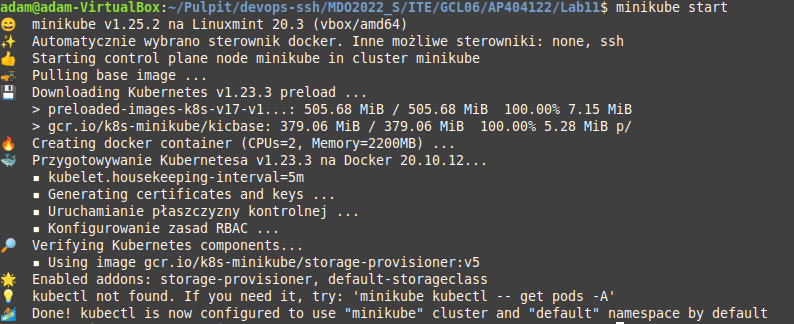
## Doinstalowanie kubectl
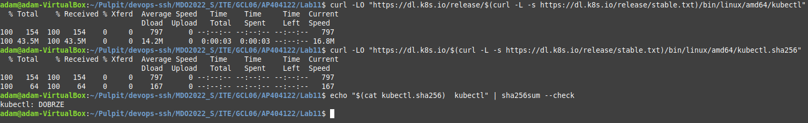
## Odpalenie dashboard'a
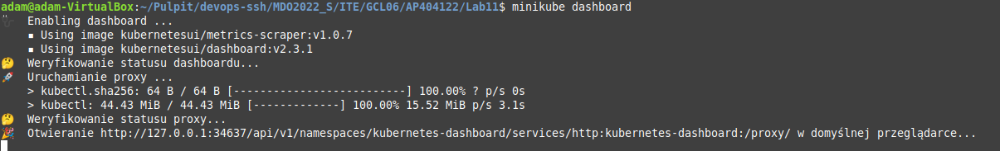
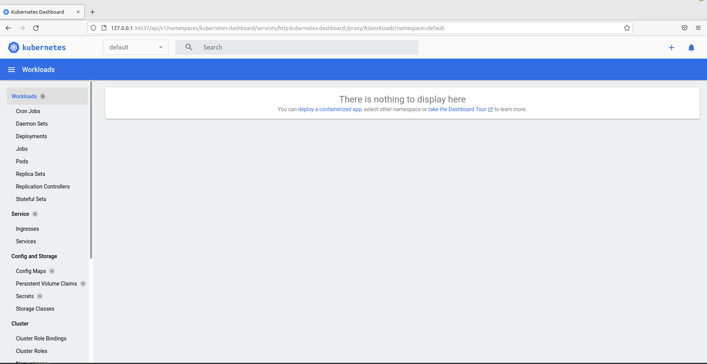
## Uruchomienie aplikacji w kontenerze bez użycia kubernetesa (aplikacja została zmieniona, ponieważ nie dało sie jej skonteneryzować)
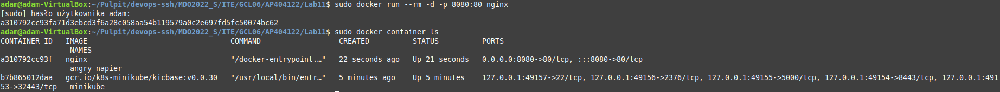
## Uruchomienie aplikacji na stosie w kubernetes
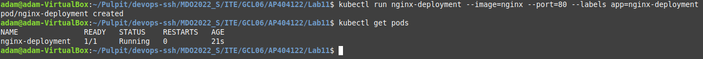
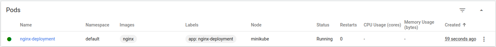
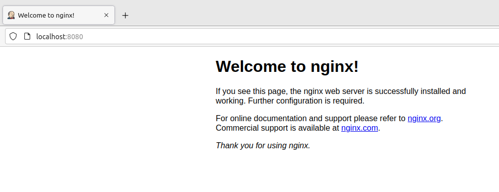
## Eksponuję port aplikacji
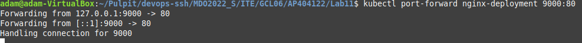
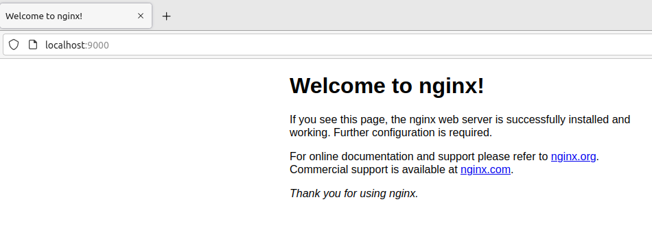
## Przekycie wdrożenia manualnego w plik wdrożenia
```
apiVersion: apps/v1
kind: Deployment
metadata:
  name: nginx-dep2
spec:
  selector:
    matchLabels:
      app: nginx
  replicas: 5
  template:
    metadata:
      labels:
        app: nginx
    spec:
      containers:
      - name: nginx
        image: nginx:1.14.2
        ports:
        - containerPort: 80
```
## Dodanie replik
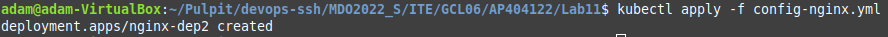
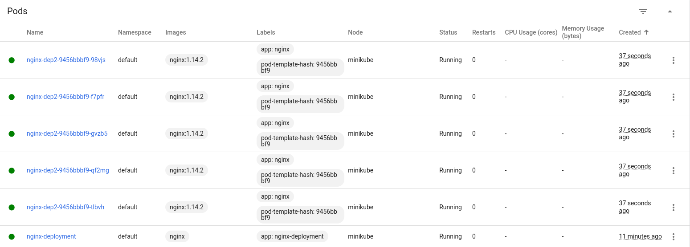