# Przygotowanie nowego obrazu
## Dodanie 4 replik do kody wdrożenia
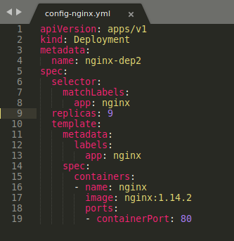
## Wdrożenie za pomocą kubectl oraz sprawdzenie stanu
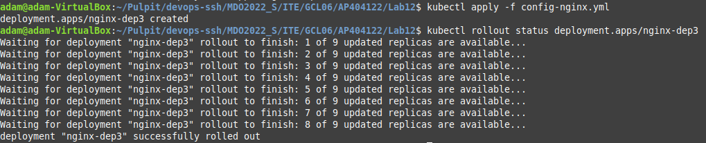
## Stworzenie błędnego obrazu
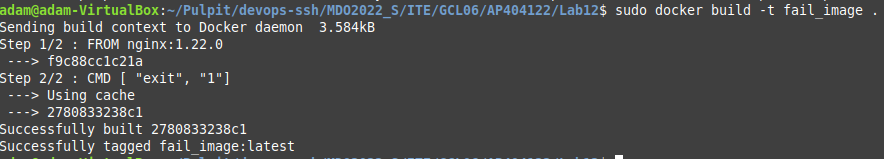
# Zmiany w deploymencie
## Zwiększenie ilości replik o jeden
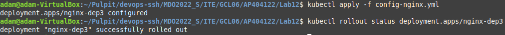
## Ustawienie ilości replik na jeden
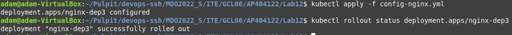
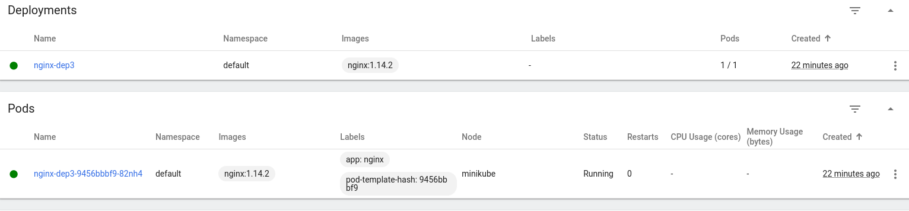
## Ustawienie ilości replik na zero
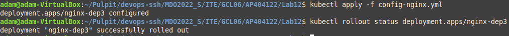
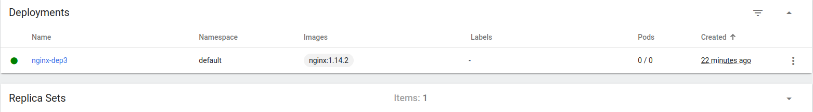
## Ustawienie niepoprawnego obrazu
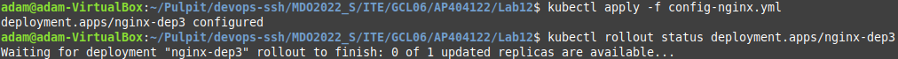

## Ustawienie najnowszego obrazu nginx
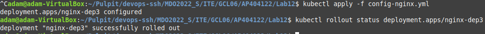
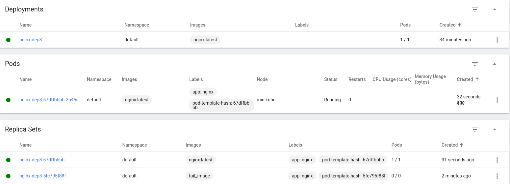
## Sprawdzenie historii
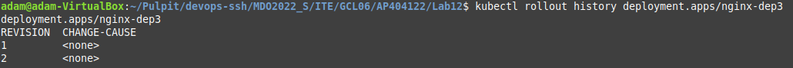
## Szczegóły pojedyńczej rewizji

## Roolback do niepoprawnego obrazu
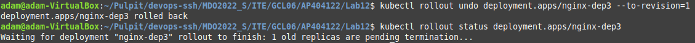
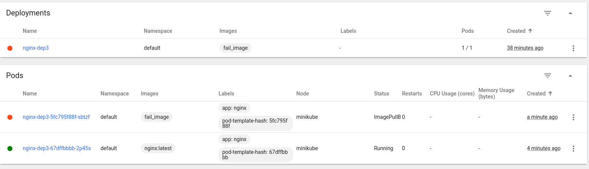
# Kontrola wdrożenia
## Stworzenie skryptu
```bash
#!/bin/bash
kubectl apply -f config-nginx.yml
sleep 60
kubectl rollout status deployment.apps/nginx-dep3
if [ $? -eq 0 ]; then
	echo "Everything is fine!"
else
	echo "Something went wrong!"
fi
```


# Strategie wdrożenia
## Recreate
```
apiVersion: apps/v1
kind: Deployment
metadata:
  name: nginx-dep3
spec:
  strategy:
    type: Recreate
  replicas: 9
  selector:
    matchLabels:
      app: nginx
  template:
    metadata:
      labels:
        app: nginx
    spec:
      containers:
      - name: nginx
        image: nginx:latest
        ports:
        - containerPort: 80
```
Strategia typu Recreate spowoduje zakońćzenie wszystkich uruchomionych wystąpień, a następnie ponowne ich utworzenie w nowszej wersji.
## Rolling update
Domyślne ustawienie, widzieliśmy działanie podczas zmiany replik
## Canary
```
apiVersion: apps/v1
kind: Deployment
metadata:
  name: nginx-dep3
spec:
  selector:
    matchLabels:
      app: nginx
  replicas: 1
  template:
    metadata:
      labels:
        app: nginx
        version: v1.0.0
    spec:
      containers:
      - name: nginx
        image: nginx:latest
        ports:
        - containerPort: 80

```
```
apiVersion: apps/v1
kind: Deployment
metadata:
  name: nginx-dep3
spec:
  selector:
    matchLabels:
      app: nginx
  replicas: 3
  template:
    metadata:
      labels:
        app: nginx
        version: v1.2.2
    spec:
      containers:
      - name: nginx
        image: nginx:latest
        ports:
        - containerPort: 80
```
Jedna replika nowej wersji została wydana wraz ze starą wersją. Następnie po pewnym czasie i jeśli nie zostanie wykryty żaden błąd, zwiększ liczbę replik nowej wersji i usuń stare wdrożenie.