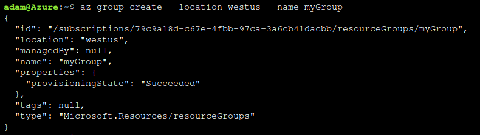
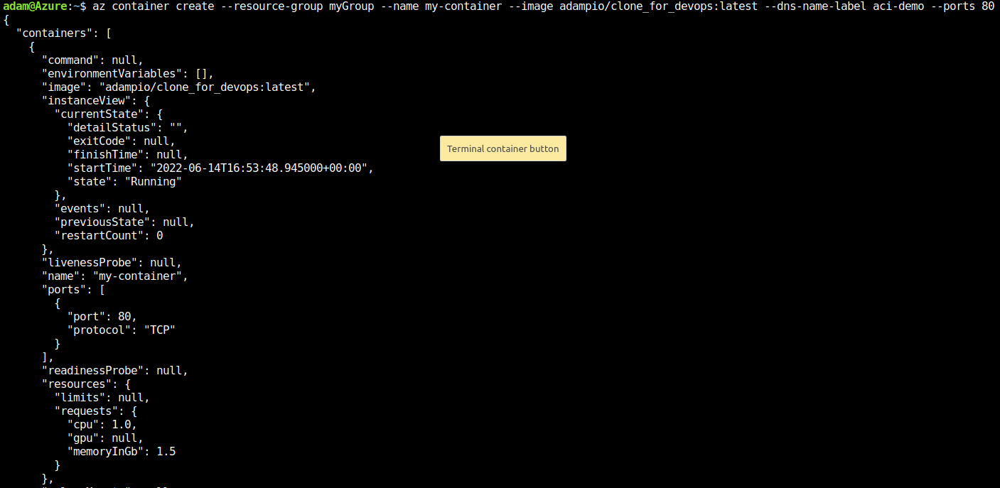
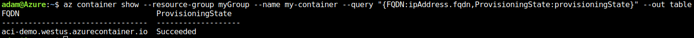
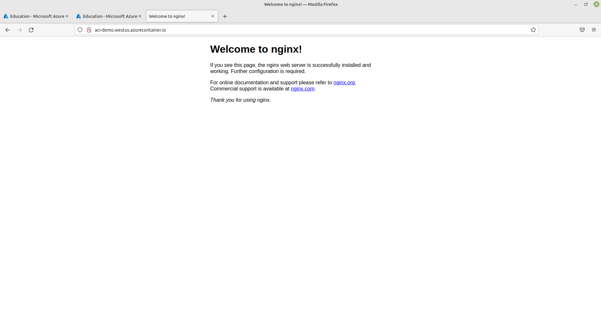
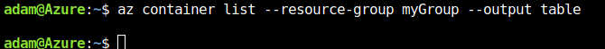
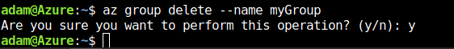
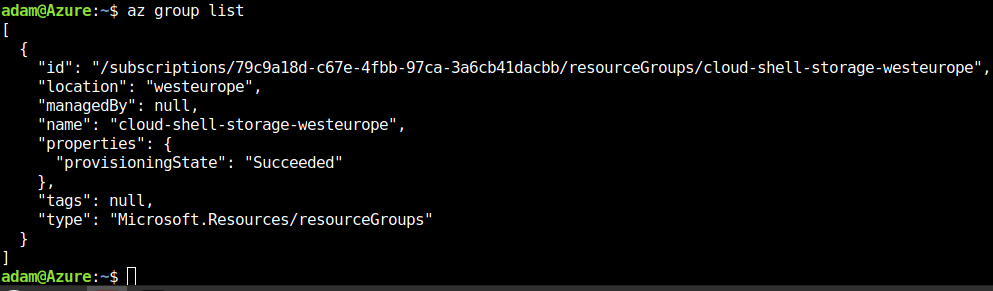

## Przygotowanie kontenera
Użyto własnego kontenera z z DockerHub
https://hub.docker.com/repository/docker/adampio/clone_for_devops
# Zapoznanie z platformą
## Odblokowanie konta za pomocą panelu AGH

## Odblokowanie 100$ za pomocą licencji studenckiej
## Przeczytanie cennika

# Wdrożenie
## Stworzenie własnej grupy badawczej

## Stworzenie kontenera

## Ukazanie działania kontenera i aplikacji

## Usunięcie kontenera

## Usunięcie grupy badawczej

