### Dominik Mrówka, 10.06.2022, gr 06
## Sprawozdanie z lab11

- Pobrano paczkę instalacji kubernetesa na maszynę wirtualną (Ubuntu, połączenie przez ssh) poleceniami:

```
curl -LO https://storage.googleapis.com/minikube/releases/latest/minikube-linux-amd64
sudo install minikube-linux-amd64 /usr/local/bin/minikube
```
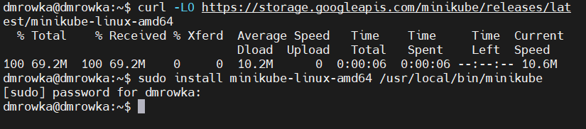

- Dodano użytkownika do grupy dockera:
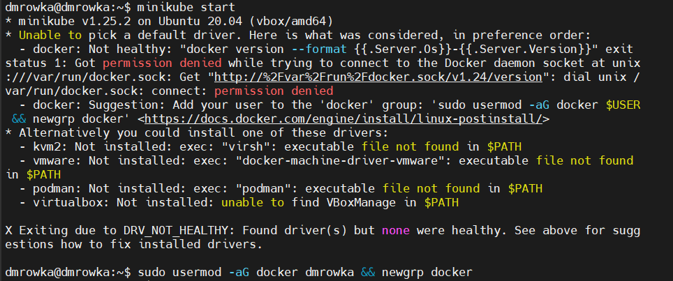

- Zwiększono ilość rdzeni procesora dla maszyny (minikube zgłosił błąd)
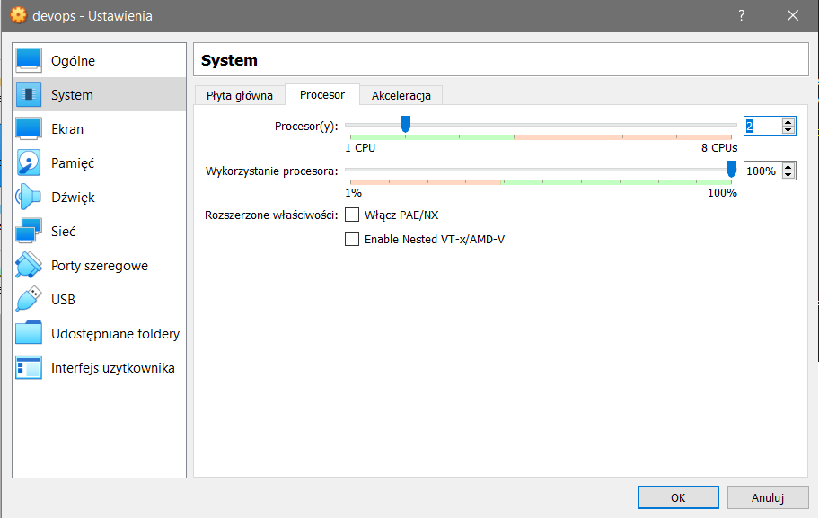

- Zabrakło miejsca na maszynie dla kubernetesa, więc dodano 10gb pamięci do dysku w ustawieniach maszyny wirtualnej (i zmodyfikowano partycje lokalnie w maszynie). Po ponownej próbie uruchomienia pojawiał się błąd przy wykonywaniu, dlatego wykonano polecenie `minikube delete` i spróbowano ponownie
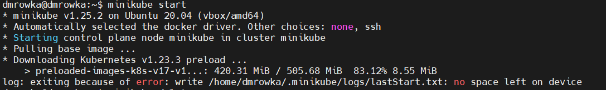
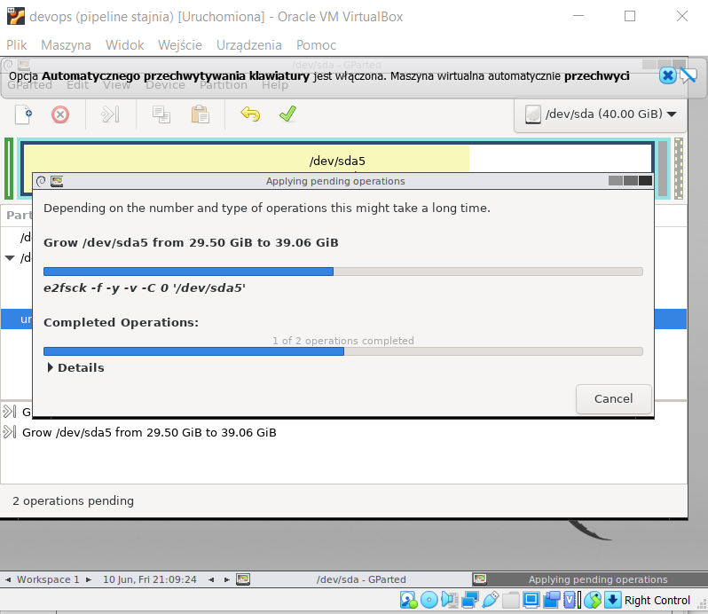
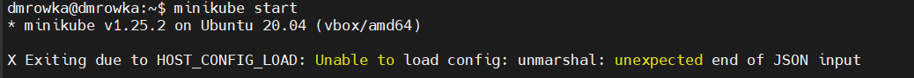
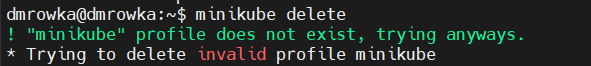

- Uruchomiono kubernetesa
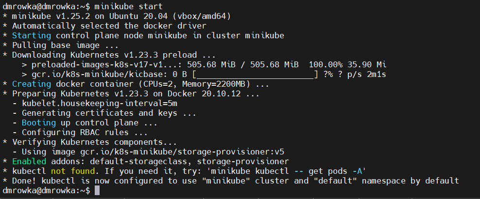

- Uruchomiono dashboard kubernetesa poleceniem `minikube dashboard --port 45091 --url`

- Nie udało się połączyć z poziomu maszyny hosta (z windowsa) do dashboardu, pomimo określenia w ustawieniach maszyny przekierowania wybranego portu, dlatego uruchomiono go w przeglądarce lokalnej maszyny
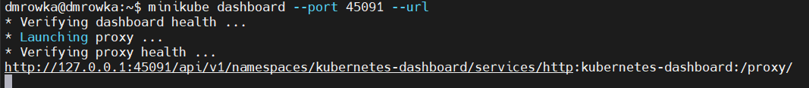
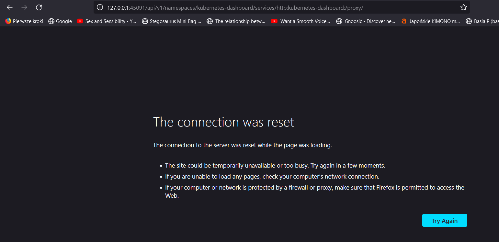
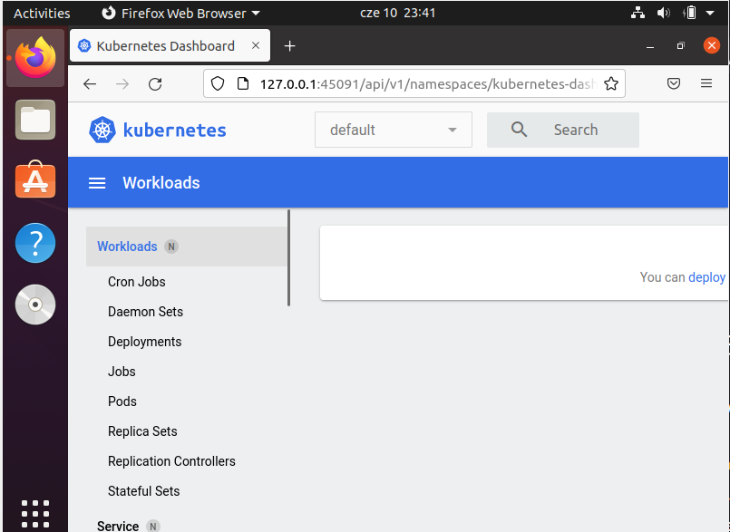

- Zainstalowano polecenie kubectl komendami
```
curl -LO "https://dl.k8s.io/release/$(curl -L -s https://dl.k8s.io/release/stable.txt)/bin/linux/amd64/kubectl"
sudo install -o root -g root -m 0755 kubectl /usr/local/bin/kubectl
```
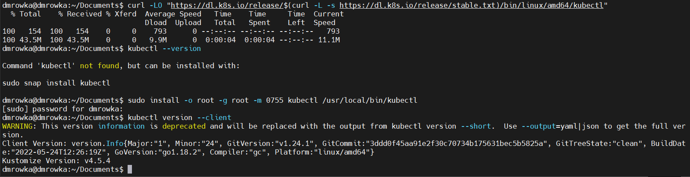

- Do realizacji zadania wykorzystano gotowy kontener z NGINX. Przygotowano Dockerfile wyglądający następująco:
```
FROM nginx
COPY static /usr/share/nginx/html

```
- Do katalogu `static` przesłano zdjęcie żeby udowodnić działanie, zbudowano obraz poleceniem `docker build -t some-content-nginx .`
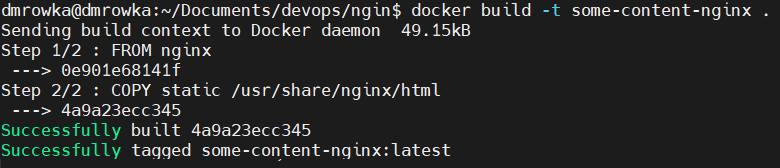

- Uruchomiono kontener poleceniem `docker run --name some-nginx -d -p 8080:80 some-content-nginx`
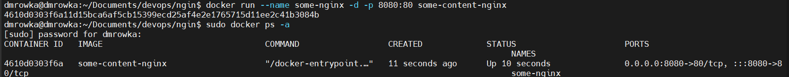
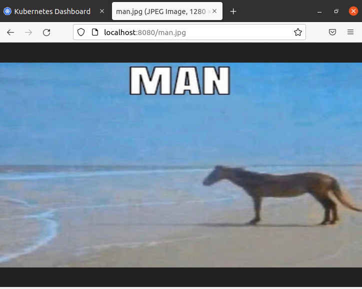

- Uruchomiono pod na kubernetesie poleceniem `kubectl run projectdeploy --image=some-content-nginx --port 8080 --labels app=project_deploy`

- Otrzymano na dashboard błąd 'Failed to pull image (...)', dlatego podjęto kroki aby możliwe było wyciągnięcie obrazu z lokalnego daemona dockera. Przy pomocy komendy `eval $(minikube docker-env)` wskazano na dockerowego daemona, oraz zrestartowano minikube (`minikube stop`). Do polecenia kubectl dodano flagę `--image-pull-policy Never`, przebudowano obraz do tagu 'yestraban/some-content-nginx' (związany z inną próbą przesłania obrazu) i uruchomiono polecenie: `kubectl run projectdeploy --image-pull-policy Never --image=yestraban/some-content-nginx --port 8080 --labels app=project_deploy`

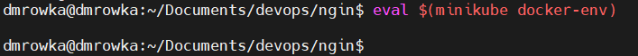
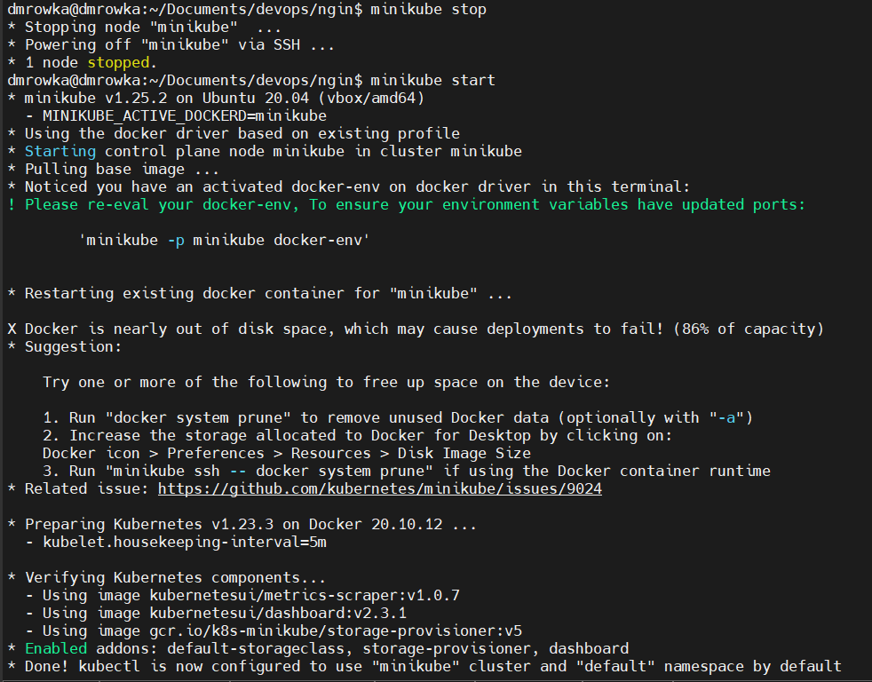
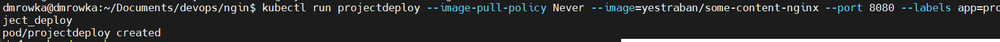
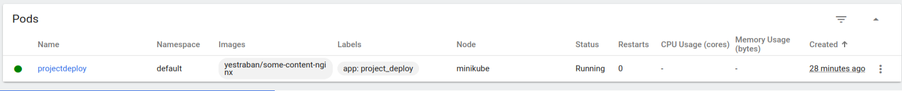
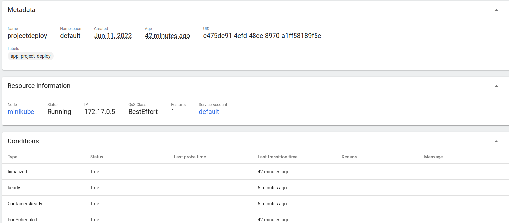

- Wyeksponowano port z poda poleceniem `kubectl port-forward projectdeploy 30255:8080`
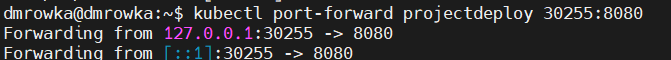

- Niestety nie udało się osiągnąć połączenia z podem przez przeglądarkę. Przy każdej próbie otwarcia strony, połączenie było odrzucane a eksponowanie portu przerywane. Po uruchomieniu przekierowania:
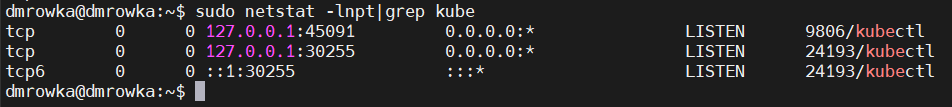
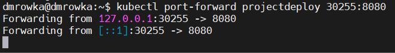
Otwarcie okna:
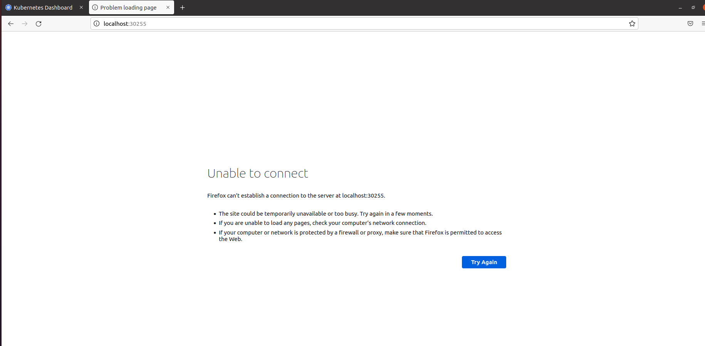
Po otwarciu:
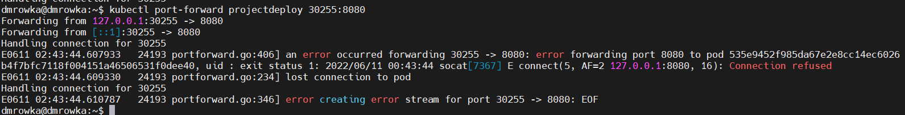
 