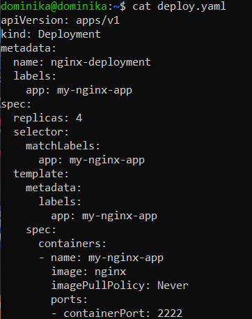
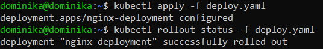
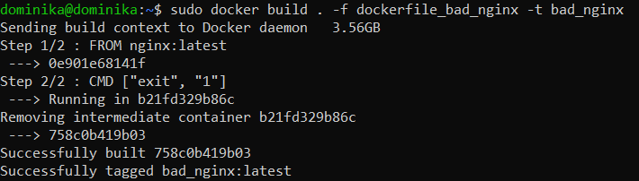
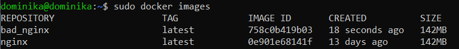
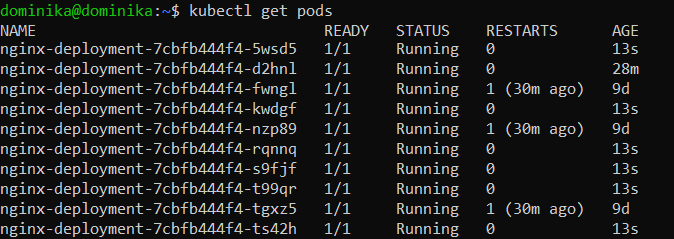
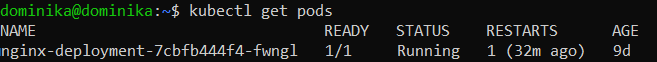
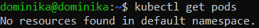
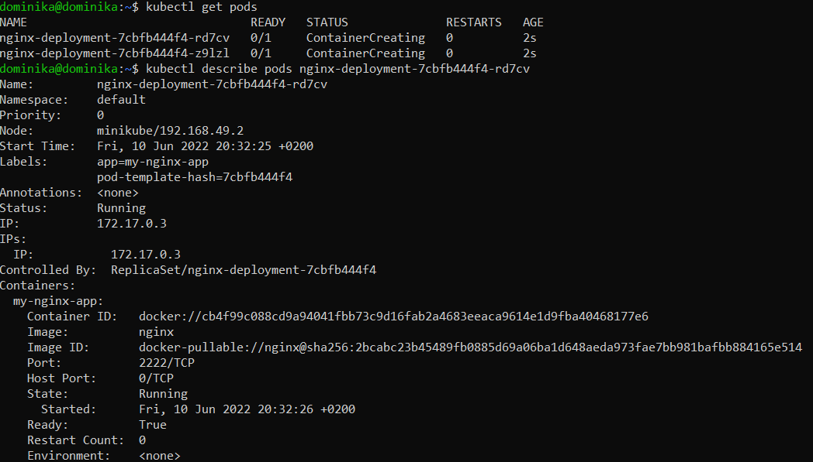
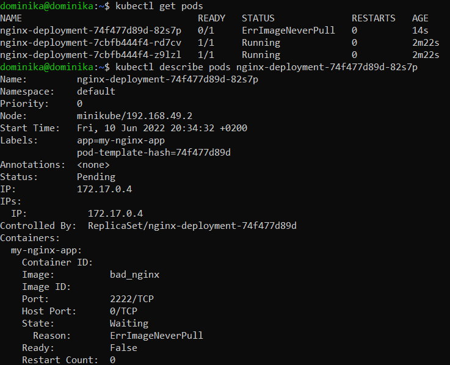
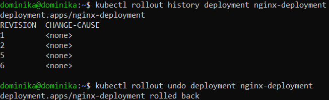

# Sprawozdanie z laboratorium 12

## Cel ćwiczenia
Celem laboratorium była dalsza praca z narzędziami oferowanymi przez środowisko Kubernetes.

## Wykonanie
1. Zwiększenie liczby replik do czterech;

    

2. Przeprowadzenie wdrożenia za pomocą polecenia `kubectl apply -f deploy.yaml` oraz sprawdzenie aktualnego stanu komendą `kubectl rollout status -f deploy.yaml`;
    

3. Przygotowanie nowej wersji obrazu, którego uruchomienie skutkuje błędem:
- Przygotowanie pliku Dockerowskiego *dockerfile_bad_nginx*:

    `FROM nginx:latest`

    `CMD ["exit", "1"]`
- Uruchomienie pliku budującego przy pomocy `sudo docker build . -f dockerfile_bad_nginx -t bad_nginx`;
    

- Wyświetlenie aktulnie istniejących obrazów;
    

4. Zmiana liczby replik:
- Zwiększenie do dziesięciu;
    

- Zmniejszenie do jednej;
    

- Zmniejszenie do zera;

    

5. Korzystanie z różnych wersji obrazu:
- Korzystanie z dobrej wersji obrazu;
    

- Korzystanie ze złej wersji obrazu;
    

6. Sprawdzenie historii wprowadzonych zmian komendą `kubectl rollout history deployment nginx-deployment`, a następnie przywrócenie poprzednich wersji poleceniem `kubectl rollout undo deployment nginx-deployment`;
    

## Opis poszczególnych strategii wdrożenia
### Recreate
W ramach strategii *recreate* praca wszystkich utworzonych dotychczas podów jest wstrzymywana, a następnie są one zabijane, zanim zostaną stworzone nowe.
### Rolling update
*Rolling update* polega na stopniowej aktualizacji kolejnych podów - ich wyłączaniu oraz ponownym włączaniu. Pozwala ona na dodatkowe zdefiniowanie, ile podów może być dodane jednocześnie, ile maksymalnie może być nieaktywnych oraz jak agresywnie mają być dezaktywnowane.
### Canary deployment workload
W *canary deployment* nowa wersja aplikacji jest wdrażana obok już istniejącej, starej wersji. Jeżeli nowa wersja spełnia wszystkie postawione wobec niej oczekiwania, stara wersja jest wygaszana, a ruch jej podów przekazywany jest do podów nowej wersji.

## Wnioski
Kubernetes, poza automatyzacją pracy, pozwala również na dopasowanie jej do indywidualnych potrzeb. Zmiana liczby replik, wykorzystywanego obrazu oraz różnie strategie wdrożenia dają możliwość dostosowania jej do aktualnych wymagań.