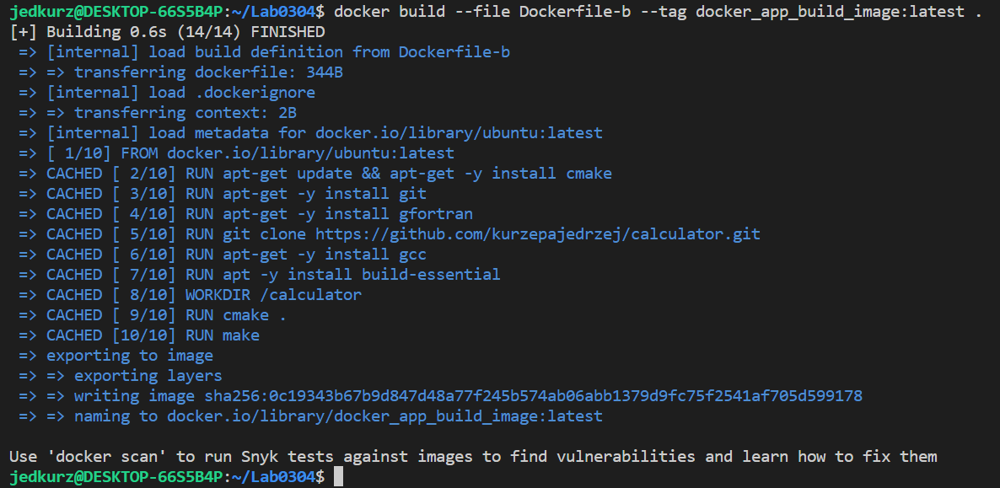
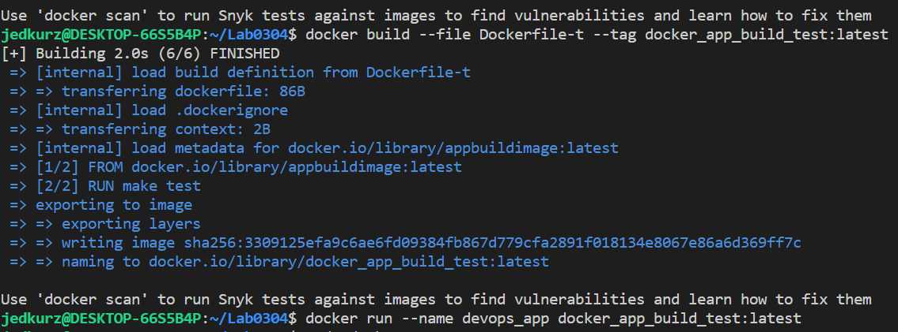
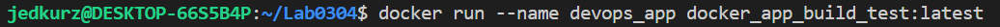
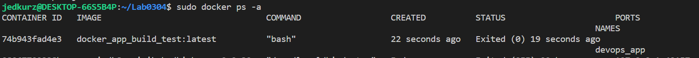
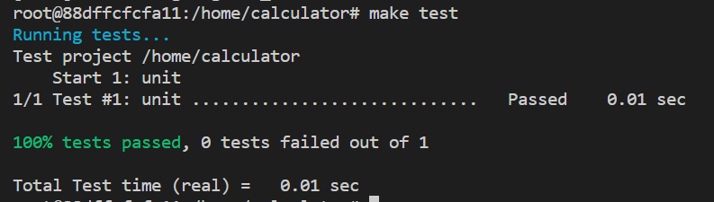
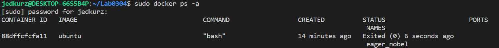

# Sprawozdanie Lab03
## Jędrzej Kurzępa GrLab07

## Aplikacja:
Jako aplikacje wybrano program napisany w C, fortran oraz wykorzystujący Cmake. 
## Dockerfile buildu:

Do poprawnego działania należało pobrać git, gfortran, camke, oraz pakiet build-essential następnie z githuba pobrać repozytorium. Następnie ustawić  Poniżej przedstawiam Dockerfile'a:

    FROM ubuntu:latest

    RUN apt-get update && apt-get -y install cmake
    RUN apt-get -y install git
    RUN apt-get -y install gfortran 
    RUN git clone https://github.com/kurzepajedrzej/calculator.git
    RUN apt-get -y install gcc
    RUN apt -y install build-essential

    WORKDIR "/calculator"
    RUN cmake .
    RUN make 

## Dockerfile testowania

Dockerfile potrzebny do testowania posiada tylko dwa elementy.

    FROM appbuildimage:latest
    
    RUN make test

## Tworzenie obrazów i uruchamianie kontenera

Dockerfile do buildowania opisano jako Dockerfile-b a dockerfile do testowania jako Dockerfile-t. Komendy do budowania i uruchomiania kontenera:

    docker build --file Dockerfile-b --tag docker_app_build_image:latest .
    docker build --file Dockerfile-t --tag docker_app_build_test:latest .
    docker run --name devops_app docker_app_build_test:latest 

Poniżej screenshoty z wykonywania powyższych komend.

## Buildowanie i testowanie wewnątrz kontenera 

Został stworzony kontener ubunut w trybie interaktywnym przy użyciu komendy:

    docker run -it ubuntu    

Poniżej przedstawiam użyte komendy:

    mkdir app   
    apt-get update
    apt-get install git
    git clone https://github.com/kurzepajedrzej/calculator.git
    apt -y install build-essential
    apt-get -y install gfortran
    apt-get -y install cmake
    cmake .
    make 
    make test

 Poniżej przedstawiam zrzut ekranu z konsoli po wykonaniu buildzie oraz testu:

 
 