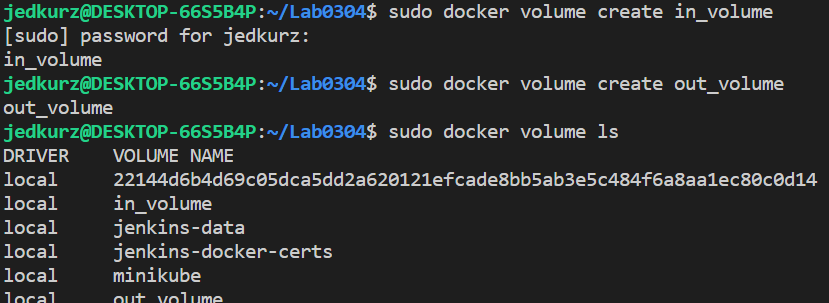
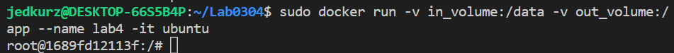
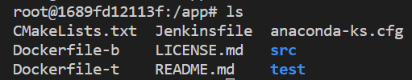
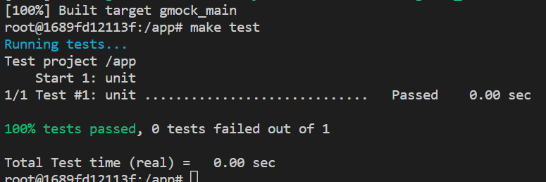
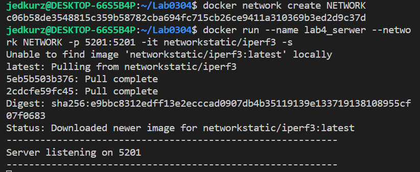
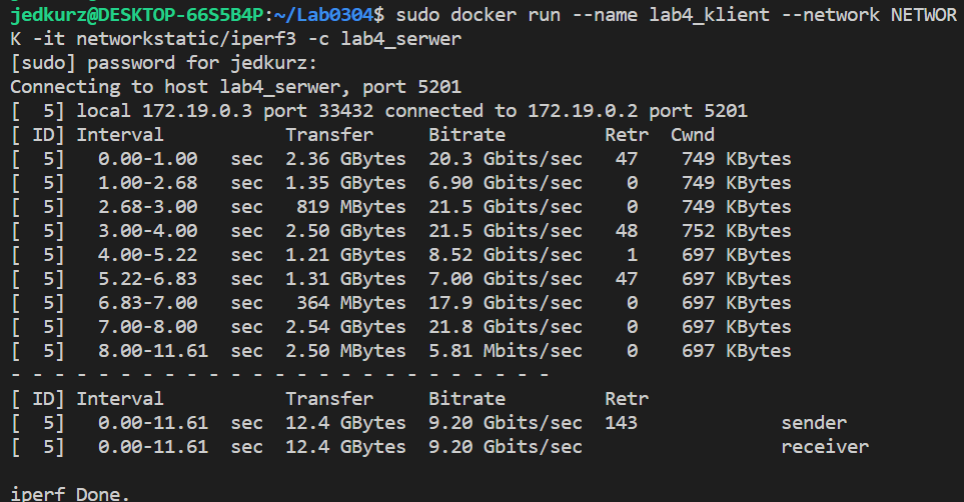
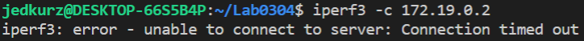
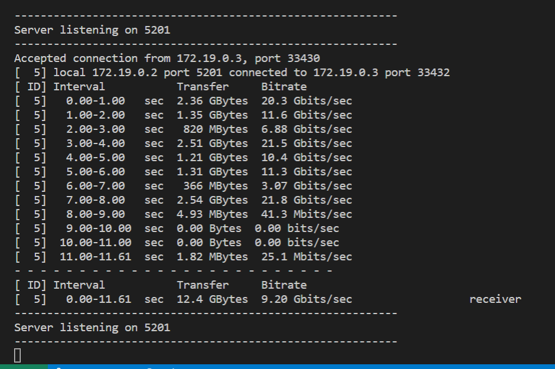
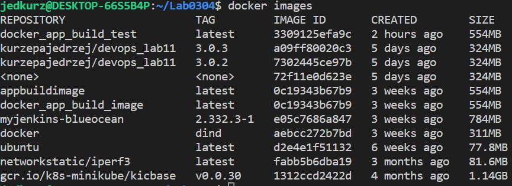

# Sprawozdanie Lab04
## Jędrzej Kurzępa grLab06

1. Stworzono wolumeny wejściowy oraz wyjściowy przy pomocy dwuktronego wywoałania komendy w dwóch wariantach. `sudo docker create --name temp -v in_volume:/data busybox` 

2. Z wolumenu stworzono kontener. `sudo docker run -v in_volume:/data -v out_volume:/app --name lab4 -it ubuntu`
    

1. Następnie sklonowano repozytorium do opowienidego pliku.
    

2. Zbuildowano apliakcje oraz wykonano testy

    
3.  Stworzono sieć za pomocą `docker network create NETWORK`.

4. Następnie korzystając z iperf3 stworzono serwer `docker run --name lab4_serwer  --network NETWORK  -p 5201:5201  -it networkstatic/iperf3 -s`.

    

5. Stworzono także klienta łączącego się z serwerem `sudo docker run --name lab4_klient   --network NETWORK  -it networkstatic/iperf3 -c lab4_serwer`.

    

6.  Następnie podjęto próbę połączenia sie z lokalnej maszyny z serwerem `iperf3 -c 172.19.0.2`.
Jednak łącznie nie powiodło się pomimo kilku prób. 
    

9. Logi serwera po połączeniu z klienetem gdzie widoczne jest połączenie z klientem.

    

10. W sprawozdaniu pominięto etpa związany z Jenkinsem ponieważ dowodem na powodzenie instalacji oraz uruchomienia Jenkinsa jest sprawozdanie z projektu(Lab05-Lab07). Na screnshocie widoczny obraz jenkinsa.
    