# Sprawozdanie lab11+12
## Jędrzej Kurzępa IT GR06

## Lab11

1. Zainstalowano minikube wykorzystując metodę podaną w poniższym linku: https://minikube.sigs.k8s.io/docs/start/ 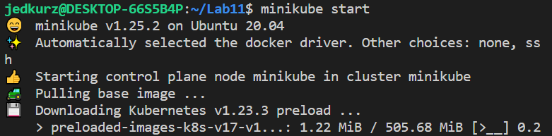 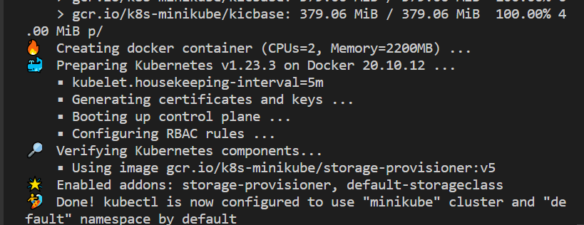
Instalacja przebiegła pomyślnie, jako domyślny sterownik został wybrany Docker.
2. Następnie zaistalowano kubectl. 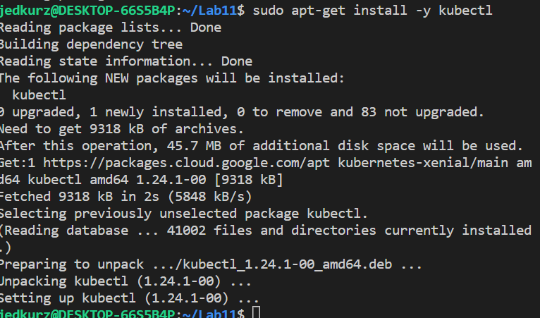
3. Uruchomiono wykorzystując komendę `minikube start` oraz komendę `minikube dashboard` uruchomiono klaster kubernetesa oraz dashboard wizualizujący działanie. Laboratorium było wykonywane w oparciu o wirtualną maszyne Ubunut (w WSL) więc w przeglądarce poprzez link wypisany przy starcie. 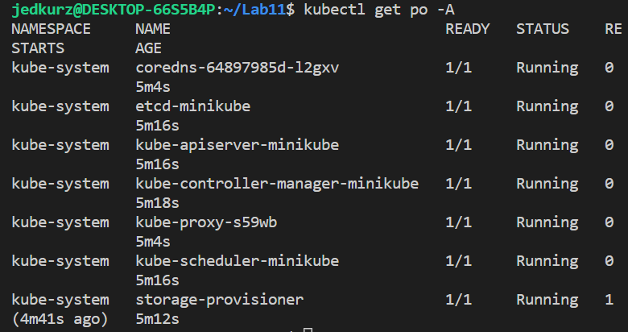 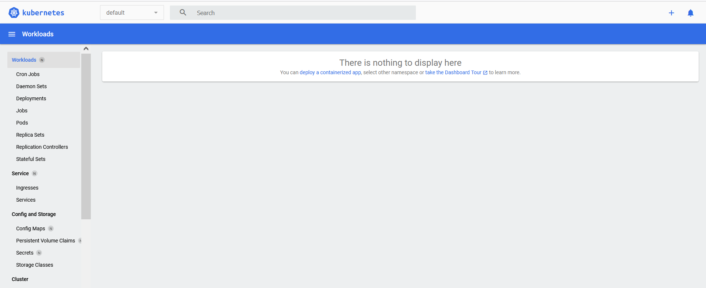
4. Na potrzeby zadania znaleziono odpowiedni prosty serwer opart o język golang, jednak nie spełniał wymagań zadania więc zforkowano go oraz zmodyfikowano poprzez połączenie go z innym istniejącym projektem. Dało to początkowo zadowlające wyniki(jednak w czasie wykonywania koljenych zadań znaleziono problem w programie, który zostanie opisany później)
5. Do programu stwrzono odpowiedni Dockerfile (oparty na poprzednich jednak)
   ```
    FROM golang:1.16-alpine
    USER root 
    WORKDIR "/app"
    RUN apk add git 
    RUN git clone https://github.com/kurzepajedrzej/Golang-Static-HTTP-Server.git
    WORKDIR "/app/Golang-Static-HTTP-Server"
    RUN go build -o devopsapplab10
    EXPOSE 8000
    CMD [ "./devopsapplab10" ]
   ```
6. Zbudowano obraz Docker (stworzono wersję 1.0.1) wykorzystując komednę `sudo docker build -t devops_lab11:1.0.1 . ` 
7. Następnie obraz dodano na dockerhub wykorzysując komendę `docker push kurzepajedrzej/devops_lab11:1.0.1`
Komenda została wykonan pomyślnie bez potrzeby logowania do dockerhub z poziomu konsoli ponieważ podczas wykonywania zadnia zalogowano na konto w aplikacji Dockera na Windows. 
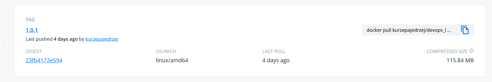
8. Następnie wykonano deploy wykorzystując komendę `sudo docker run -p 9090:8000 -d kurzepajedrzej/devops_lab11:1.0.1` 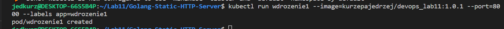 
9. Następnie stwrzono dwa pliki .yaml `backend-service.yaml` oraz `backend-deploument.yaml`. Treść plików delikatnie różni się względem tego co można zobaczyć na screenshotach z działania ponieważ wklejono ich formę z dalszych kroków(wersja wdrożenia 3.0.3 liczba replik)O następującej zawartości:
```
apiVersion: v1
kind: Service
metadata:
  creationTimestamp: null
  labels:
    io.kompose.service: wdrozeniev2
  name: wdrozeniev2
spec:
  ports:
    - name: "8000"
      port: 8000
      targetPort: 8000
  selector:
    io.kompose.service: wdrozeniev2
status:
  loadBalancer: {}

```
```
apiVersion: apps/v1
kind: Deployment
metadata:
  creationTimestamp: null
  labels:
    io.kompose.service: wdrozeniev2
  name: wdrozeniev2
spec:
  replicas: 1
  selector:
    matchLabels:
      io.kompose.service: wdrozeniev2
  strategy: {}
  template:
    metadata:
      annotations:
        kompose.cmd: kompose convert
        kompose.version: 1.26.1 (HEAD)
      creationTimestamp: null
      labels:
        io.kompose.service: wdrozeniev2
    spec:
      containers:
        - env:
            - name: network_mode
              value: host
          image: kurzepajedrzej/devops_lab11:3.0.3
          name: wdrozeniev2-goapp
          ports:
            - containerPort: 8000
          resources: {}
      restartPolicy: Always
status: {}
``` 
10. Następnie uruchomiono komendę `kubectl apply -f backend-deployment.yaml,backend-service.yaml`.
Czego efekt był następujący. 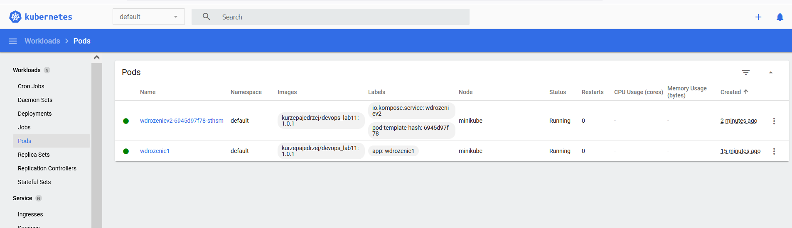
11. Zfordwardowano port aby móc wyświetlić efekty działania aplikacji: `kubectl port-forward service/wdrozeniev2 8000:8000`
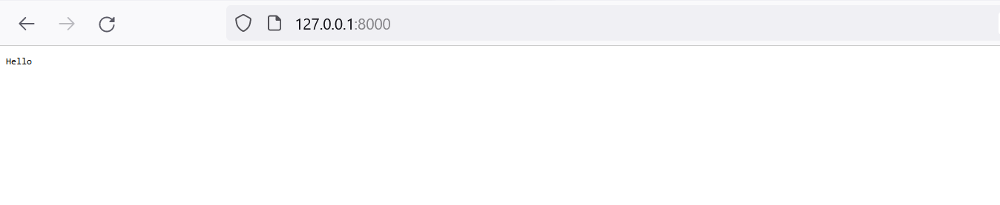. 

## Lab12
1. Laboratorium 12 w początkowym etapie opierało się o kolejne zmiany w plikach .yaml, i obserwacji efektów tych zmian. Przy pomocy komendy `rollout status` zbadano status. W każdym zadanym wariancie po wykonaniu zmian w pliku uruchamiano komendę `kubectl apply  -f backend-deployment.yaml,backend-service.yaml`. Na poniższych screenach można zobaczyć 3 warianty ilości replik oraz zastosowanie starszych oraz nowszych obrazów. Na dockerhub załadowano kilka różnych wersji. 
   
* Stan początowy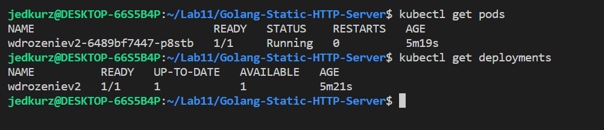 
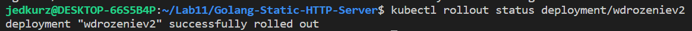 
* Dodano 5 replik 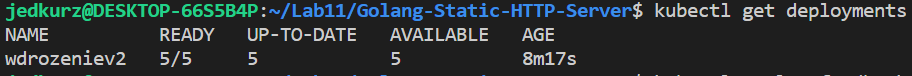 
* Zmieniono liczbę replik na 3  
* Zmieniono liczbę replik na 1 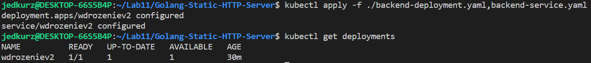 
* Zmieniono liczbę replik na 0 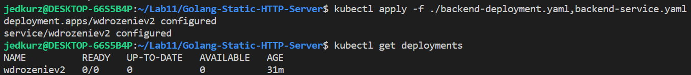
* Powrócono z wersji 3.0.3 na 2.0.0 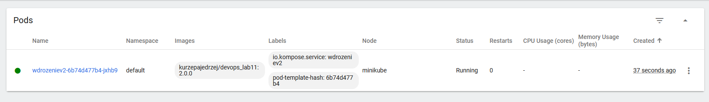
* Rollouthistory 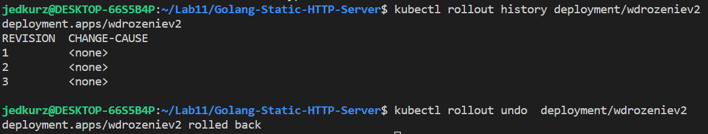
* 3 różne wersje poprzez roo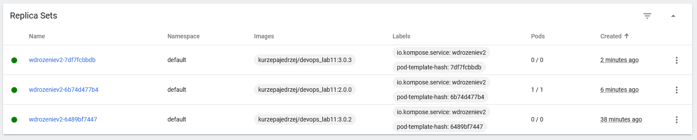