# Sprawozdanie Lab_12 Kacper Nosarzewski
## 1. Cel cwiczenia

Wdrażanie na zarządzalne kontenery: Kubernetes (2)
## 2. Wykonanie cwiczenia

1. Powiekszenie ilosci replik zapisanych w pliku deploy.yaml
```
apiVersion: apps/v1
kind: Deployment
metadata:
  name: kn-nginx-deployment
  labels:
    app: knnginx1
spec:
  replicas: 4
  selector:
    matchLabels:
      app: knnginx1
  template:
    metadata:
      labels:
        app: knnginx1
    spec:
      containers:
      - name: knnginx1
        image: nginx
        imagePullPolicy: Never
        ports:
        - containerPort: 2222
```
2. Nowe wdrozenie wykonane poleceniem  `kubectl apply -f deploy.yaml` 

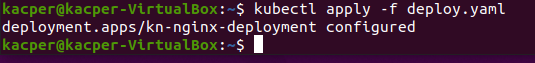

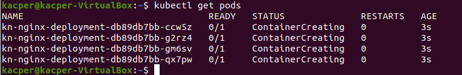

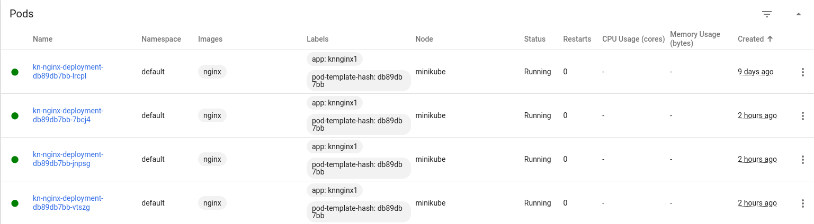

3. Zbadanie nowego stanu poleceniem `kubectl rollout status -f deploy.yaml`

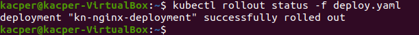


4. Utworzenie dockerfile `Dockerfile_kn_error_nginx` z nginx ktorego uruchomienie konczy sie bledem
```
FROM nginx:latest
CMD [ "exit", "1" ]
```
5. Zbudowanie nowego obrazu nginx poleceniem `sudo docker build . -f Dockerfile_kn_error_nginx -t kn_error_nginx`

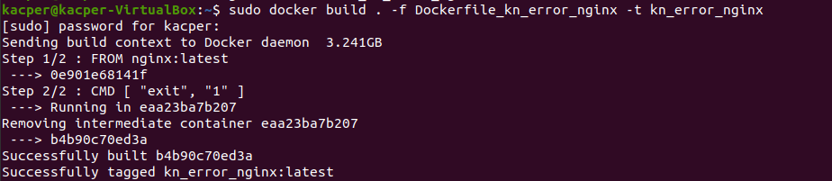

6. Zwiekszenie liczby replik z `4` na `7`

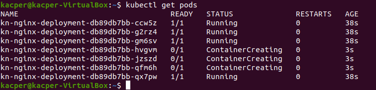

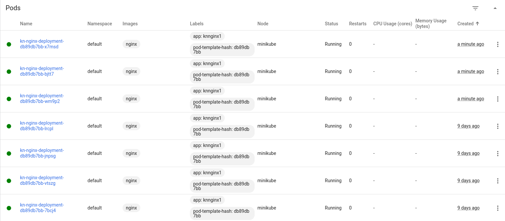

7. Zmniejszenie ilosci replik z `7` na `1` 

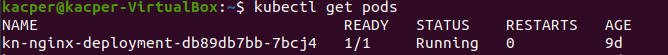

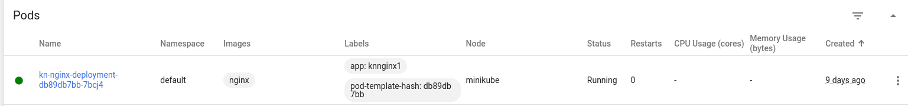

8. Ustawienie ilosci replik na `0`

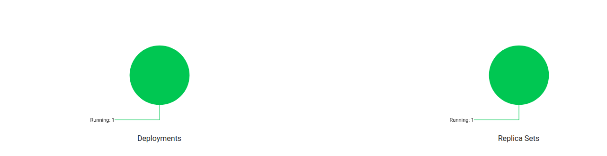

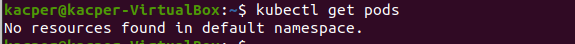

9. Wyswietlenie repliki z dzialajacym nginx i z obrazem konczacym sie bledem poleceniem `kubectl describe pods kn-nginx-deployment-7db67c9dd9-9dzcg
`
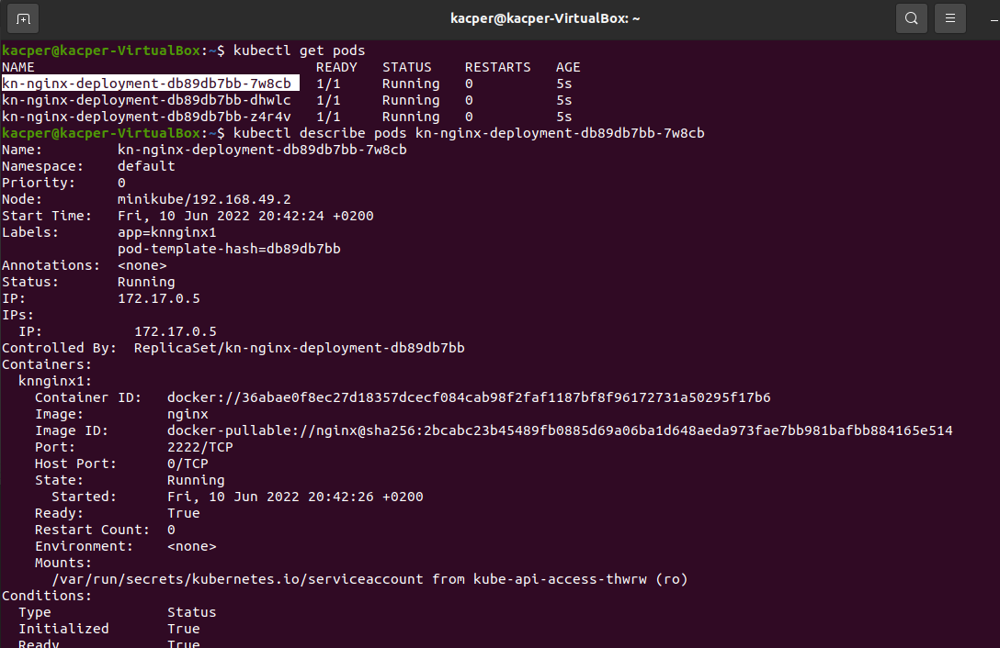


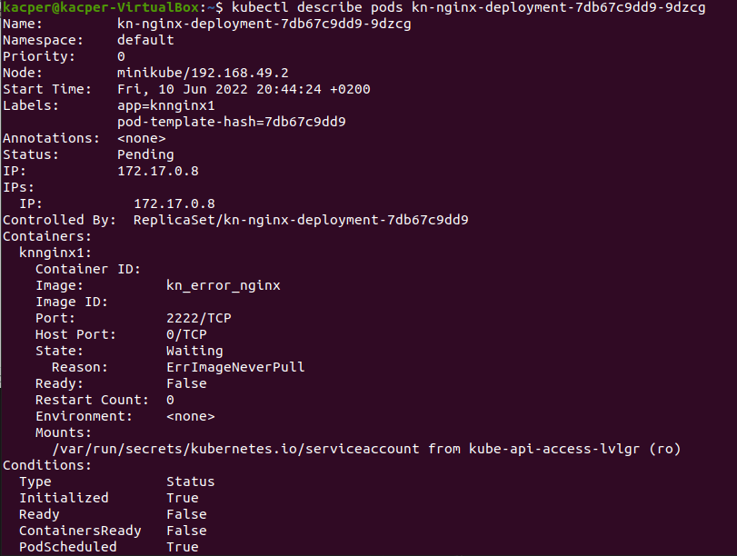

10. Wyswietlenie stanu dashboarda po wykonaniu wdrozenia z blednym obrazem

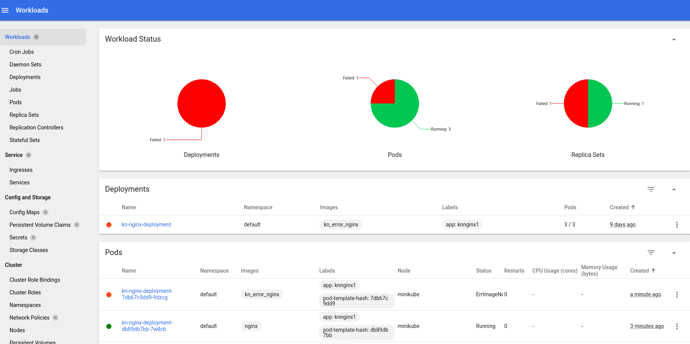

11. Przywrocenie poprzednich wersji wdrozen poleceniem `kubectl rollout history deployment kn-nginx-deployment` i `kubectl rollout undo deployment kn-nginx-deployment`

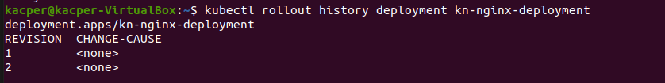

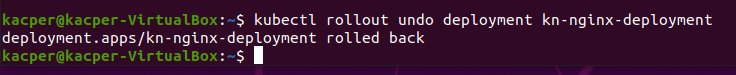

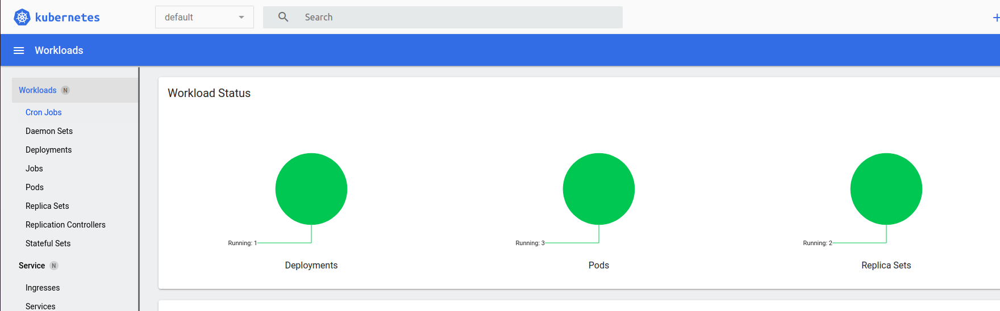


