# Rafał Olech - Sprawozdanie z laboratorium 12

## Cel i opis projektu:

Celem ćwiczeń była dalsza praca z kubernetesem. 


## Wykonanie ćwiczenia:

### 1. Konwersja wdrożenia ręcznego na wdrożenie deklaratywne YAML.

* Zmiana liczby replik na 4.

Zawartość pliku `deploy.yaml`:

```
apiVersion: apps/v1
kind: Deployment
metadata:
  name: nginx-deploy
  labels:
    app: mynginx1
spec:
  replicas: 4
  selector:
    matchLabels:
      app: mynginx1
  template:
    metadata:
      labels:
        app: mynginx1
    spec:
      containers:
      - name: mynginx1
        image: nginx
        imagePullPolicy: Never
        ports:
        - containerPort: 2222
```

* Wdrożenie za pomocą polecenia `kubectl apply -f deploy.yaml`:


* Zbadanie stanu kubectl poleceniem `kubectl rollout status -f deploy.yaml`:


### 2. Przygotowanie nowego obrazu.

* Utworzenie nowej wersji obrazu, którego uruchomienie zwróci błąd:

Zawartość pliku `dockerfile_lab12`:

```
FROM nginx:latest
CMD [ "exit", "1" ]
```


* Uruchomienie pliku zwracającego błąd poleceniem `sudo docker build . -f dockerfile_lab12 -t project_with_error`:

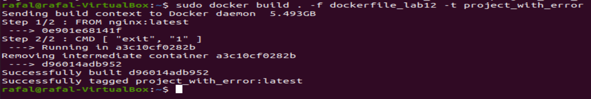


* Wyświetlenie aktualnie działających obrazów za pomocą `sudo docker images`. Wśród nich jest obraz o nazwie `project_with_error`:

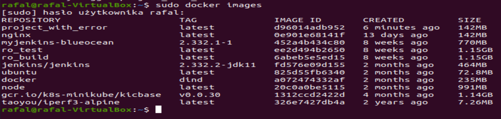


### 3. Zmiany w deploymencie.

* Zwiększenie liczby replik do 8 w pliku `deploy.yaml`:

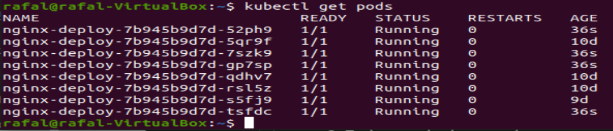
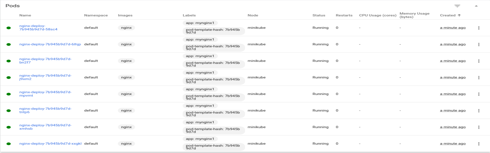


* Zmniejszenie liczby replik do 1 w pliku `deploy.yaml`:

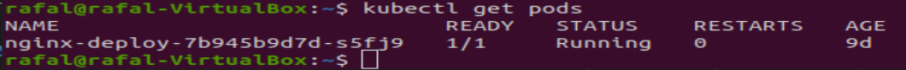
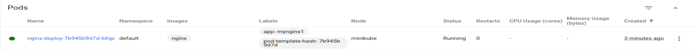


* Zmniejszenie liczby replik do 0 w pliku `deploy.yaml`:

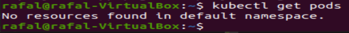


* Zastosowanie starszej/dobrej wersji obrazu poleceniem `kubectl describe pods nginx-deploy-7b945b9d7d-7bvk6`:


* Zastosowanie nowej/błędnej wersji obrazu poleceniem `kubectl describe pods nginx-deploy-7dbc85df-cs44f`:

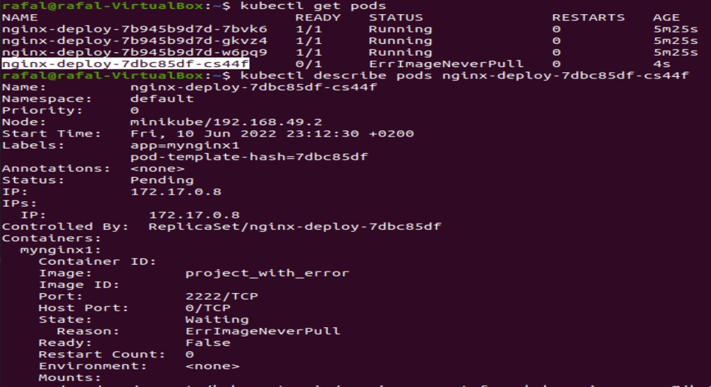
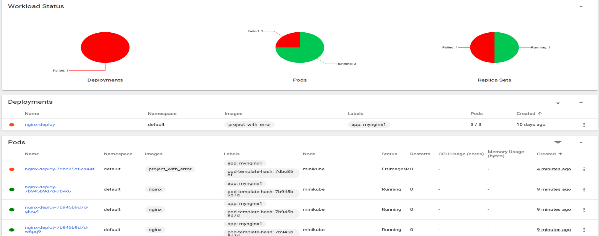


* Wyświetlenie historii zmian poleceniem `kubectl rollout history deployment nginx-deploy`:

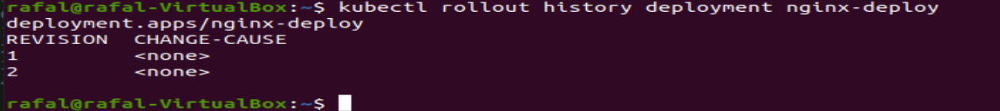


* Przywrócenie poprzednich wersji wdrożeż za pomocą polecenia `kubectl rollout undo deployment nginx-deploy`:

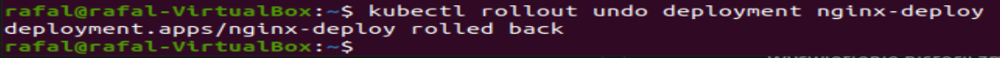
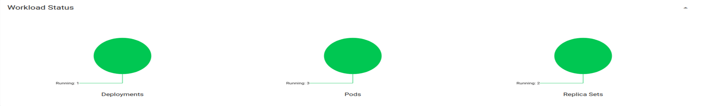


