# Sprawozdanie z laboratorium 11,12 
 
## Wykonanie laboratorium część 1

**1. Instalacja klastra Kubernetes**

a) instalacja curl, minikube'a kubectl'a, wyświetlenie sumy kontrolnej


b) uruchomienie minikube'a


c) uruchomienie dashboardu i pokazanie łączności


Kubernetes wymaga 20 GB wolnej przestrzeni dyskowej, 2 rdzeni oraz 2 GB RAM-u. Aby go uruchomić należy także mieć połączenie ze środowiskiem konteneryzacji ,np.: Dockerem lub Hyperkitem. 

**2. Analiza posiadanego kontenera**

Wybrałem nową aplikację, ponieważ poprzednia nie udostępniała portów.

a) klonowanie


b) aplikacja zawierała Dockerfile


c) docker build


d) uruchomienie kontenera i przekierowanie portu


**3. Uruchamianie oprogramowania**

a) utworzenie pliku definicji pod.yml

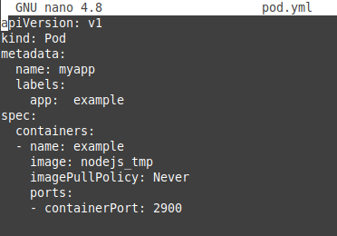

b) utworzono pod'a za pomocą polecenia kubectl apply

Próba utworzenia poda kończy się niepowodzeniem, ponieważ obraz jest utworzony w lokalnym dockerze, a nie w kubernetesie.
Ustawienie imagePullPolicy: Never powoduje, że obraz nie będzie zaciągany z internetu, tylko jest poszukwany lokalnie w danym nodzie.
Polecenie minikube docker-env zwraca zestaw zmiennych środowiskowych Bash, które służą do konfiguracji lokalnego środowiska w celu ponownego użycia Dockera wewnątrz Minikube. Użycie eval powoduje, że bash poprawnie utwozru poda


c) utworzenie obrazu w node na podstawie tego samego Dockerfile


d) utworzenie poda i pokazanie działania


e) przekierowanie portów


**4. Przekucie wdrożenia manualnego w plik wdrożenia**

a) pod i dashboard

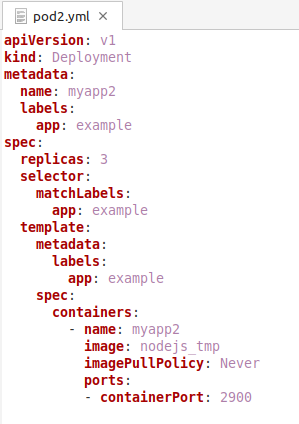


## Wykonanie laboratorium część 2

**1. Konwersja wdrożenia ręcznego na wdrożenie deklaratywne YML**

a) zmiana replik na 4

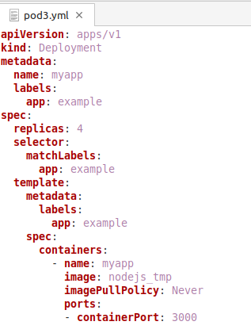

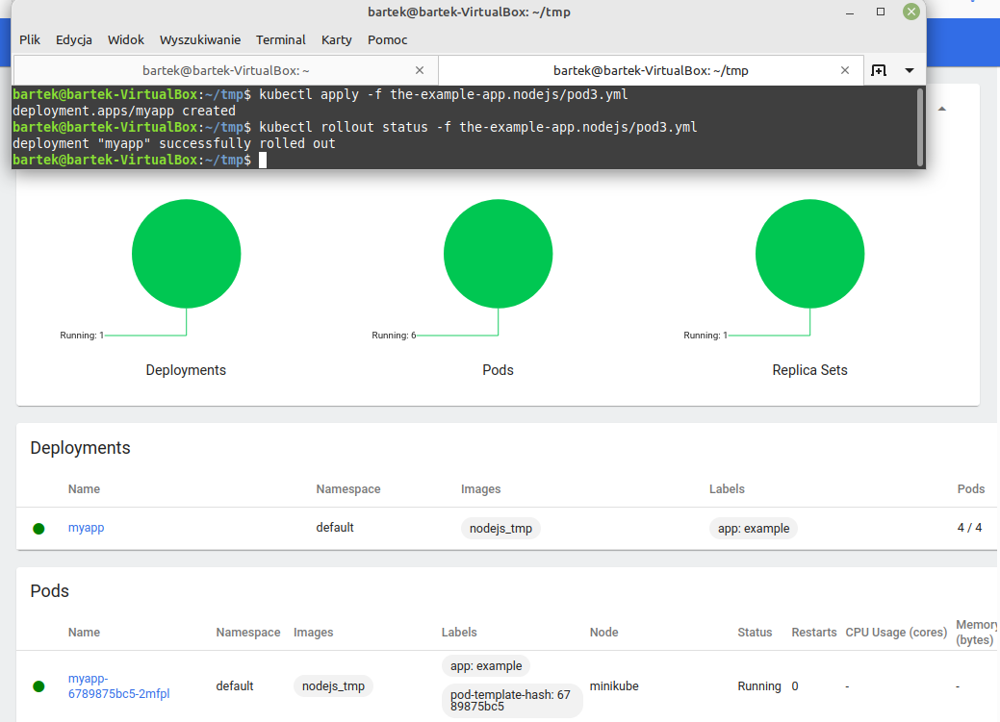

**2. Przygotowanie nowego obrazu**

a) logowanie na dockerhuba

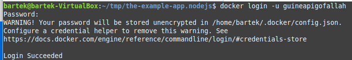

b) buildowanie 2 obrazów - działającego i niekompletnego oraz pushowanie do repo na dockehubie

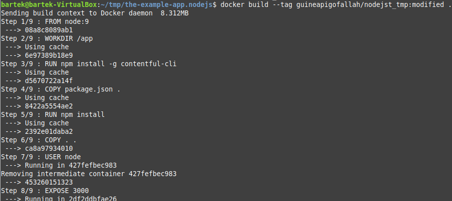

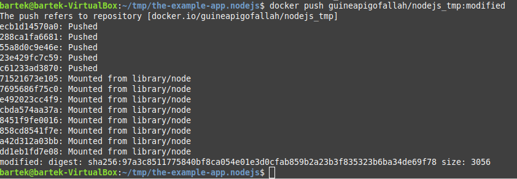

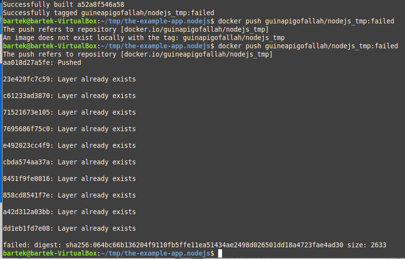

c) sprawdzenie repo

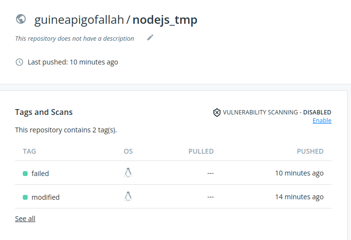

**3. Zmiany w deploymencie**

a) zwiększenie replik do 20

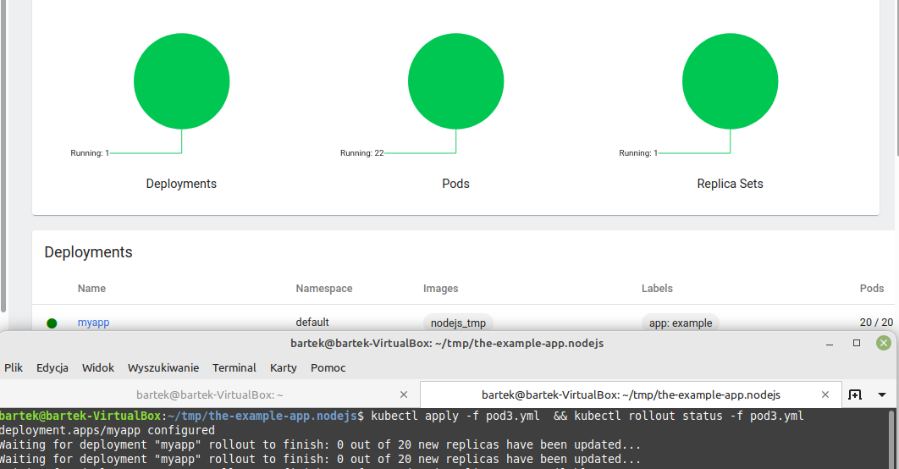

c) zmniejszenie do 0

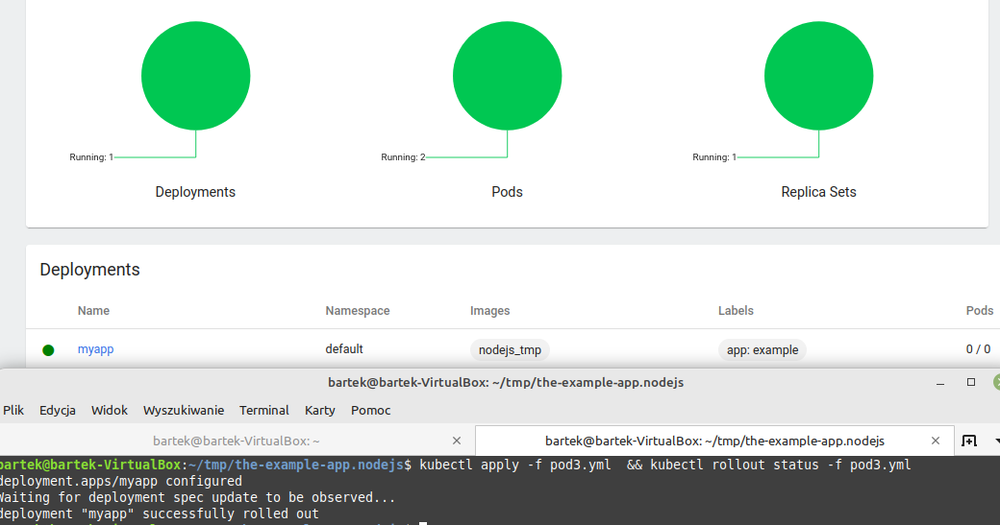

d) zwiększenie do 1 oraz zastosowanie wersji modified

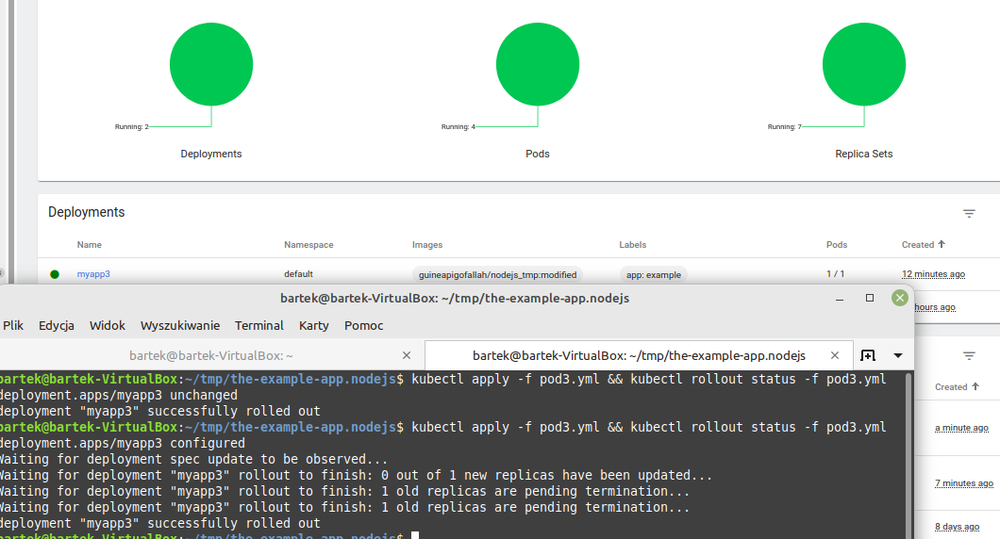

e) zastosowanie wersji failed

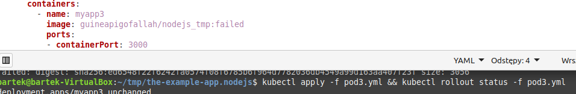

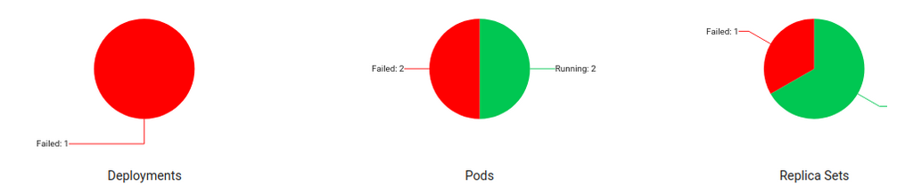

h) wyświetlenie historii wersji i przywrócenie wdrożeń

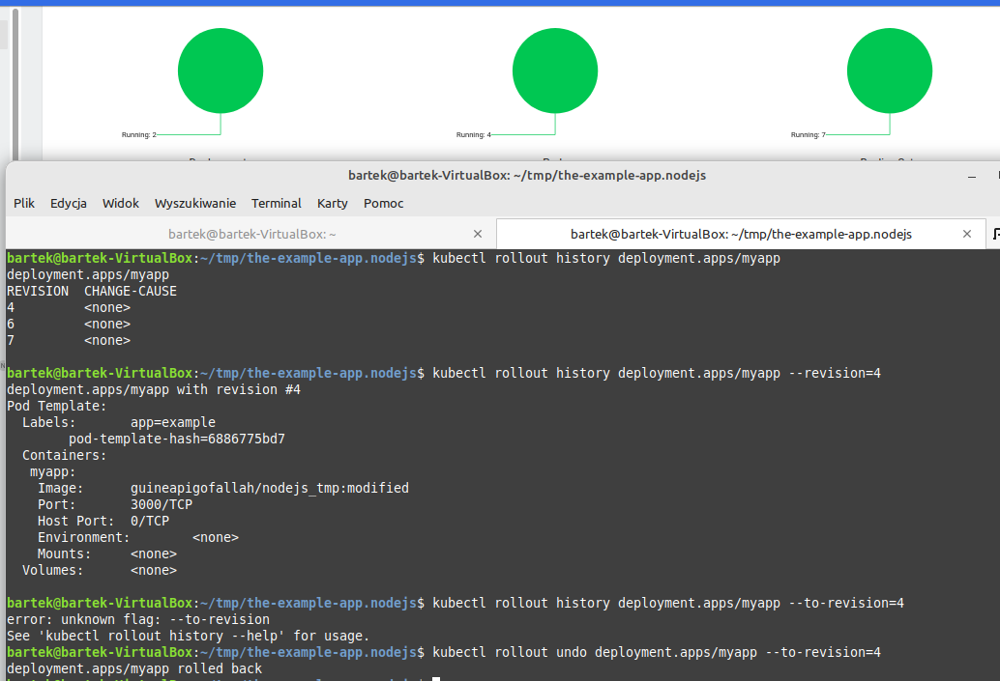

**4. Kontrola wdrożenia**

a) utworzenie skryptu

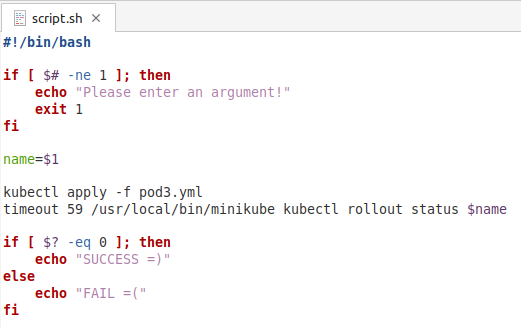

**5. Strategie wdrożeniowe**

a) Recreate - wszystkie aktualnie działające instancje są ubijane i następnie wdrażana jest nowa wersja
```
spec:
  replicas: 4
  strategy:
    type: Recreate
```
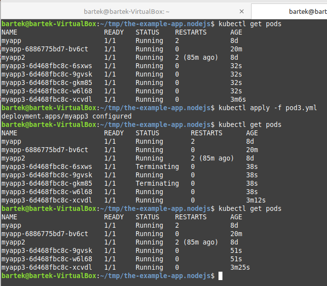

b)  RollingUpdate - nowy zestaw replik; pody zabijane tak, aby liczba nadmiarowych nie przekroczła MaxSurge

```
spec:
  replicas: 6
  strategy:
    type: RollingUpdate
    rollingUpdate:
      maxSurge: 2
      maxUnavailable: 0 
```

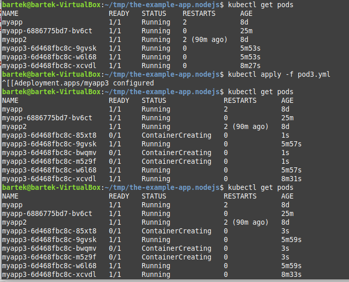

c) Canary - Jedna replika nowej wersji jest wypuszczana obok starej i jeżeli nie wystąpią żadne błędy to zwiększa się liczba replik nowej wersji i usuwa stare wdrożenie

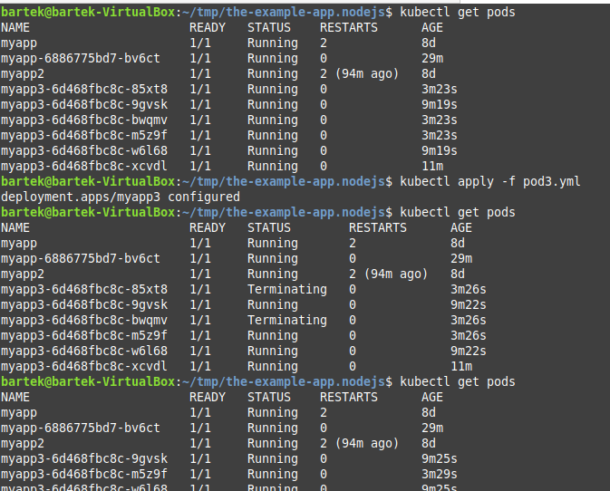
