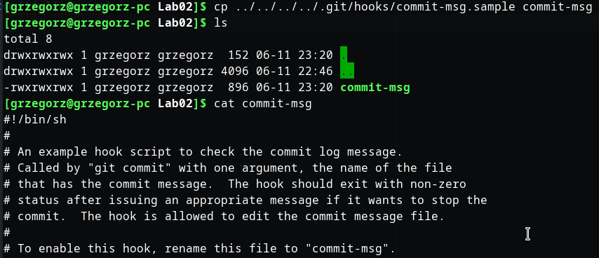
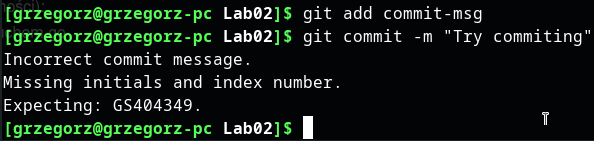
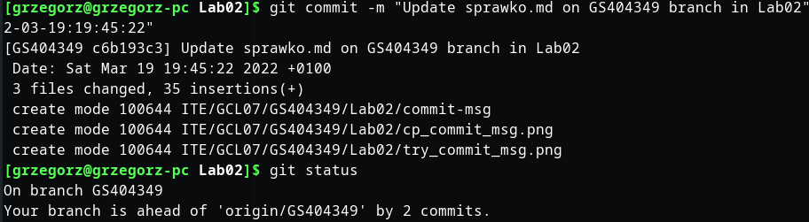
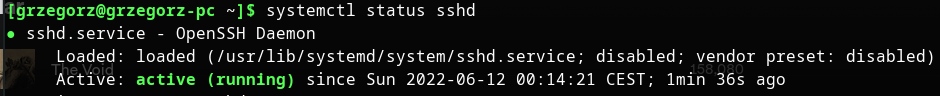
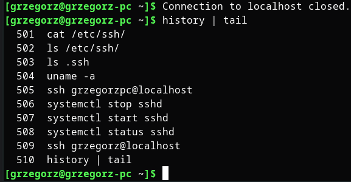
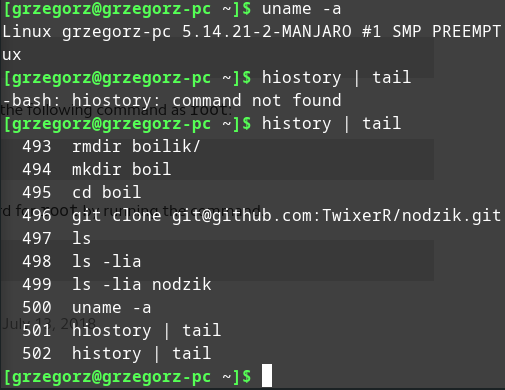

# Sprawko lab02
## Stworzyłem skrypt hooka na bazie przykładowego z katalogu .git projektu
  if [ -z "$(sed '/^#/d' "$1" | grep -w 'GS404349')" ]
  then
      echo >&2 Incorrect commit message.
      echo >&2 Missing initials and index number.
      echo >&2 Expecting: GS404349.
      exit 1
  fi

  LAB_NUMBER="$(egrep -o 'Lab[0-9][0-9]' "$1" | sort | uniq)"
  if [ "$LAB_NUMBER" != "$(sed '/^#/d' "$1" | egrep -o 'Lab[0-9][0-9]')" ]
  then
      echo >&2 Incorrect commit message.
      echo >&2 Lab number not in commit message.
      echo >&2 Expecting: Lab[0-9][0-9].
      exit 1
  fi

## Sprawdziłem działanie. Commit nie przeszedł. Otrzymałem obie wiadomości.

## Commit z wymaganą treścią wiadomości przechodzi poprawnie

## Uruchomiłem daemona ssh

## Skonfigurowałem serwer i połączyłęm się przez SSH na domyslnym porcie 22
## Na bazie efektu uruchomienia "history" wykażę poprawnośc połączenia przez SSH
## Historia poleceń przed:

## Historia poleceń po: (z promptem zakończenia połączenia ~.)

## Uznaję, że wykazałem połączenie przez ssh

## Założyłem konto DockerHub

