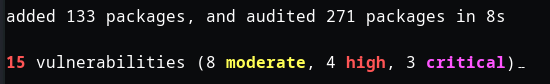
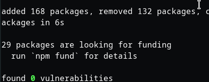
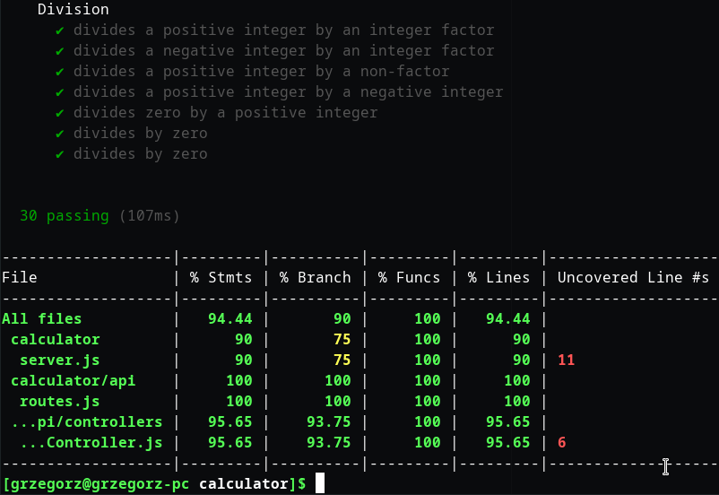
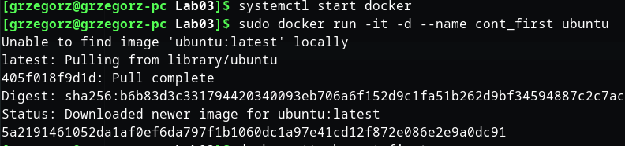
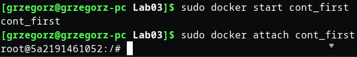
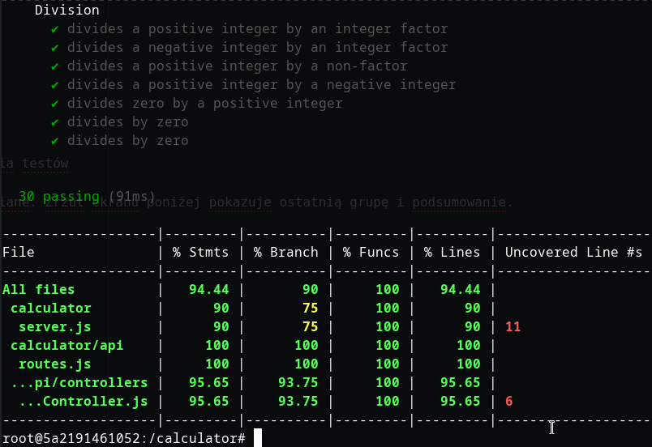
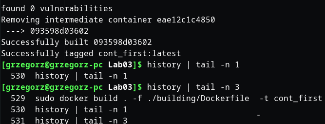
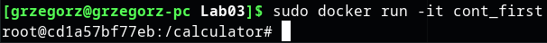
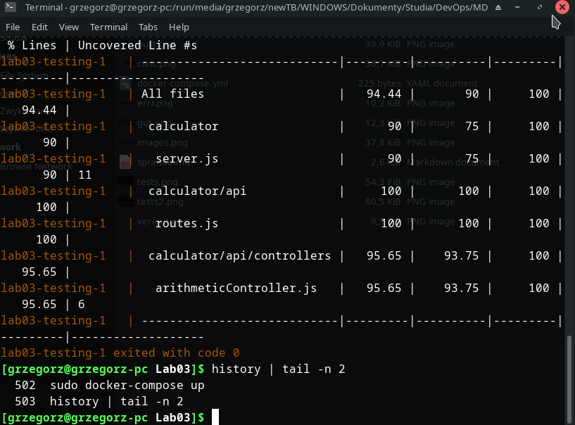
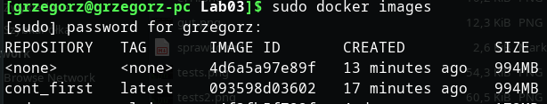

# Część pierwsza - projekt
Wybrałem projekt [kalkulator](https://github.com/actionsdemos/calculator), który jest prostym demo w nodejs z komunikacją po porcie 3000.
Wykonanie
  npm install
  npm test
Spełni wymagania zbudowania aplikacji i uruchomienia jej testów
**npm install** wymagał naprawienia krytycznych vulnerabilities

  npm audit fix

Z zadowalającym zerem przy podatnościach przeszedłem do uruchomienia testów
  npm test  
Output listuje wszystkie testy z kategorii, które zostały przewidziane. Zrzut ekranu poniżej pokazuje ostatnią grupę i podsumowanie.

Pragnę zwrócić uwagę na prompt natywnego systemu. Będzie istotnym elementem porównawczym z późniejszymi zrzutami ekranu.

# Część druga - docker
Stworzyłem kontener ubuntu

Podłączyłem się do niego

Managerem pakietów w tym systemie jest **apt-get**.
* Zaktualizowałem listy pakietów i
* pobrałem gita,
* npm oraz
* sklonowałem repozytorium
  sudo apt-get update
  sudo apt-get install git
  sudo apt-get install npm
  git clone https://github.com/actionsdemos/calculator;cd calculator
Tak, jak poprzednio, poza kontenerem, wykonanie
  npm install
pozostawiło te same podatności, które zostały analogicznie naprawione
  npm audit fix
Uruchomienie testów przeszło poprawnie
  npm test
Widoczny jest inny prompt - właściwy dla kontenera

# Część trzecia - automatyzacja przez Dockerfile
Zachowując kanon nazewnictwa stworzyłem dwa pliki Dockerfile w katalogach do **budowania** i **testowania**
Zawartość pliku Dockerfile do budowania to powtórzenie kroków z opcjami obsługującymi interaktywne wymagania apt-get install. Opcja -y odpowie twierdząco w każdym punkcie tego wymagającym, czyli w tym przypadku udzieli zgody na zajęcie określonego miejsca na dysku.
  FROM ubuntu:latest
  RUN apt-get update
  RUN apt-get -y install git
  RUN apt-get -y install npm
  RUN git clone https://github.com/actionsdemos/calculator
  WORKDIR calculator/
  RUN npm install
  RUN npm audit fix --force

Uruchomienie
  sudo docker build . -f ./building/Dockerfile -t cont_first
daje efekt

Zawartość pliku do testowania jest uogólniona na wszystkie testy npm - stąd argument pozwalający na uruchomienie testów praktycznie każdego obrazu, który
  sudo docker build --build-arg imagename=cont_first . -f ./testing/Dockerfile  -t cont_first
Po wykonaniu powyższych kroków możliwe jest uruchomienie kontenera przez
  sudo docker start cont_first

# Docker compose
Pożądany efekt uruchomienia
Nieco inaczej, niż poprzednio, wyświetlony jest pozytywny exit code testów uruchomionych w kontenerze.
  docker-compose up

# Dyskusja kontenera
Takie wdrożenie obrazu wymagałoby odchudzenia go z całości pakietu npm, ponieważ odpowiada on za ponad 700MB obrazu. Takie wdrożenie miałoby sens, gdyby istniała minimalna instalacja npm pozwalająca na uruchomienie testów i pobranie pakietów o rozmiarze porównywalnym do gita (ok 30MB)

Obraz raczej wymaga oczyszczenia z plików lockfile, jeżeli interakcja z apliakcją w kontenerze będzie warunkowała operacje na nowszych wersjach programów.
Skoro środowisko + skompilowany output = artefakt, dystrybucja tego obrazu ma sens bez dołączania doinstalowanych pakietów. Wykorzystany projekt jest utrzymywany w sensownym systemie kontroli wersji, a starsze release **npm** i **gita** będzie powszechnie dostępne. Nie przewiduję tutaj tak krytycznych  zależności, które warunkowałyby tworzenie gigabajtowego artefaktu.
