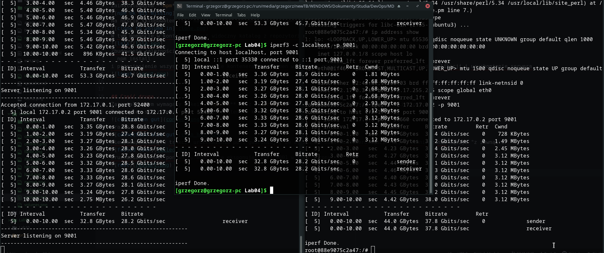
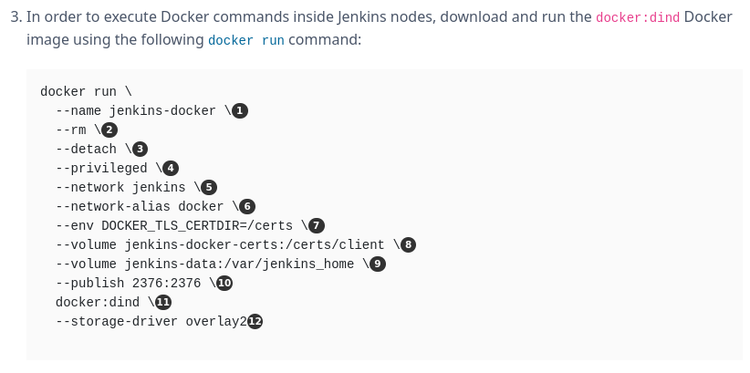

## Część pierwsza - wolumeny + klon
Stworzyłem wolumeny: wejściowy i wyjściowy

Zbudowałem kontener w oparciu o ostatni release Ubuntu podając utworzone dwa wolumeny
  sudo docker run -it -v "volume_in:/volume_in" -v "volume_out:/volume_out" ubuntu:latest
Zainstalowałem **npm** potrzebny do zbudowania projektu. Wykazałem nieobecność **git**'a w kontenerze

Na hoście sklonowałem repo na mountpoint wolumenuu wejściowego

W tym momencie w kontenerze jest widoczny katalog z repozytorium

Zbudowanie zależności przez
  npm install
i przeniesienie wszystkiego w obrębie kontenera na wolumen wyjściowy pozwala na dostęp z poziomu hosta do aplikacji i uruchomienie serwera.

## Część druga - ekspozycja portów
Zainstalowałem wymagany pakeit **iperf3** oraz **iproute2** do wyświetlenia listy interfejsóœ sieciowych
Połączyłem się z serwerem z poziomu kontenera klienta

oraz z hosta

Niewyeksponowany w trakcie uruchamiania port gwarantuje, że wyłącznie host kontenera będzie się w stanie z nim łączyć "z zewnątrz"

Uruchamiam serwer ponownie, explicite eksponując port 9001 w obie strony

Teraz możliwe jest połączenie z kontenerem-serwerem również z poziomu sieci hosta

Zmierzony bitrate
* klient->serwer  :37.8 Gbits/sec
* host->serwer    :45.7 Gbits/sec
* host_lan->serwer:28.2 Gbits/sec

## Część trzecia - Jenkins
Stworzyłem sieć dockera dla Jenkinsa

Pobrałem i uruchomiłęm obraz dind dockera wg dokumentacji dockera

Uruchomiłem kontener i odnalazłem hasło

Skonfigurowałem instalację Jenkinsa

