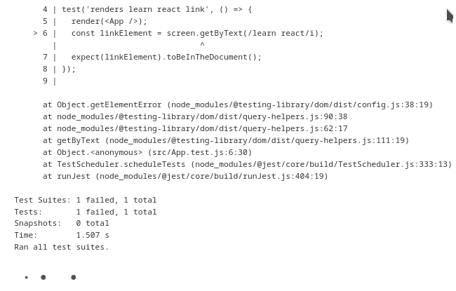

Stworzyłem pipeline budujący projekt zaliczeniowy z przedmiotu 'boil' napisany w nodzie.

Założenia na poszczególne kroki
## clone
* pobranie z repo wszystkiego
* przeniesienie do katalogu roboczego
## build
## test
* uruchomienie testów
* (FIX) pominięcie samego **npm test**, aby pipeline przeszedł pomyślnie dalej
## deploy
* uruchomienie kontenera
* uruchomienie aplikacji
* przechwycenie exit code z próby uruchomienia
## prepare Publish
* przygotowanie miejsca na tworzone artefakty
## Publish
* stworzenie artefaktu
* stworzenie archiwum wersji 1.0.0

Na każdym kroku czyszczenie poprzednich i tymczasowych kontenerów

Cała konfiguracja została pobrana automatycznie z repozytorium.
Jenkinsfile i dockerfile w roocie mojego brancha

Pipeline stawał na etapie testów. Logi wskazywały na błąd wewenątrz aplikacji, albo niezamknięty tag <script> przez problem z konwersją znaków, co jest widoczne na poniższych zrzutach ekranu.

Z pominięciem kroku
  npm install
otrzymałem poprawny artefakt i potwierdziłem poprawne działanie całego pipeline'u

