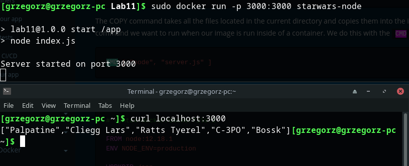
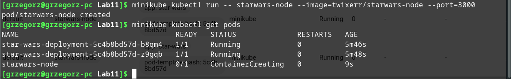
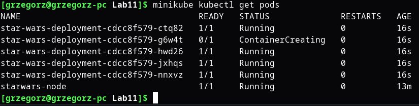

Zainstalowałem minikube

Uruchomiłem kubernetes z driverem dockerowym
  minikube start --driver=docker
Nadałem uprawnienia aplikacji
  sudo usermod -aG docker $USER && newgrp docker

Pobrałem kubectl
  minikube kubectl
Uruchomiłem dashboard
  minikube dashboard

Wykorzystałem prosty skrypt-stronę (całość to index.js),  która na curl portu 3000 zwróci domyślnie 5 nazw postaci z Gwiezdnych Wojen

stworzyłem Dockerfile

I obudowałem całość w kontener

Po uruchomieniu sprawdziłem połączenie

Stworzyłem poda z gotowego kontenera

Stworzyłem plik konfiguracyjny poda **pod_def.yaml**
  apiVersion: apps/v1
  kind: Deployment
  metadata:
    name: star-wars-deployment
  spec:
    selector:
      matchLabels:
        app: star-wars
    replicas: 2
    template:
      metadata:
        labels:
          app: star-wars
      spec:
        containers:
          - name: star-wars
            image: starwars-node
            ports:
              - containerPort: 3000
            imagePullPolicy: Never
Zaaplikowałem do kontenera

Otrzymałem działające pody

Sprawdziłem dashboard
]
Uruchomiłem poda według polecenia

Wyprowadziłem port 3000 poda na lokalny port 3070

Poprawiłem plik konfiguracyjny deploymentu zmieniając iloiśc replik na 5. Wymagało to  usunięcia obecnie żyhjącego deploymentu i reaplikowanie konfiguracji
  minikube kubectl delete deployment star-wars-deployment
  minikube kubectl -- apply -f pod_def.yaml

