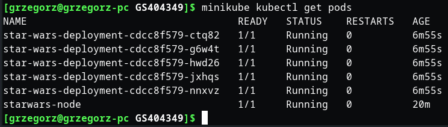
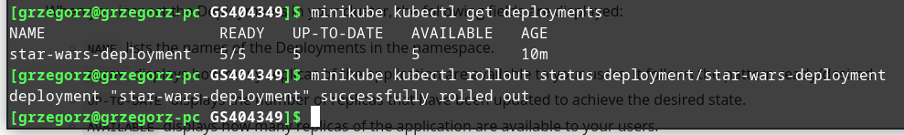
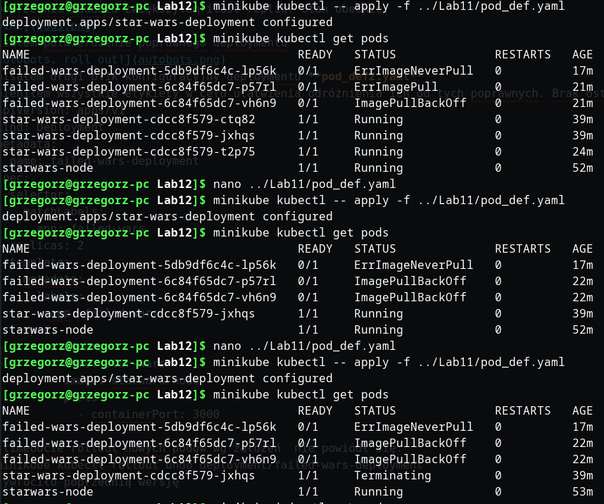
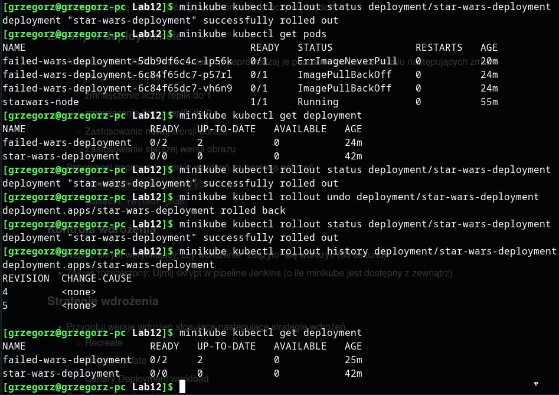
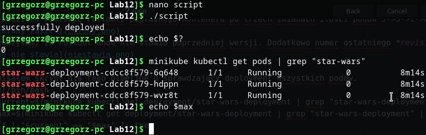

W poprzednim zadaniu zwiększyłem ilość replik. Stan obecnie:

Dostałem potwierdzenie poprawnego deploymentu

Napisałem drugi plik konfiguracyjny deploymentu **pod_def2.yaml**
Zmnieniłem wszystkie etykiety w celu ułatwienia odróżnienia ich od tych poprawnych. Brak ostatniej linijki *imagePullPolicy: Never* wywróci pody
  apiVersion: apps/v1
  kind: Deployment
  metadata:
    name: failed-wars-deployment
  spec:
    selector:
      matchLabels:
        app: failed-wars
    replicas: 2
    template:
      metadata:
        labels:
          app: failed-wars
      spec:
        containers:
          - name: star-wars
            image: starwars-node
            ports:
              - containerPort: 3000

Po timeoucie rollout nowych podów wg założeń  nie powiódł się.
  minikube kubectl rollout undo deployment/failed-wars-deployment
przywróciło poprzednią wersję

Sprawdziłem historię rolloutu poprawnego kontenera po trzech zmianach ilości podów 5->3->1->0

Zauważyłem, że rollout undo nie stawia poprzedniej wersji. Dodatkowo numer ostatniego *revision* wyłącznie rośnie.

Napisałem skrypt dla tego pipeline'u sprawdzający deployment wszystkich podów.
  #!/bin/bash
  current=$(minikube kubectl get deployment/star-wars-deployment | grep "star-wars-deployment" | awk '{print $2}' | cut -d '/' -f1)
  max=$(minikube kubectl get deployment/star-wars-deployment | grep "star-wars-deployment" | awk '{print $2}' | cut -d '/' -f2)
  if [ "$current" == "$max" ]; then
  	echo "successfully deployed"
    exit 0;
  else
  	echo "didn;t deploy in time"
    exit 1;
  fi
Uruchomienie **sleep(60);./script** zaraz po **minikube kubectl -- apply -f pod_def.yaml** pozwoli na sprawdzenie deploymentu w pipelinie
Dodanie kodów wyjścia ułatwi pracę pipeline'a. Taki sposób uruchomienia nie zostawi za sobą żadnych pozostałości w pamięci poza pożądanym exit code'm. Działanie demonstruję na zrzucuie ekranu

