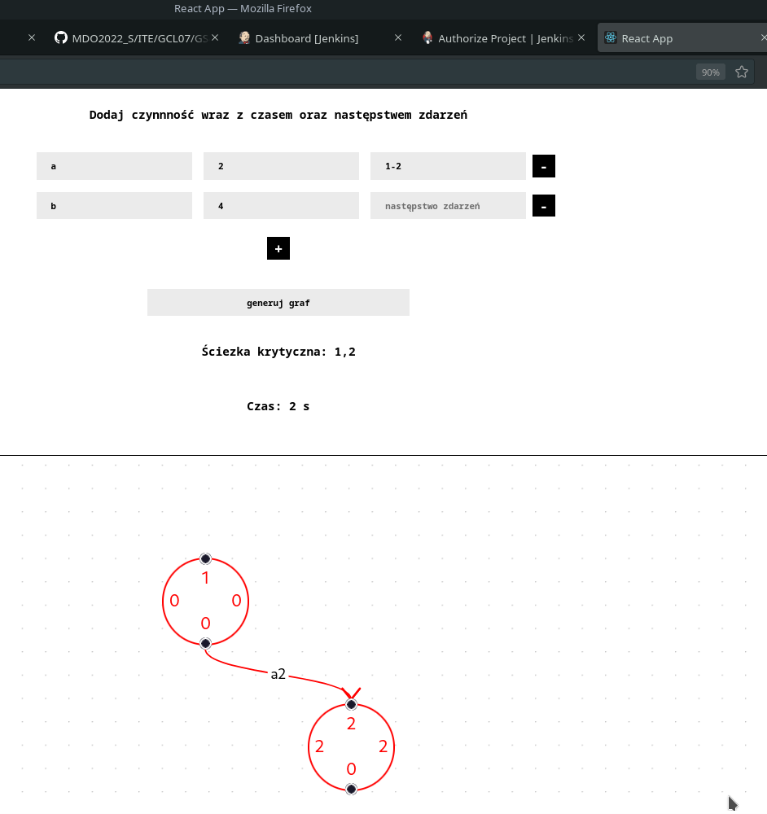
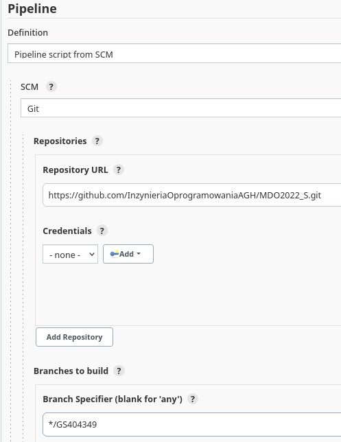
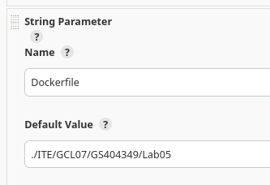
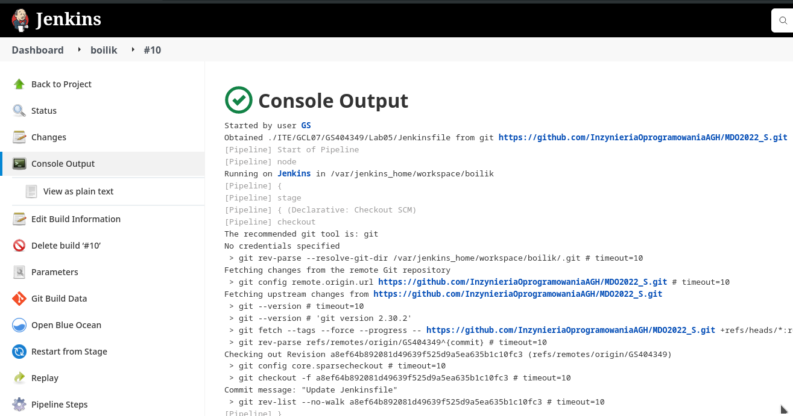
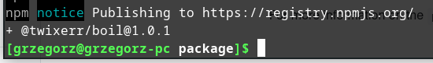

# Sprawozdanie z projektu zaliczeniowego DevOps 2022

Wykonał Grzegorz Surdziel, nr albumu 404349

## Wybór repozytorium

Poszukując odpowiedniego projektu spełniającego wymagania komunikacji przez TCP, oraz na otwartej licencji postanowiłem wykorzystać projekt tworzony na zaliczenie przedmiotu BOIL wraz z dwoma kolegami.
*Sforkowałem* całość pod swoje konto. Struktura projektu pozwala na bezpośrednie umieszczenie tam plików odpowiedzialnych za pipeline.
Aplikacja dostarcza serwer odpowiadający na zapytania GET przez HTTP na porcie 3000. Odpowiedź to aplikaca webowa przeznaczona do prostej algorytmiki w oparciu o grafy zdarzeń.


## Setup

Sklonowałem projekt przez ```git clone https://github.com/TwixerR/nodzik.git```.
Zainstalowałem wymagane zależności, uruchomiłem testy i serwer ```npm install;npm test;npm start```
Wykazałem działanie lokalnie na dwa sposoby.


Utworzyłem obraz dockera w oparciu o gotowy **node:alpine** pobrany z DockerHuba. Wersja **alpine** to minimum, jakie pozwoli na uruchomienie aplikacji, ponieważ posiada już zainstalowane podstawowe narzędzia, w tym node.js, oraz npm.
```
docker run -it -d --name meow node:alpine
```


Sposób realizacji tych kroków jest podobny do tych, które później zostaną ujęte w pliki automatyzujące ten proces.

Wszystkie pliki konfiguracyjne Jenkins pobiera automatycznie ze wskazanego miejsca w moim repozytorium., tj.:
Jenkinsfile

Dockerfile



## Pipeline

Pipeline podzieliłem na sześć etapów. Omówię każdy po kolei.

### clone
```
stage('Clone') {
  steps {
    echo 'Cloning nodzik'
    sh 'docker volume create input-volume'
    sh 'docker rm tempContainer || true'
    sh 'docker run --rm --name tempContainer --mount "type=volume,src=input-volume,dst=/app" node bash -c "cd ~/ && ls nodzik || git clone https://github.com/TwixerR/nodzik;cp -R nodzik /app; ls /app"'
  }
}
```
Tworzę wolumen dla kontenera, do którego kopiuję zawartość katalogu aplikacji po sklonowaniu repozytorium w katalog *app*
Aby upewnić się, że środowisko nie skoliduje na tym etapie - próbnie usuwam kontener, jeżeli przed powyższym etapem już istnieje.
Stworzenie samego kontenera buildowego może opierać się o (w tym wypadku) zainstalowanie modułów node przez skopiowanie do kontenera na wolumin wejściowy pliku ```package.json``` z repozytorium, po czym wywołanie ```npm install```

### Build
Kontenerem bazowym jest **node:alpine**. Zawiera minimum potrzebne do zbudowania obrazu, a zajmuje dziesiątą część miejsca pełnego obrazu node.
```
stage('Build') {
  steps {
    echo 'Buildig nodzik with npm'
    dir("${params.Dockerfile}") {
      sh 'docker build . -t nodzik_alpine -f Dockerfile'
      sh 'docker volume create output-volume'
      sh 'docker rm nodzik-build || true'
      sh 'docker run --rm --name nodzik-build --mount "type=volume,src=input-volume,dst=/app" --mount "type=volume,src=output-volume,dst=/app_build" nodzik_alpine bash -c "cd /app/nodzik && npm install; cp -R /app/nodzik /app_build"'
    }
  }
}
```
Buduję podstawowy obraz w oparciu o wskazany **Dockerfile**.
Do kontenera bazowego wpinam dwa wolumeny: wejściowy do przekazania źródeł, wyjściowy do instalacji aplikacji.

```
# syntax=docker/dockerfile:1

FROM node:alpine

WORKDIR app_test

RUN apk update && apk add bash

```
Tworzę minimalny obraz **node:alpine**, katalog **app_test**.
Troszczę się o dostępność powłoki (bash) zdolnej do uruchomienia wymaganego skryptu.

### Test


```
stage('Test') {
  steps {
    echo 'Testing nodzik with npm'
    dir("${params.Dockerfile}") {
      sh 'docker rm nodzik-test || true'
       sh 'docker run --rm --name nodzik-test --mount "type=volume,src=input-volume,dst=/app_test" nodzik_alpine bash -c "cd /app_test/nodzik && npm test"'
    }
  }
}
```
Działam na kontenerze powstałym tak, jak w poprzednim kroku, lecz tutaj na koniec uruchamiam testy (*npm test*) zamiast utworzenia źródła aplikacji.


### Deploy
```
stage('Deploy') {
  steps {
    echo 'Deploying nodzik'
    sh 'docker rm -f nodzik-deploy || true'
    sh 'docker run --name nodzik-deploy --mount "type=volume,src=output-volume,dst=/usr/local/app" nodzik_alpine bash -c "cd /usr/local/app/nodzik && npm run"'
    sh 'sleep 5; exit $(docker inspect nodzik-deploy --format="{{.State.ExitCode}}")'
    sh 'docker rm -f nodzik-deploy'
  }
}
```
Sprawdzam, czy kontener analogiczny do poprzednich będzie w stanie zadziałać poprawnie na ```npm run```. Oczekuję pięć sekund na reakcję i wychodzę. Pobieram kod wyjścia przez ```docker inspect``` na działającym kontenerze i przenoszę go do kodu wyjścia tej części skryptu.
Logi w tym momencie powinny pokazać początek uruchomienia, lub ewentualne błędy.
W konfiguracji Jenkinsa przy pierwszym uruchomieniu określiłem widoczność logów.

Na późniejszym etapie program zostanie spakowany w archiwum. Jest to motywowane sposobem dystrybucji i potencjalnego wykorzystania. Aplikacja może zostać uruchomiona w szerokim zakresie środowisk, a rozmiar rozsyłanego projektu to po kompresji ~25Kb.
Dystrybucja jako obraz dockera jest możliwa. Skróci istotnie setup.
Obraz nie musi zawierać logów i artefaktów z poprzednich etapów, chyba, że rozwój projektu wymusi korzystanie z nich. W tym momencie logi będą wykorzystywane wyłącznie na potrzeby rozwoju projektu, więc ich dystrybucja nie wydaje mi się zasadna.

### Pre-Publish
```
stage('Prepare publish') {
  when {
    expression {
      return params.Promote
    }
  }
  steps {
    echo 'Preparing publish'
    sh 'ls /var/jenkins_home/workspace/artifacts || mkdir /var/jenkins_home/workspace/artifacts'
  }
}
```
Przed stworzeniem artefaktu troszczę się o przygotowanie miejsca na niego. Odpowiedni katalog na wszystkie artefakty.

### Publish
```
stage('Publish') {
    when {
      expression {
        return params.Promote
      }
    }
    agent {
      docker {
        image 'node:alpine'
        args '--rm --mount "type=volume,src=output-volume,dst=/usr/local/app" --mount "type=bind,source=/var/jenkins_home/workspace/artifacts,dst=/usr/local/copy" -u root:root'
      }
    }
    steps {
      sh 'rm -rf /usr/local/copy/* || true'
      sh "cd /usr/local/app/nodzik && npm version --allow-same-version ${params.Version} && npm pack"
      sh "mv /usr/local/app/nodzik/boil-${params.Version}.tgz /usr/local/copy"
      dir('/var/jenkins_home/workspace/artifacts') {
        archiveArtifacts artifacts: "boil-${params.Version}.tgz"
      }
    }
  }
}
```
Pełna wersja korzysta tutaj z mniejszego obrazu **node:alpine**. Na potrzeby rozwoju projektu poprzednie etapy mogą skorzystać z większego obrazu **node:latest**, lub jakiejkolwiek stabilnej wersji (numery parzyste).
Gotowy artefakt jest spakowany w archiwum z nadanym numerem wersji.
Opublikowanie przeprowadzę ręcznie przez utworzenie konta w **npm**, aby umożliwić ```npm publish boil-1.0.0.tgz``` po zalogowaniu się w terminalu danymi z rejestracji. Zazwyczaj ten etap nastąpiłby automatycznie, po pomyślnym przejściu przez automatyczne testy, ale tutaj wycięcie tego kroku z całego pipeline'u zmniejszy stopień zaśmiecenia archiwum
Opublikowałem wersję 1.0.1 w npm


