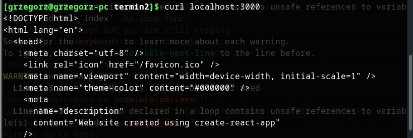

# Sprawozdanie z projektu zaliczeniowego DevOps 2022

Wykonał Grzegorz Surdziel, nr albumu 404349

## Wybór repozytorium

Poszukując odpowiedniego projektu spełniającego wymagania komunikacji przez TCP, oraz na otwartej licencji natrafiłem na [meta-repozytorium](https://github.com/public-apis/public-apis) (gromadzące otwarte, publiczne API), gdzie odnalazłem [meowfacts](https://github.com/wh-iterabb-it/meowfacts).
Projekt na licencji MIT (według jego pliku LICENSE) spełnia założenia sprawozdania.
Aplikacja dostarcza serwer odpowiadający na zapytania GET przez HTTP na (domyślnym) porcie 5000. Odpowiedź jest w surowym formacie JSON i zawiera zawsze krótki tekst.


## Setup

Klonuję repozytorium


Pracuję w środowisku z zainstalowanym node.js, lecz bez wymaganych przez ten projekt pakietów. Zależności z pliku **package.json** są następujące:

  "chai-http": "4.3.0",
  "express": "4.18.1",
  "helmet": "4.1.1",
  "sst": "git+https://github.com/wh-iterabb-it/sst.git"

Instaluję wymagane pakiety w oparciu o powyższy plik programem **npm**

  npm install

Uruchamiam testy, które przechodzą w całości pozytywnie

Potwierdzam poprawne działanie w przeglądarce pod adresem localhost:5000. Widoczny jest zwrócony JSON formatowany przez Firefox'a, oraz log w terminalu uruchomionego serwera wskazujący otrzymanie zapytania GET.

Wykonuję również zapytanie przez *curl*


## Modyfikacje projektu

*Sforkowałem* repozytorium projektu. Zmodyfikuję swoją wersję.


W celu zbudowania kontenera stworzyłem **Dockerfile** opatrzony komentarzami do każdej linii. Plik znajduje się w repozytorium, tutaj wklejam również całość

```
  # syntax=docker/dockerfile:1

  # use a predefined docker image with npm and node.js installed
  FROM node:12.18.1
  # set environment variable to target a production release
  ENV NODE_ENV=production
  # create work directory for application
  WORKDIR /app
  # copy dependency list files into container
  COPY ["package.json", "package-lock.json*", "./"]
  # install with npm from previously copied package.json file targeting production release
  RUN npm install --production
  # copy all source
  COPY . .
  # expose container's port in order to allow server's communication
  EXPOSE 5000
  # run the server
  CMD [ "node", "server.js" ]
```

Powyższy plik pozwoli na zachowanie kroków tworzenia obrazu i zautomatyzowanie odtworzenia tej pracy
Wykorzystanie stworzonego Dockerfile wymaga wydania polecenia **docker build**. Dobrą praktyką jest odpowiednie otagowanie obrazu. Tutaj nazywam ją wersją **first**

  docker build --tag meow-docker:first .

To polecenie każe dockerowi zbudować obraz o nazwie **meow-docker** o tagu **first** z pliku **Dockerfile** znajdującego się w ostatnim argumencie, czyli lokalnym katalogu (kropka)

Zbudowany obraz jest już widoczny

