# Wdrażanie na zarządzalne kontenery: Kubernetes 1 i 2

## Wykonanie laboratorium:

# **Część 1: Instalacja klastra Kubernetes**
- instalacja i uruchomienie minikube.


- urochomienie dashboardu w przeglądarce i pokazanie łączności.


- wymagania sprzętowe

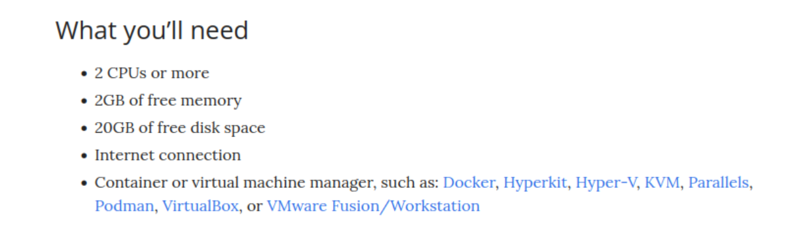

- Można zauważyć, że wymagania sprzętowe nie są duże - do uruchomienia klastra może posłużyć nawet Raspberry Pi 

# **Część 2: Analiza posiadanego kontenera**

Do wykonania tego punktu byłem zmuszony zmienić aplikację - poprzednia nie eksponowała portu. Wybrałem opcję minimum tj. obraz-gotowiec. Skorzystałem z gotowego obrazu Grafana - przydatnego narzędzia do logowania wartości i umieszczania ich na wykresie - np. aktualny prąd płynący z paneli fotowoltaicznych do baterii/sieci.

- pull obrazu


# **Część 3: Uruchamianie oprogramowania**

- Uruchomienie kontenera, który automatycznie został ubrany w pod.

  

- Przedstawienie działania

  

  

- Wyprowadzenie portu

  

- Przedstawienie komunikacji z eksponowaną funkcjonalnością

  

# **Część 4: Przekucie wdrożenia manualnego w plik wdrożenia**

Utworzenie nowego pliku definicji do wdrożenia, zawierającego dodane replik. 

```
apiVersion: apps/v1
kind: Deployment
metadata:
  name: grafana
  labels:
    app: grafana
spec:
  replicas: 6
  selector:
    matchLabels:
      app: grafana
  template:
    metadata:
      labels:
        app: grafana
    spec:
      containers:
      - name: grafana
        image: grafana/grafana:latest
        ports:
        - containerPort: 3000
```

Wykazanie działania na dashboardzie:


# **LAB12**

# **Część 6: Przygotowanie nowego obrazu**
Z racji użycia obrazu-gotowca skorzystałem ze starszej wersji oprogramowania, aby użyć drugi obraz. :latest zostało zmienione na 4:2:0

` containers:

      - name: grafana
        image: grafana/grafana:4.2.0`

# **Część 7: Zmiany w deploymencie**
Ta cześć polegała na aktualizowaniu pliku yml i obserwowaniu zachodzących zmian w trakcie tworzenia wdrożeń.

- zwiększenie liczbę replik do 10.
```
spec:
  replicas: 10
```

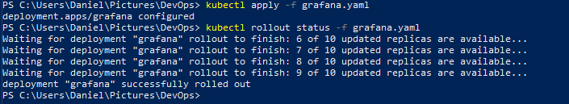

- zmniejszenie liczbę replik do 1.
```
spec:
  replicas: 1
```

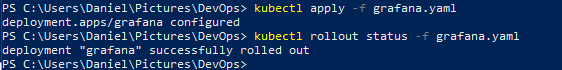

- zmniejszenie liczbę replik do 0.
```
spec:
  replicas: 0
```
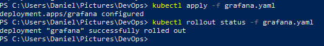

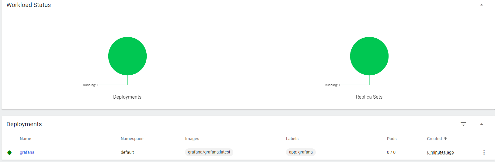

- zastosowanie starszej wersji z ustawioną liczbą replik równą 1.
```
  spec:
      containers:
      - name: grafana
        image: grafana/grafana:4.2.0
```

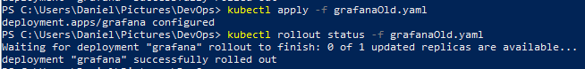

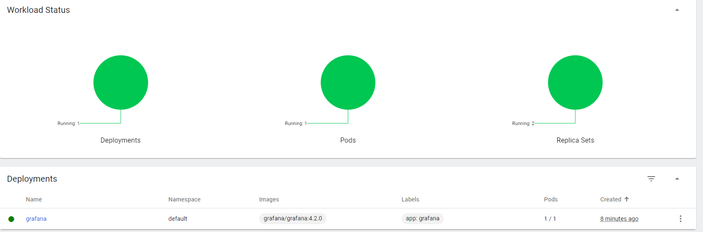

Przywracanie poprzedniej wersji.  `kubectl rollout history` umożliwia wyświetlenie historii wersji. Za pomocą `kubectl rollout undo` mamy możliwość powrotu do poprzedniej wersji. Powrót do wybranej wersji umożliwia dopisanie w poleceniu  `--to-revision=2`.

Powrót do nowszej wersji przy pomocy  kubectl rollout undo

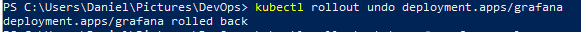

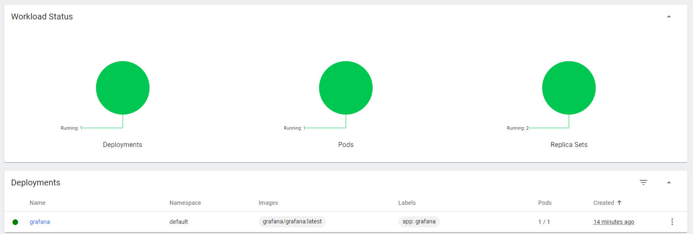

Powrót przy użyciu --to-revision=2

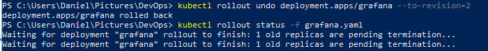

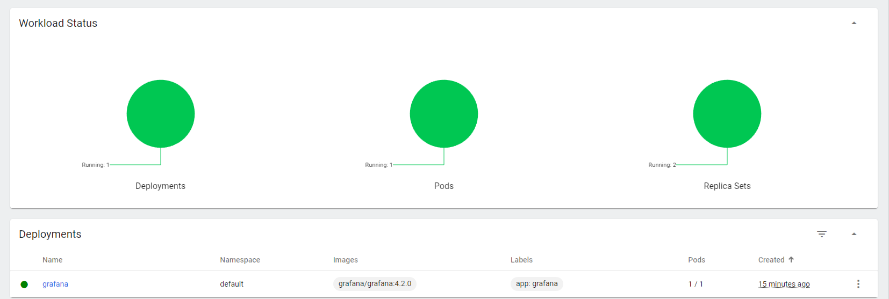

# **Część 8: Kontrola wdrożenia**

Brak

# **Część 9: Strategie wdrożeniowe**

- pierwszą strategią wdrożenia była strategia `Recreate`.
```
spec:
  replicas: 5
  strategy:
    type: Recreate
```
Strategia ta polega na tym, że wszystkie aktualnie działające instancje są ubijane i następnie wdrażana jest nowa wersja.

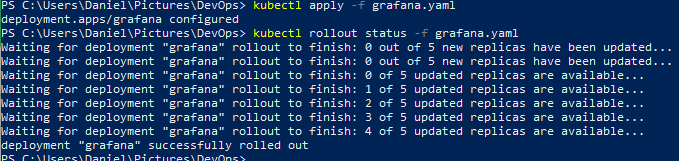

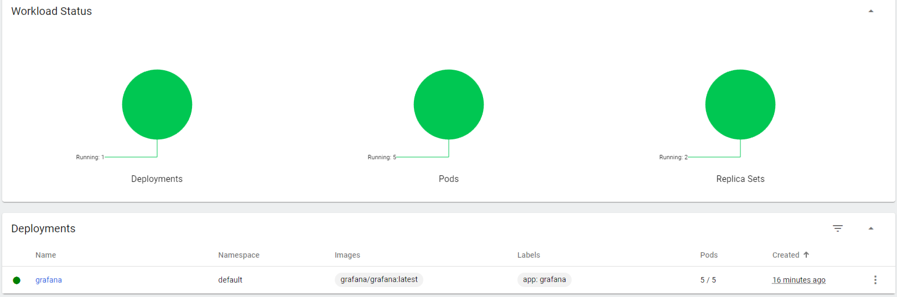

- druga strategia `RollingUpdate` polega na stopniowym wdrażaniu replik. Tworzony są nowe repliki, z nową wersją, a starszę są ubijane.  `maxSurge` określa ilość podów możliwą do dodania w określonym czasie, a `maxUnavailable` ilość podów niedostępnych w trakcie wdrożenia.

```
spec:
  replicas: 5
  strategy:
    type: RollingUpdate
    rollingUpdate:
      maxSurge: 2
      maxUnavailable: 0 
```

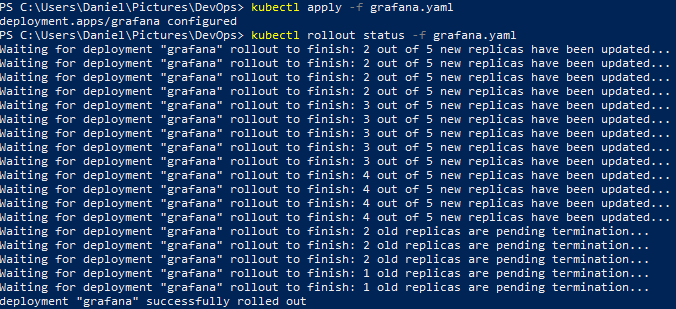

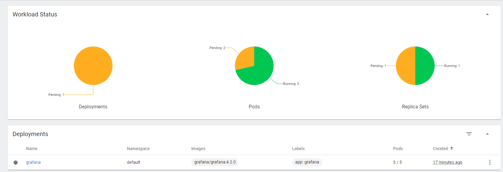

- trzecia strategia `Canary` wykonywane jest przy użyciu dwóch wdrożen ze wspólnymi etykietami. Jedna replika nowej wersji jest wypuszczana obok starej i po pewnym czasie jeśli nie zostanie wykryty żaden błąd usuwane jest stare wdrożenie. 

```
 app: grafana
```

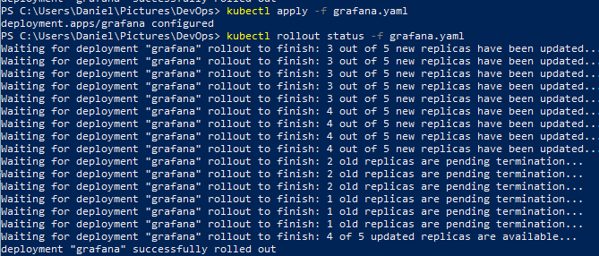

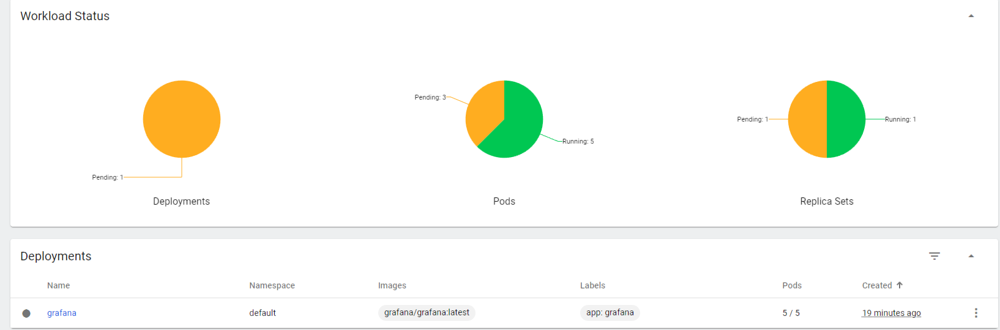

**Podsumowując:**

Kubernetes ułatwia wdrażanie nowej wersji. Wdrożenia operują replikami i pomagają w opracowaniu strategi wdrożenia poprzez manipulowanie nimi, aby osiągnąć wymarzony efekt

Wdrożenia mają tak naprawdę dwa typy strategii: Recreate i RollingUpdate.

RollingUpdate to strategia domyślna, kubernetes tworzy nowy zestaw replik i zaczyna go skalować w górę, jednocześnie stary skalować w dół. Natomiast Recreate skaluje od razu stary set do zera i od razu tworzy nowe repliki. 