# Sprawozdanie lab 09
#### Patrycja Pstrag

## Przygotowanie wdrożeń nienadzorowanych dla platform z pełnym OS

### 1. Przygotowanie systemu pod uruchomienie - instalacja pierwszej Fedory
Pierwszym punktem zajęć była instalacja systemu Fedora Server 36 w VM.  Instalacja polegała na pobraniu obrazu oraz przeprowadzeniu instalacji.

##### 1.1 Instalacja obrazu w VM została przeprowadzona zgodnie z poradnikiem: https://itsfoss.com/install-fedora-in-virtualbox/

##### 1.2 Uruchomienie systemu a następnie instalacji:
- Uruchomienie instalacji

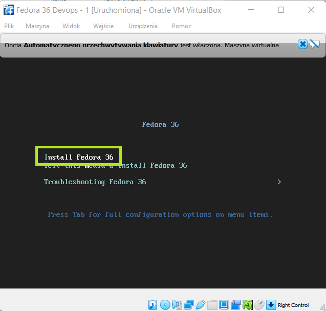
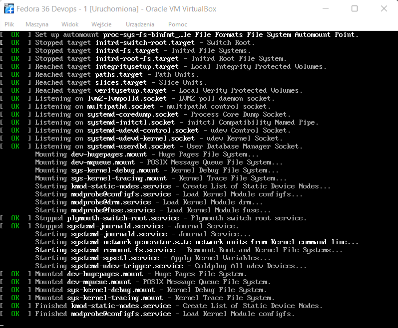

- Wybór języka

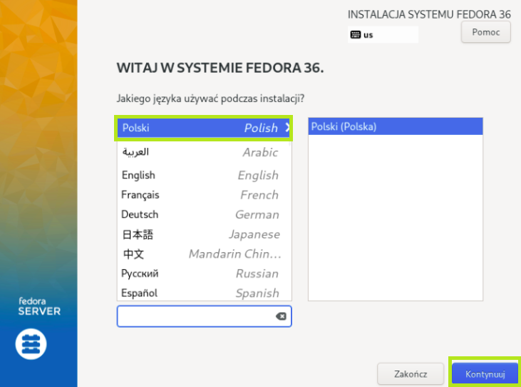

- Konfiguracja dysku i partycji

 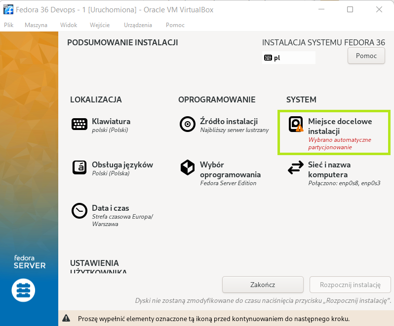
 ( aby wybrać dysk należy podwójnie na niego kliknąć, zaznaczamy również opcję **niestandardowej** konfiguracji urządzeń do przechwytywania danych aby była możliwość ręcznego partycjonowania )
 
 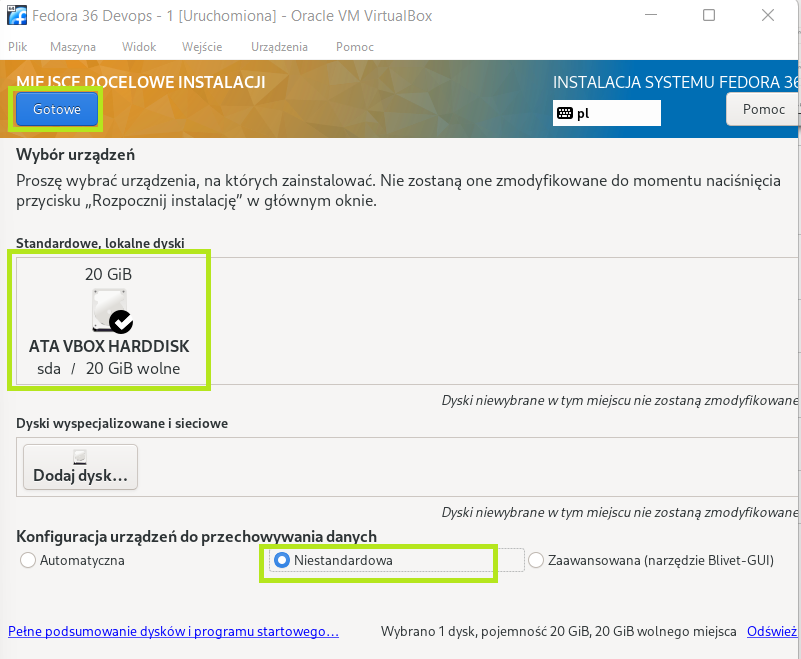
 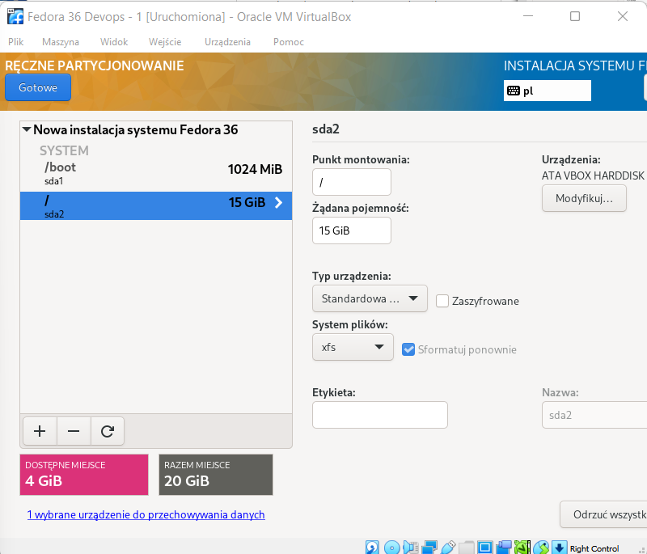
  
	Następnie kliamy przycisk "gotowe" przechodzimy do menu instalacji i wybieramy pozycję "Wybór oprogramowania" i wybieramy instalację minimalną **bez GUI**.
	
   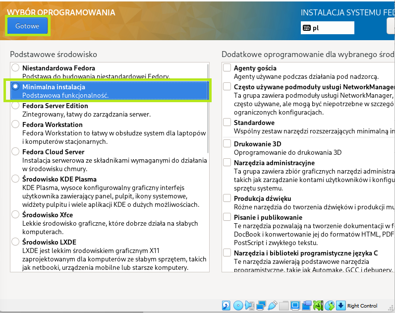

- Sieć i nazwa komputera

   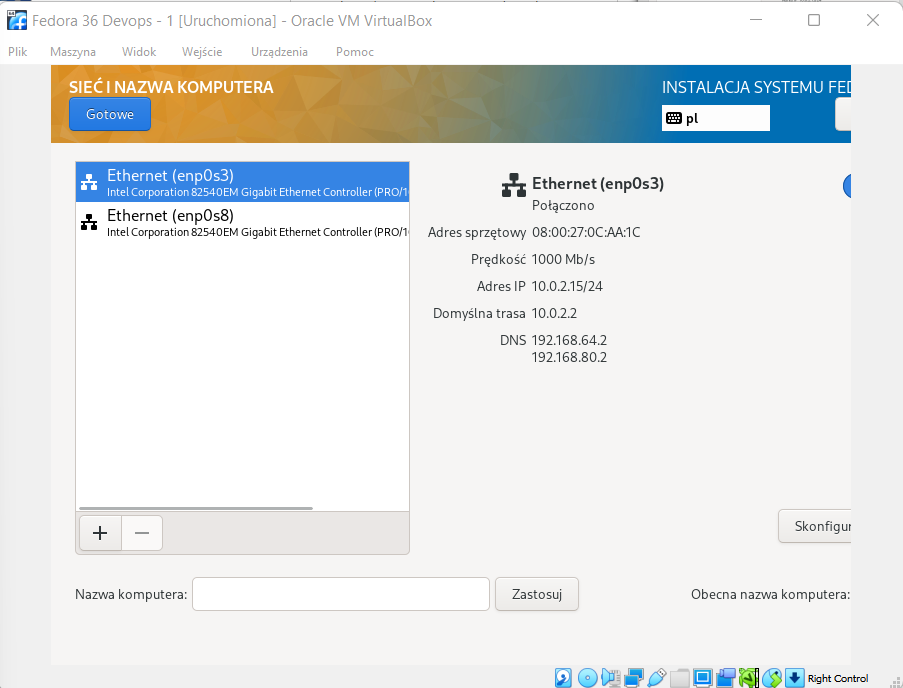
   
-   Ustawienie hasła konta  `root`

   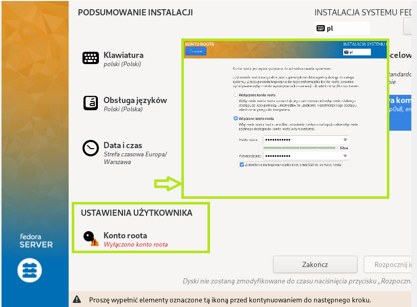
**hasło**: *devops1234!*

Po wykonaniu tych wszystkich kroków opcja rozpocznij instalację staje się dostępna. 
  
Aby przy ponownym uruchomieniu maszyny instalacja nie włączała się na nowo usuwamy płytkę instalacyjną. W menu VM klikamy:
	**Urządzenia -> Napędy optyczne -> Usuń dysk z wirtualnego napędu**
	
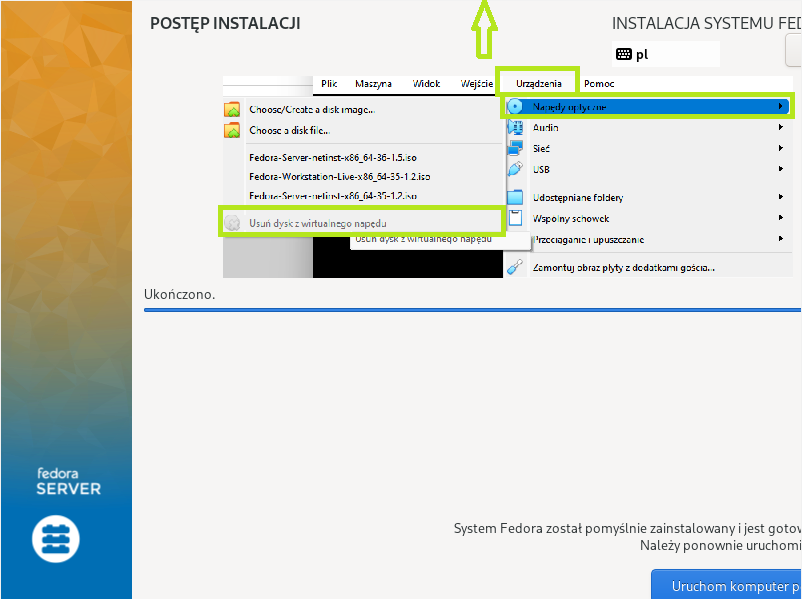
 
##### 1.3 Ponownie uruchomiamy maszynę i sprawdzamy czy instalacja przebiegła pomyślnie.

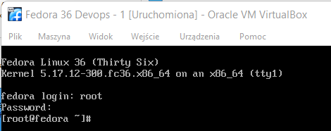
 
### 2. Przeprowadzamy drugą instalację systemu Fedora w VM
#### Celem drugiego systemu jest wyłącznie serwowanie repozytorium przez HTTP.
Instalacje przeprowadzamy tak jak poprzednio oraz usuwamy dysk z wirtualnego napędu. Sprawdzamy czy te operacje przebiegły pomyślnie poprzez ponowne uruchomienie maszyny.

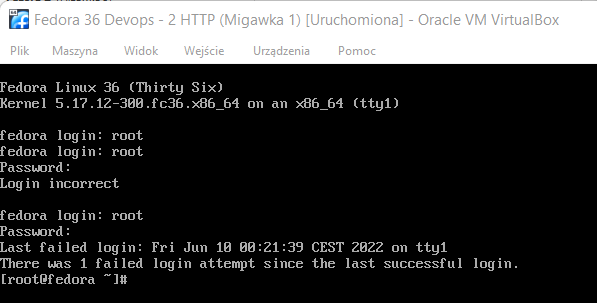

##### Pobranie pliku konfiguracyjnego i ustawienie serwera
Na maszynie Fedora 36 DevOps - 2 HTTP uruchamiam polecenie ``` ip a ``` 
- ***``` ip a ```*** to polecenie do konfiguracji interfejsów sieciowych, tablic tras czy tuneli w systemach operacyjnych Linux

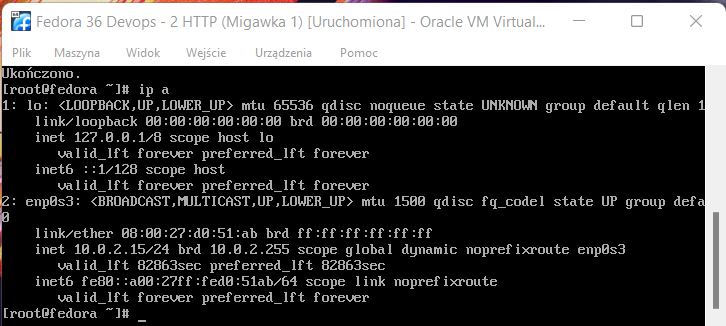

Następnie umieszczam plik .deb (w moim przypadku to plik program.deb) na maszynie, która ma być serwerem. Robię to w następujący sposób:
- Instaluję ```curl``` za pomocą polecenia 
```sudo dnf install curl```

- Pobieram plik z własnego repozytoriu i zapisuję pod nazwą program.deb :
``` curl https://github.com/vkpam/DevOpsProgramLab03/blob/main/program.deb -o program.deb ```

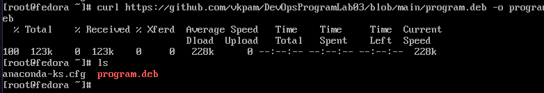

- instaluję pakiet httpd 
``` dnf install httpd ``` a następnie potwierdzam instalację poprzez wpisanie 't'
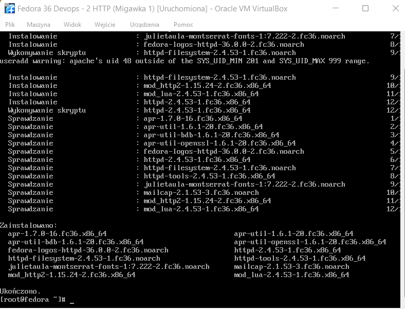

- instaluję firewalla z pomocą [strony](https://nsix.pl/kb/instalacja-i-konfiguracja-firewalld-na-centos/)
``` sudo dnf install firewalld ```

Odpowiednio skonfigurowana zapora, jest jednym z najważniejszych aspektów ogólnego bezpieczeństwa systemu. FirewallD to kompletne rozwiązanie do konfiguracji zapory, które zarządza regułami iptables i zapewnia interfejs do ich obsługi.

Aby zezwolić na ruch przychodzący HTTP (port 80) dla interfejsów w strefie publicznej, tylko dla bieżącej sesji, należy uruchomić polecenie: ``` sudo firewall-cmd --zone=public --add-service=http ```

Aby sprawdzić, czy usługa http została dodana pomyślnie, należy użyć polecenia z flagą –list-services:
```sudo firewall-cmd --zone=public --list-services```

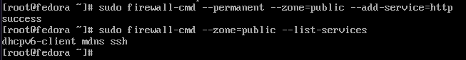

- uruchamiam usługę httpd
``` systemctl enable httpd --now```

- tworzę folder program w lokazlizacji /var/www/html/program
``` mkdir ../var/www/html/program/ ```
- nadaję mu odpowiednie uprawnienia
``` chmod 755 ../var/www/html/program```
- kopiuję do niego plik program.deb
- ``` cp ../var/www/html/program/```


##### Ustawienie klienta
- instaluję pakiet wget na maszynie klienta
``` dnf install wget```

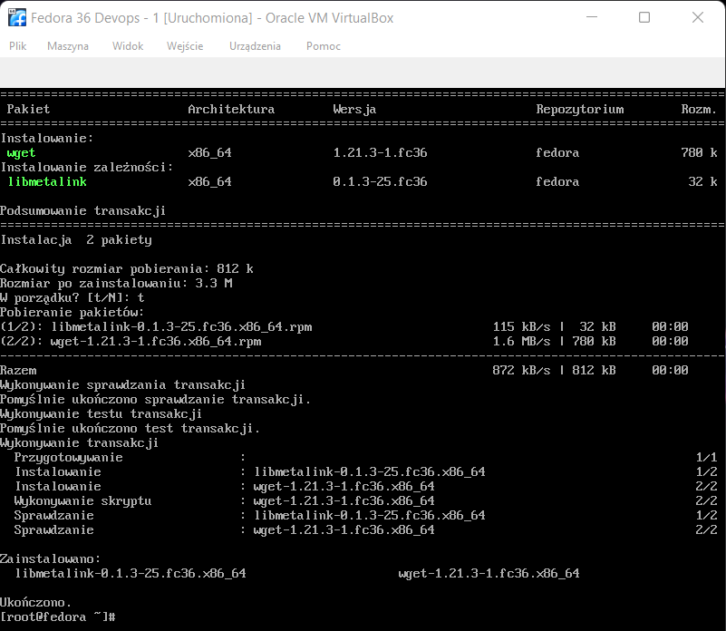

- zarówno po stronie serwera jak i klienta uruchamiam polecenie 
``` firewall-cmd --add-port=80/tcp ```

Usługa HTTPS nasłuchuje na porcie 80 i używa TCP. Aby otworzyć port w strefie publicznej dla bieżącej sesji należy użyć flagi –add-port =.


- pobieram z serwera plik ***program.deb***

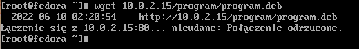

Pomimo użycia różnych konfiguracji sieci błąd nie znikał w związku z tym plik pobrałam ponownie za pomocą polecenia curl.

- zainstalowałam pakiet alien ``` sudo dnf install alien 	```. Instalacja przebiegła pomyślnie, co sprawdziłam, za pomocą polecenia ``` dnf info alien ```

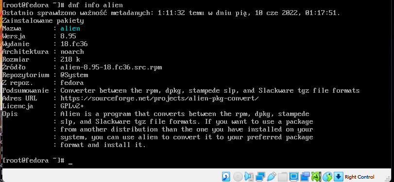

- za pomocą polecenia ``` alien --to-rpm program.deb``` chciałam stworzyć plik instalacyjny .rpm z pliku .deb . Zgodnie z [instrukcja](https://fedingo.com/how-to-convert-deb-to-rpm-files-in-linux/). Niestety próby zakończyły się niepowodzeniem.

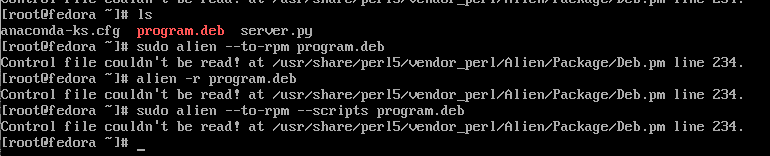

Zbudowałam plik instalacyjny raz jeszcze. Dla pewności z powodzeniem zainstalowałam za jego pomocą program w systemie Ubuntu. Plik zbudowany na nowo ponownie pobrałam na klienta za pomocą curl, bo wget nie działał*. Problem nadal był ten sam jak przy poprzedniej próbie. 
Sprawdziłam czy plik jest pusty - nie był.

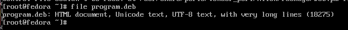

[*] Podczas wykonywania laboratorium w sieci domowej a nie akademikowej nie było już tego problemu. Adresy IP tworzyły się poprawnie a komenda wget działała bez zarzutu. 
( **Fedora 36 Devops - 2 HTTP** to serwer, 
**Fedora 36 Devops -1** to klient)

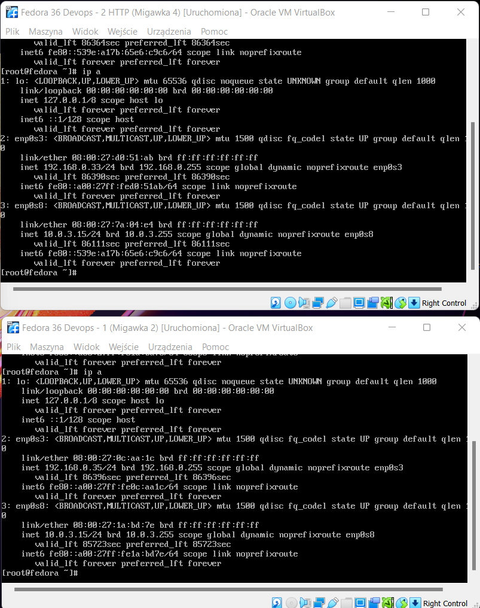


### 3. Instalacja nienadzorowana
Ten punkt laboratorium rozpoczęłam od zmiany zawartości pliku **anaconda-ks.cfg**. Plik ten znajduje się na [moim repozytorium](https://github.com/InzynieriaOprogramowaniaAGH/MDO2022_S/tree/PP401409/ITE/GCL07/PP401409/Lab09).

Następnie utworzyłam nową maszynę wirtualną **FedoraKlientNn**. Wszystkie ustawienia i przebieg instalacji przeprowadziłam tak samo jak w przypadku poprzednich maszyn. Wyskoczył mi błąd:

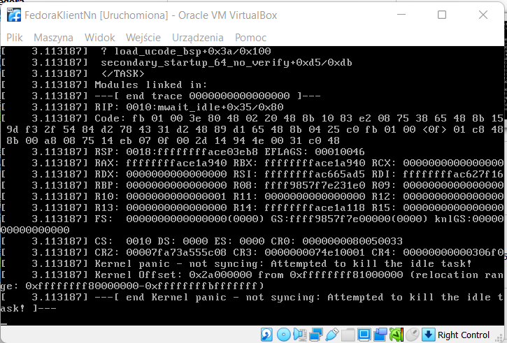

Był on spowodowany tym, że zapomniałam zmienić ilość CPU w maszynie z 1 na 2. Po ponownym uruchomieniu ekran błąd znikł a ekran menu instalacji wyświetliło się. 
Nie klikamy żadnej opcji tylko **wciskamy przycisk TAB** i do komendy która nam się wyświetli ``` vmlinuz initrd=initrd.img inst.stage2=hd:LABEL=Fedora-S-dvd-x86_64-36 rd.live.check quiet ``` dopisujemy ``` inst.ks=https://raw.githubusercontent.com/InzynieriaOprogramowaniaAGH/MDO2022_S/PP401409/ITE/GCL07/PP401409/Lab09/anaconda-ks.cfg ``` i wciskamy **Enter.**

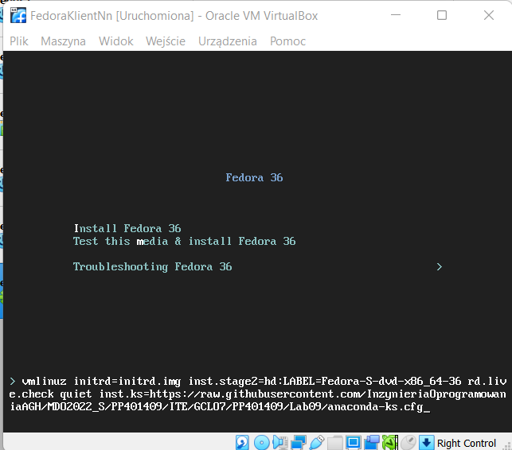
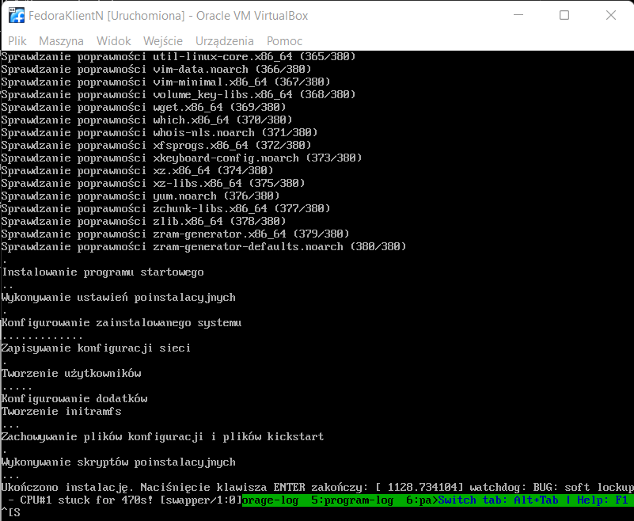

w	 momencie pojawienia się okna instalacji wyłączyłam maszynę i usunęłam dysk optyczny z wirtualnego napędu. Sprawdziłam czy instalacja przebiegła pomyślnie i czy pakiet został pobrany.

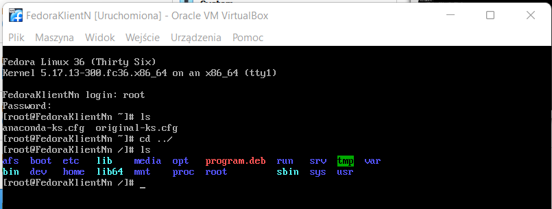

## Infrastructure as code
Kolejny punkt laboratorium rozpoczęłam od utworzenia katalogu media/iso oraz zamontowaniu w nim obrazu z napędem za pomocą komendy ``` mount /dev/sr0 media/iso ``` .

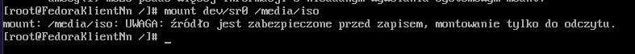

Skopiowałam plik anaconda do obrazu

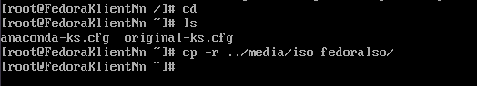

Dodałam do pliku **isolinux.cfg** ``` inst.ks=cdrom:/isolinux/ks.cfg```
Plik isolinux.cfg znajdował się w ścieżce **fedoraIso/isolinux**.

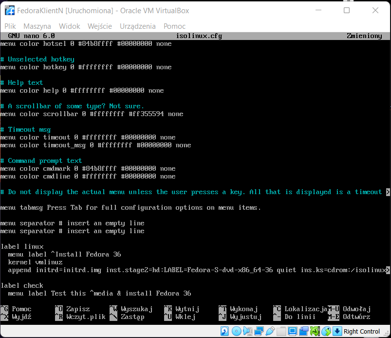

Zainstalowałam pakiet genisoimage - ``` dnf install genisoimage ```

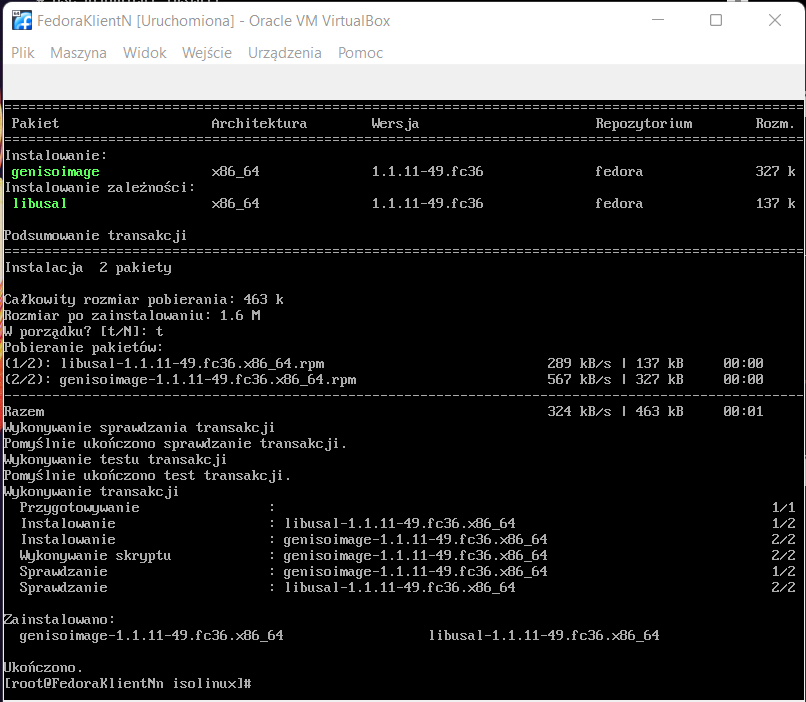

A następnie utworzyłam iso:

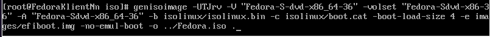
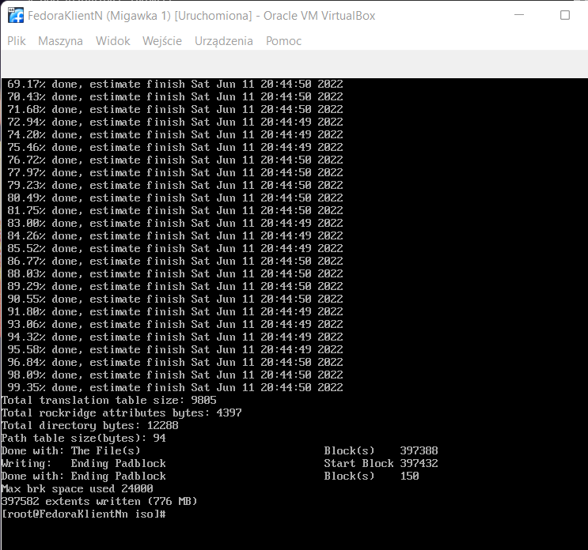

Rezultat


