# Wdrażanie na zarządzalne kontenery: Kubernetes

Instalacja curl: ``` sudo dnf install curl ```. Curl będzie potrzebne do pobrania kubernetesa.

Instalacja minikube z instrukcją zawartą na stronie https://minikube.sigs.k8s.io/docs/start/.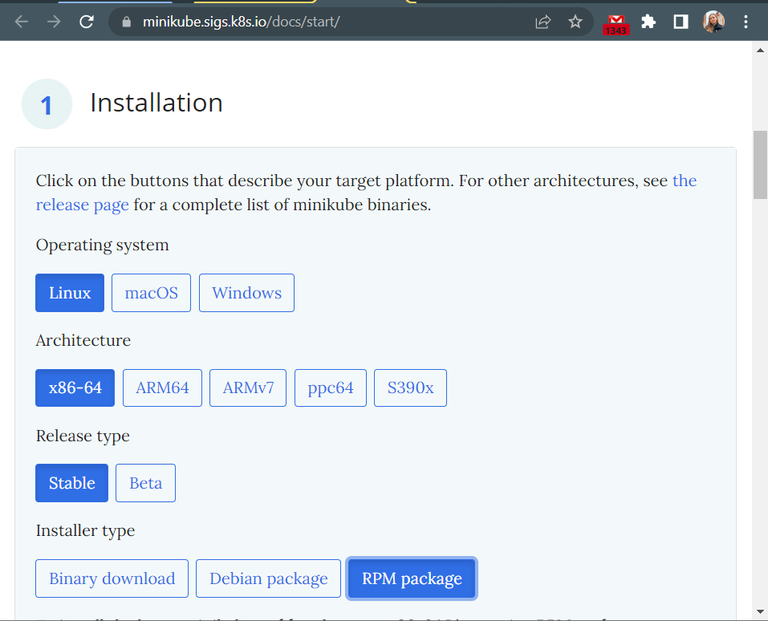

``` 
curl -LO https://storage.googleapis.com/minikube/releases/latest/minikube-latest.x86_64.rpm
sudo rpm -Uvh minikube-latest.x86_64.rpm 
```

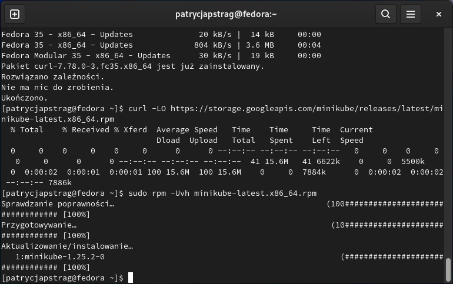

Uruchomienie minikube za pomocą komendy ``` minikube start```

[**FAIL**] Niepowodzenie i użycie podanej przez terminal komendy żeby go to naprawić:

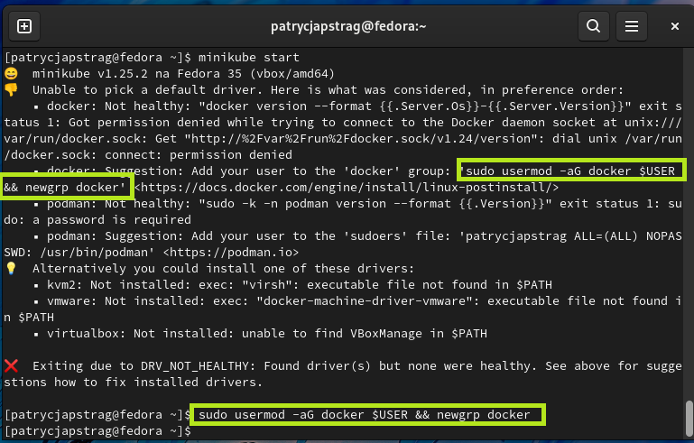

[**SUCCESS**] Ponowne uruchomienie minikube:

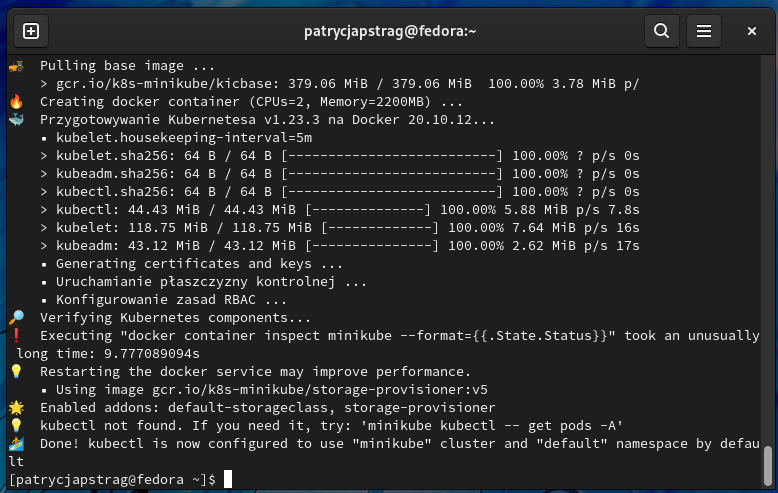

Sukces oczywiście nie przyszedł tak łatwo. Miliony kombinacji co do pamięci RAM i CPU. Za dużo - maszyna się wysypywała, za mało - maszyna się wysypywała. Ostatecznie stanęło na 3 CPU i 3857MB.

Sprawdzenie działania minikube ```minikube kubectl -- get po -A ```
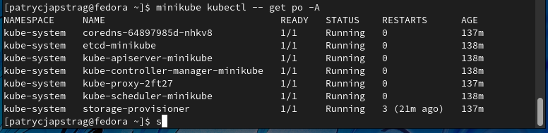

Następnie dodano alias ```alias kubectl="minikube kubectl --" ``` 
i sprawdzono działanie za pomocą  ```kubectl get po -A```


Aby uzyskać dodatkowy wgląd w stan klastra, minikube dołącza Dashboard Kubernetes, pozwala on łatwo zaaklimatyzować się w nowym środowisku. Aby wyświetlić dashboard należy użyć komendy ``` minikube dashboard ```.

Tutaj pojawił się błąd, maszyna wirtualna notorycznie się wysypywała. Żadne prośby i błagania nie dały pozytywnego skutku więc do akcji wkroczył plan B. 

# Plan B - WSL
Zgodnie z [poradnikiem](https://ubuntu.com/tutorials/install-ubuntu-on-wsl2-on-windows-11-with-gui-support#3-download-ubuntu) zainstalowałam **WSL** oraz **Ubuntu**. Instalacja przebiegła pomyślnie. Więc od początku rozpoczęłam przygodę z kubernetesem. VirtualBoxa już nawet nie dotykając :)

## Instalacja minikube
Zrobiłam update Ubuntu za pomocą ``` sudo apt update && sudo apt upgrade```.

Do pobrania kubernetesa był potrzebny curl, więc zainstalowałam go za pomocą komendy: ``` sudo apt install curl ```.  A następnie sprawdziłam jego wersję: ```curl --version```.

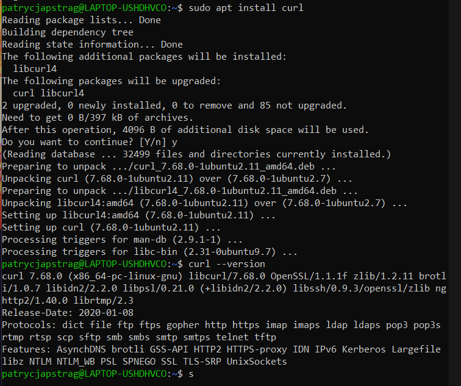


Instalacja minikube za pomocą instrukcji zawartej na [stronie](https://minikube.sigs.k8s.io/docs/start/.) .

Wybrałam ustawienia dostosowane do moich potrzeb. 

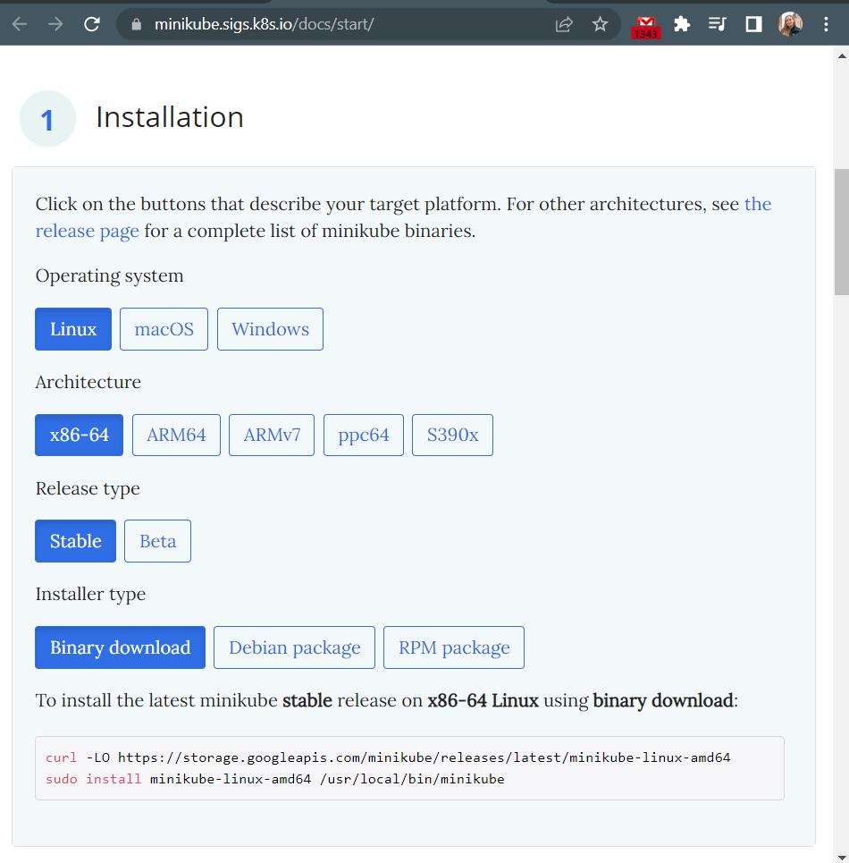

Skopiowałam wygenerowane komendy do binarnego pobierania:
```
curl -LO https://storage.googleapis.com/minikube/releases/latest/minikube-linux-amd64
sudo install minikube-linux-amd64 /usr/local/bin/minikube
```
 
 i użyłam ich w terminalu Ubuntu. 
 A następnie uruchomiłam minikube za pomocą ``` minikube start```.

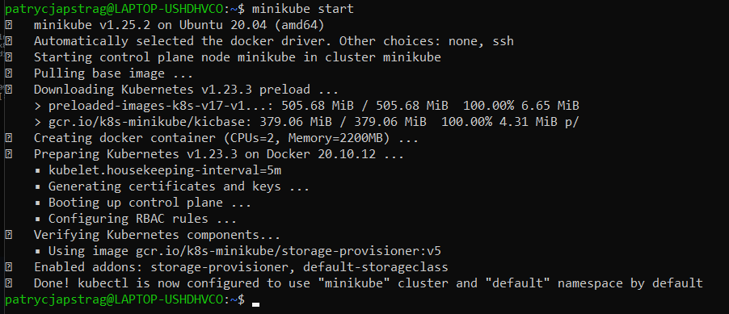

Zaopatrzyłam się w ``kubectl`` za pomocą polecenia ```minikube kubectl```. Instalacja przebiega pomyślnie.

Uruchomiłam kubernetes, działający kontener ``` docker ps ```
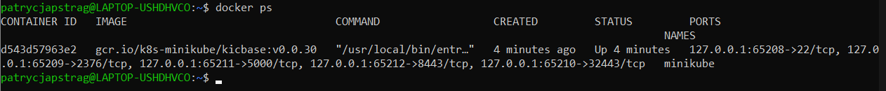

```minikube kubectl -- get po -A```
Dodałam alias ```alias kubectl="minikube kubectl --"```

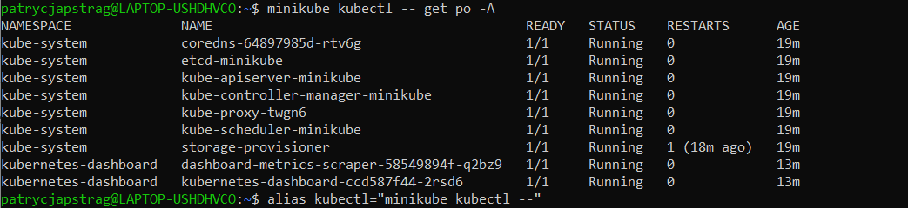

A następnie uruchomiłam dashboard za pomocą komendy ``` minikube dashboard ```.

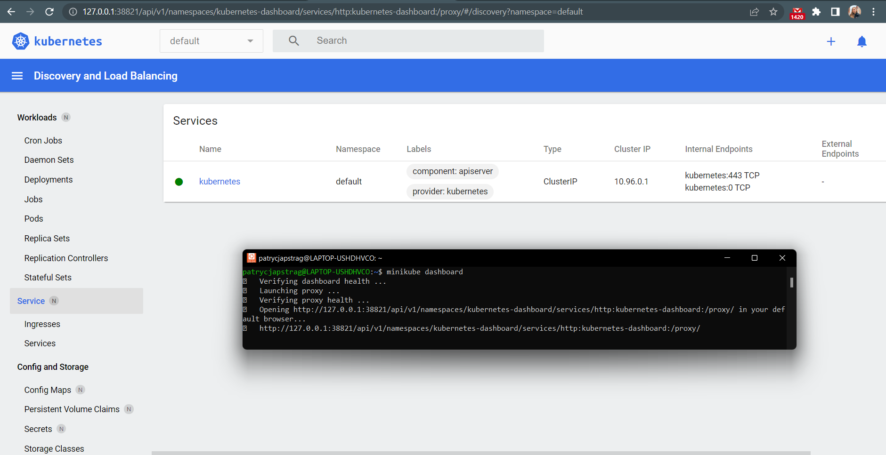

## Analiza posiadanego kontenera

Jako że deploy'owany przeze mnie program nie nadaje się do tego zadania (nie korzysta z żadnych portów), wykorzystałam gotowy obraz nginx.

Uruchomiłam obraz  ```minikube kubectl run -- nginx --image=nginx``` a następnie wprowadziłam go na port 5000 za pomocą komendy ```minikube kubectl port-forward nginx 5000:80```

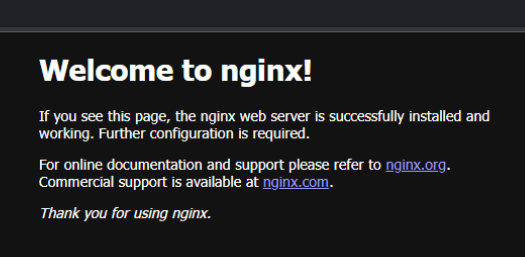

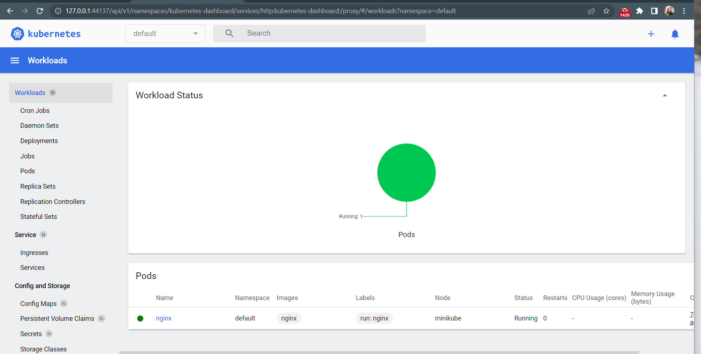

## Wdrożenie manualne, plik wdrożenia

Utworzyłam plik deploy.yaml, dla wdrożenia 5 podów nginx'a:
```
apiVersion: apps/v1
kind: Deployment
metadata:
  name: nginx
  labels:
    app: nginx
spec:
  replicas: 5
  selector:
    matchLabels:
      app: nginx
  template:
    metadata:
      labels:
        app: nginx
    spec:
      containers:
      - name: nginx
        image: nginx
        ports:
        - containerPort: 80
```

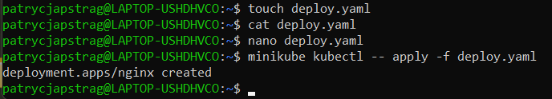

Efekt wdrożenia YAML'a:

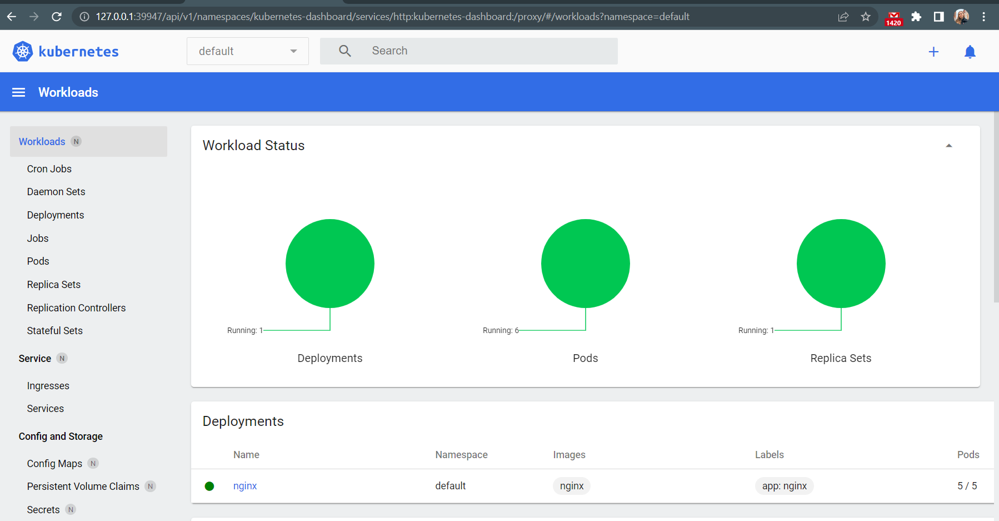
