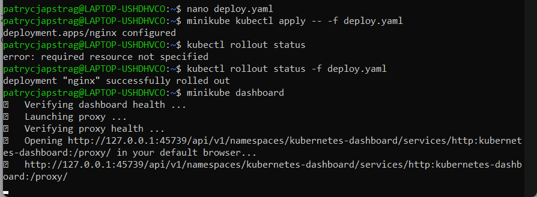
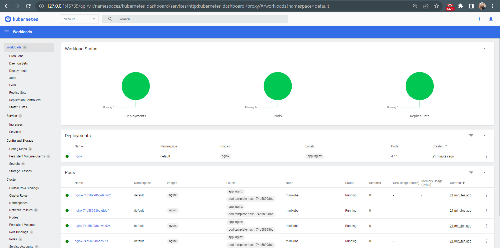
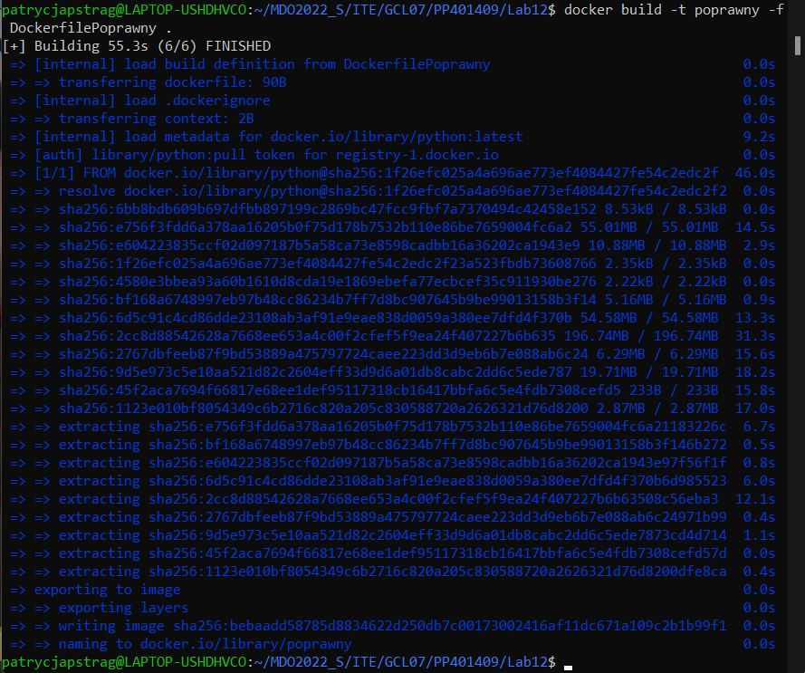
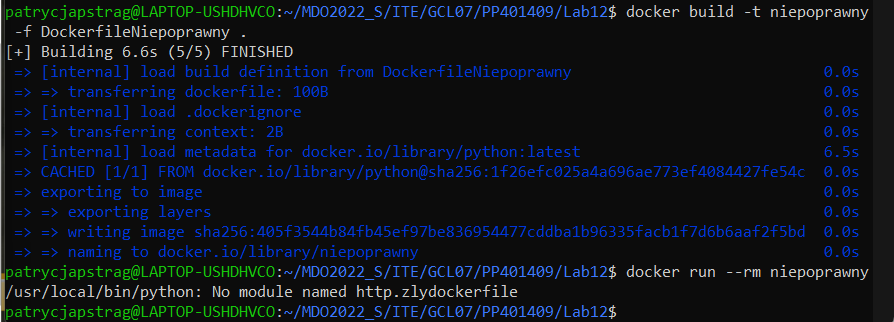
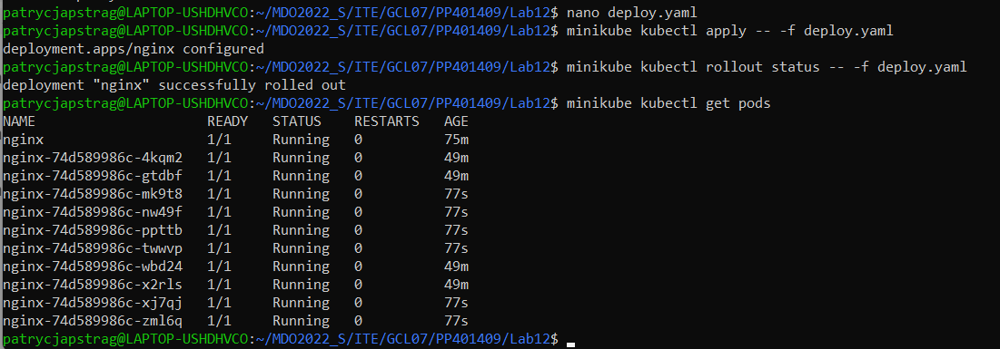
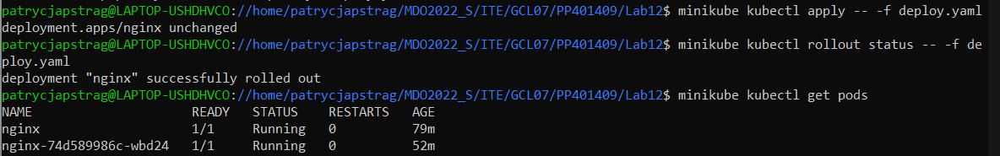
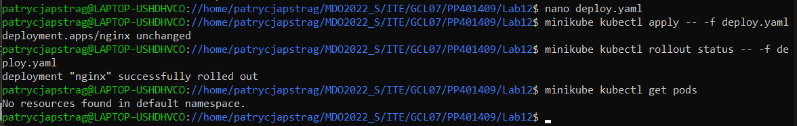
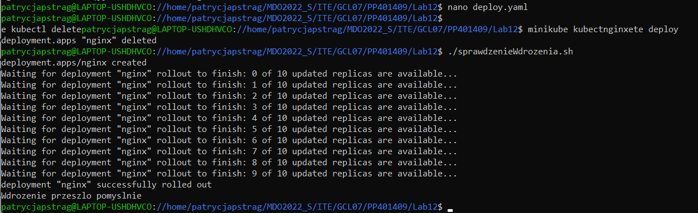
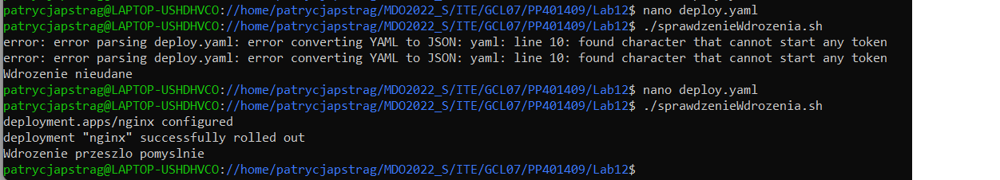
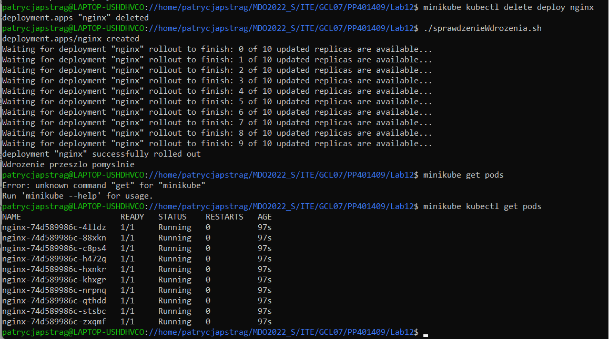

## Sprawozdanie Lab12 Patrycja Pstrąg
# Konwersja wdrożenia ręcznego na wdrożenie deklaratywne YAML

Wzbogacamy obraz o 4 repliki. Aby to zrobić w pliku deploy.yaml zmieniamy parametr ``` replicas ``` na 4:


A następnie rozpoczynamy wdrożenie z użyciem zmodyfikowanego pliku deploy.yaml za pomocą komendy ```minikube kubectl apply -- -f deploy.yaml```.

Za pomocą ``` kubectl rollout status ``` sprawdzam stan wdrożenia i uruchamiam dashboard ``` minikube dashboard ```. Wszystkie te kroki, łącznie z przypadkowym kliknięciem Enter w czasie wpisywania komendy przedstawia poniższy zrzut ekranu:




## Nowy obraz
Tak jak i w poprzednim laboratorium - korzystam z obrazu-gotowca. Przygotowuje dwa obrazy lokalne, jeden poprawny o nazwie "**poprawny**" i drugi niepoprawny, w którym celowo zrobiłam błąd o nazwie "**niepoprawny**". Komendy oraz efekty zbudowania przedstawiają poniższe zrzuty ekranu:

``` docker build -t poprawny -f DockerfilePoprawny . ```



``` docker build -t niepoprawny -f DockerfileNiepoprawny . ```
oraz uruchomiłam obraz ``` docker run --rm niepoprawny ```




## Zmiany w deploy.yaml

Zmieniam plik deploy.yaml z wdrożeniem i przeprowadzam je ponownie po zmianach dotyczących replik (czyli zmieniam wartość parametru ```replicas```). A następnie sprawdzam pody za pomocą polecenia ``` minikube kubectl get pods``` aby sprawdzić czy wszystko poszło zgodnie z oczekiwaniami. Do przeprowadzenia wdrożeń używam komendy ``` minikube kubectl apply -- -f deploy.yaml``` oraz ```minikube kubectl rollout status -- -f deploy.yaml```

 - **Liczba replik = 10**


 - **Liczba replik = 1**


Pod nginx nie powinien się pojawiać, w tym momencie przypomniałam sobie o jego usunięciu :)

 - **Liczba replik = 0**


## Kontrola wdrożeń
Kontrolą wdrożeń był skrypt weryfikujący, czy wdrożenie wykonało się w mniej niż 60 sekund. Początek skryptu to komendy używane dotychczas przy wdrożeniu czyli: 
```minikube kubectl apply -- -f deploy.yaml``` oraz ```minikube kubectl rollout status -- -f deploy.yaml```. Sprawdzenie czy wdrożenie wykonało się w ciągu 60s sprawdzam poprzez ```timeout 60```.

Treść skryptu:

```
#!/bin/bash

minikube kubectl apply -- -f deploy.yaml
timeout 60 minikube kubectl rollout status -- -f deploy.yaml
if [ $? -eq 0 ]
then
    echo "Wdrozenie przeszlo pomyslnie"
else
    echo  "Wdrozenie nieudane"
fi
```



## Strategie wdrożenia
Aby zmienić strategię wdrożenia należało dodać ``` strategy ``` do sekcji ``` spec ``` a następnie określić typ.

### **Recreate** - w miejsce starej wersji wdrażana jest nowa.

Treść dla typu Recreate:

```                                                                                            apiVersion: apps/v1
kind: Deployment
metadata:
  name: nginx
  labels:
    app: nginx
spec:
  replicas: 10
  strategy:
        type: Recreate
  selector:
    matchLabels:
      app: nginx
  template:
    metadata:
      labels:
        app: nginx
    spec:
      containers:
      - name: nginx
        image: nginx
        ports:
        - containerPort: 80
```

Efekt dla 
``` 
strategy:
	type: Recreate
```


(Błąd pojawił się ponieważ użyłam z automatu tabulacji zamiast spacji ale wiemy że sprawdzanie wdrożenia działa poprawnie)


### RollingUpdate 
- w tym typie pody są wyłączane, a następnie uruchamiane.

Skrypt:
``` 
apiVersion: apps/v1
kind: Deployment
metadata:
  name: nginx
  labels:
    app: nginx
spec:
  replicas: 10
  strategy:
      type: RollingUpdate
      rollingUpdate:
                 maxSurge: 4
                 maxUnavailable: 1
  selector:
    matchLabels:
      app: nginx
  template:
    metadata:
      labels:
        app: nginx
    spec:
      containers:
      - name: nginx
        image: nginx
        ports:
        - containerPort: 80
```
`maxSurge` - maksymalna ilość podów które mogą zostać dodane `maxUnavailable` - maksymalna ilość podów które mogą być niedostępne. 

W swoim przykładzie przedstawiam wdrożenie w którym możemy mieć 4 dodane pody oraz 1 niedostępy. Ogólna ilość replik: 10.




