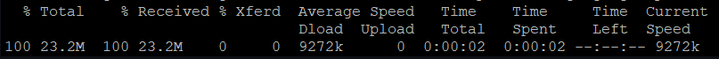
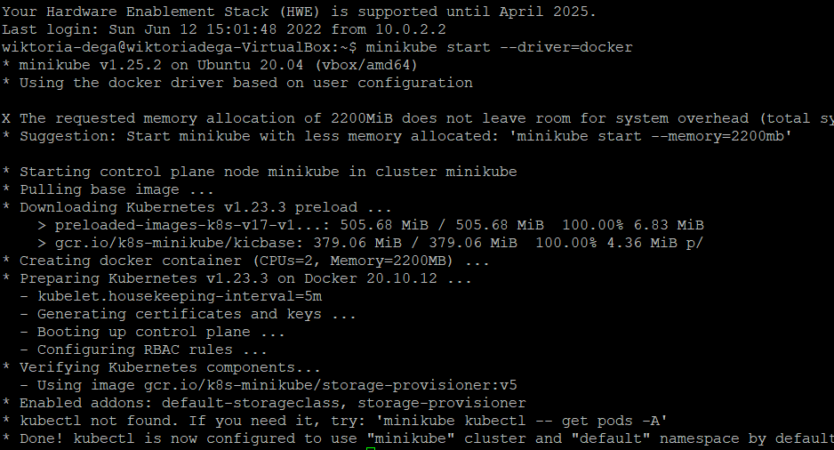
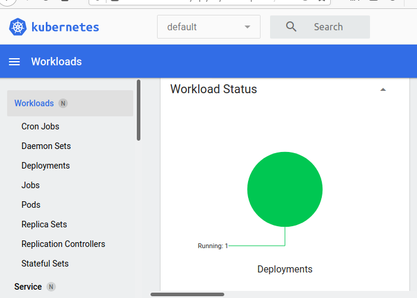
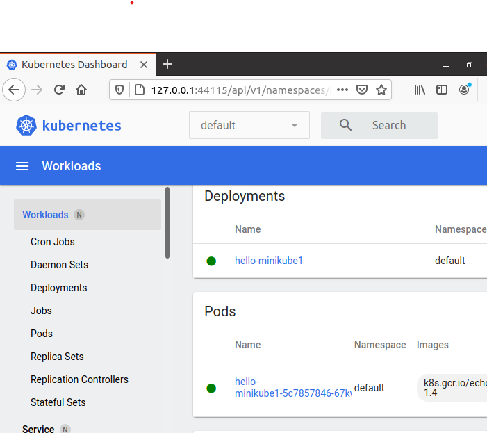
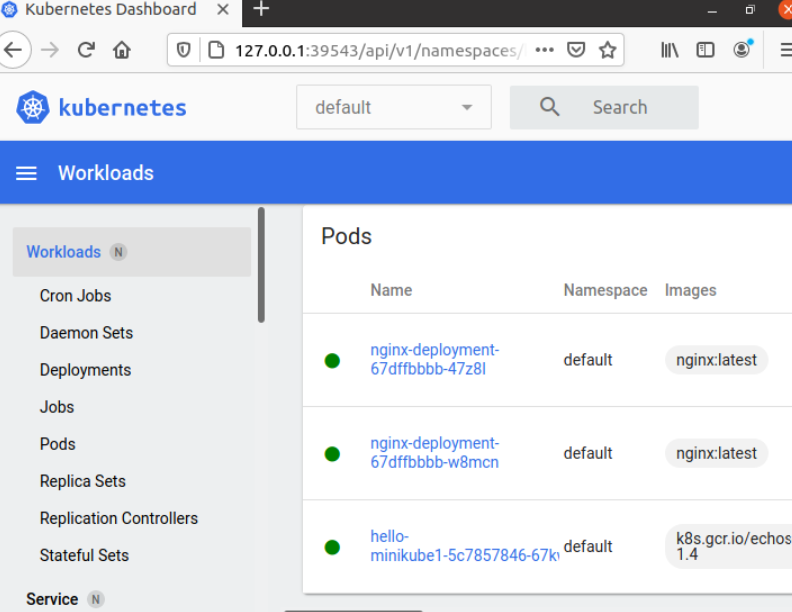
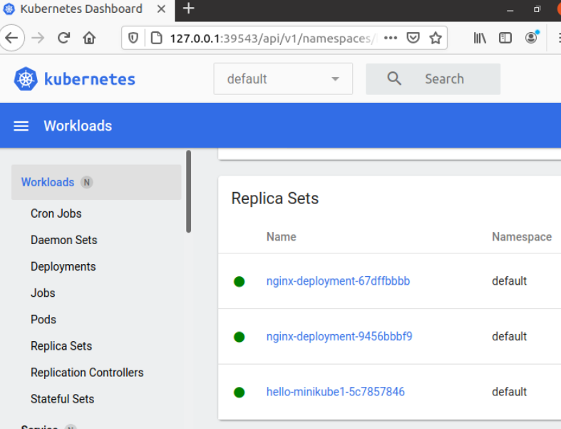
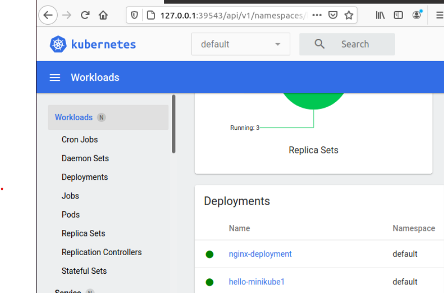

# Konwersja wdrożenia ręcznego na wdrożenie deklaratywne YAML

Dodano do pliku 4 repliki ora rozpoczeto wdraæanie 
`kubectl apply -f lab11.yaml`

uruchomiono klaster przy użyciu komendy z przełącznikiem 
`minikube start --driver=docker`

`minikube kubectl -- get po -A` w celu uzyskania dostępu do klastra

spełnioneo podstawowe wymagania sprzętowe:
(2 rdzenie dla procesora, 3 GB pamięci RAM, 60GB miejsca fizycznego, kontener (Docker))
Deployowany obrazem, który wykorzystano był gotowy obraz echoserver:1.4. Za pomocą polecenia

 `kubectl create deployment hello-minikube1 --image=k8s.gcr.io/echoserver:1.4` 
 stworzono deployment.
`kubectl expose deployment hello-minikube1 --type=LoadBalancer --port=8080, w celu wykonania kroku expose`
Następnie ma miejsce przekierowanie na port 7080 przy pomocy polecenia `kubectl port-forward service/hello-minikube1 7080:8080`
Po wysłaniu requesta do localhost:7080 :


## Przekucie wdrożenia manualnego w plik wdrożenia (wprowadzenie)

plik YML:
```bash
apiVersion : apps/vl
kind: Deployment
metadata:
    name: nginx-deployment
spec:
    selector:
     matchLabels :
        app: nginx
    replicas: 2
    template:
     metadata:
       labels :
         app: nginx
    spec:
      Containers:
       - name: nginx
         image: nginx:latest
        ports:
        - containerPort : 80
```



